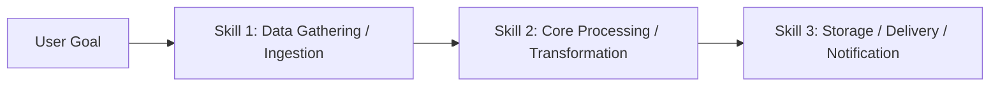

# 🧠 AUTONOMOUS AI AGENT MASTER OPERATING SYSTEM & SKILL PROTOCOL

> **FILE PURPOSE:**  
> This is the **SINGLE SOURCE OF TRUTH (All-in-One Master File)** for ANY AI Agent (Gemini, Claude, ChatGPT, Cursor, Copilot, DeepSeek, etc.) interacting with this repository.
> 
> **Zero Token Waste Directive:**  
> 🛑 **NEVER crawl or scan all 900+ directories in `antigravity-gemini-skills/` recursively!**  
> Everything you need to know about what skills exist, when to use them, and how to combine them is documented in this single file.

---

## ⚡ 1. MANDATORY AGENT OPERATING DIRECTIVES (STRICT RULES)

Before performing **ANY** user task, every AI Agent **MUST** follow these 4 golden rules:

### 🔹 Rule 1: Always Check This Skill Directory First
- **Never guess or invent code from scratch blindly.** 
- For any user prompt (coding, debugging, workflow automation, pentesting, database, scraping, etc.), first match the task to the **Category Matrix (Section 2)** and locate the exact skill in **Section 4**.

### 🔹 Rule 2: Deep Inspection Before Execution ("Dhyan Se Dekhein")
- Before writing a single line of code or executing an automation:
  1. Open and thoroughly read the designated `SKILL.md` file at its exact relative path.
  2. **Inspect the `scripts/` folder:** If a skill has a `scripts/` directory (marked with 🛠️ in the catalog), check it immediately. It contains production-grade Python/Node/Bash scripts ready to execute, saving you from writing code from scratch.

### 🔹 Rule 3: Multi-Skill Chaining (Combine Multiple Skills Together)
- Real-world tasks frequently require **more than one skill**. 
- You are strictly encouraged to **chain multiple skills together** in sequence!
- *Example 1 (Data Pipeline):* Use `web-data` to extract -> `database` to store -> `workflow-automation/n8n` to trigger notifications.
- *Example 2 (Security Audit):* Use `security/sql-injection-testing` to test -> `security/api-security-best-practices` to remediate -> `document-processing` to export executive report.
- *Example 3 (Fullstack Web App):* Use `design-to-code` for UI -> `web-development` for APIs -> `pocketbase` or `database` for backend -> `railway` for deployment.

### 🔹 Rule 4: Zero Token Waste
- Never list or read unrelated directories. Jump **directly** to the target `SKILL.md` via its relative path.

---

## 🧭 2. FAST INTENT-TO-CATEGORY ROUTING MATRIX

Match the user's intent to the target category domain below:

| # | User Task / Intent | Target Domain | Skill Count | Common Multi-Skill Partners |
|---|:---|:---|:---:|:---|
| 1 | **Security, Pentesting & Vulnerability Testing** | `security` | 47 | + `document-processing` (Reporting), + `web-development` (Patching) |
| 2 | **Workflow Automation (n8n, Zapier, Make, Slack, Jira)** | `workflow-automation` | 23 | + `enterprise-communication`, + `web-data`, + `git` |
| 3 | **Fullstack Web Dev (React, Next.js, Node, CSS, APIs)** | `web-development` | 230 | + `creative-design`, + `database`, + `railway` (Deploy) |
| 4 | **AI Agents, Multi-Agent Orchestration & Memory** | `ai-research` | 131 | + `ai-maestro` (Lifecycle), + `workflow-automation` |
| 5 | **AI Agent Management & Lifecycle CLI** | `ai-maestro` | 6 | + `ai-research`, + `operations` |
| 6 | **Database Architecture, SQL & Migrations** | `database` | 13 | + `web-development`, + `analytics`, + `pocketbase` |
| 7 | **PocketBase Realtime Backend & Collections** | `pocketbase` | 6 | + `web-development`, + `security` |
| 8 | **Web Scraping, Crawling & HTML Extraction** | `web-data` | 6 | + `database`, + `workflow-automation`, + `media` |
| 9 | **Data Analytics, Dashboards & BI Metrics** | `analytics` | 1 | + `database`, + `document-processing` |
| 10 | **Git, Branching, Commits & PR Workflows** | `git` | 3 | + `workflow-automation/github-automation`, + `development` |
| 11 | **Document Processing (PDF, OCR, Excel, Word)** | `document-processing` | 18 | + `analytics`, + `productivity` |
| 12 | **Media Processing (Images, Audio, FFmpeg)** | `media` | 5 | + `video`, + `creative-design` |
| 13 | **Video Production, Subtitles & Rendering** | `video` | 3 | + `media`, + `creative-design` |
| 14 | **Cloud Deployment & Hosting (Railway)** | `railway` | 12 | + `web-development`, + `database` |
| 15 | **Operations, DevOps, Docker & Supply Chain** | `operations` | 6 | + `railway`, + `git` |
| 16 | **Error Tracking & Monitoring (Sentry)** | `sentry` | 6 | + `web-development`, + `development` |
| 17 | **Productivity, Notes, Knowledge & Time Management** | `productivity` | 50 | + `document-processing`, + `career` |
| 18 | **Business Strategy, Marketing & Growth (GTM)** | `business-marketing` | 49 | + `marketing`, + `analytics` |
| 19 | **Marketing & Social Scrapers** | `marketing` | 1 | + `web-data`, + `business-marketing` |
| 20 | **Enterprise Communication (Slack, Hand-off docs)** | `enterprise-communication` | 33 | + `workflow-automation`, + `productivity` |
| 21 | **Creative UI/UX Design, 2D/3D Games, Tailwind** | `creative-design` | 43 | + `design-to-code`, + `web-development` |
| 22 | **Design to Code (Figma to HTML/React/Tailwind)** | `design-to-code` | 1 | + `creative-design`, + `web-development` |
| 23 | **Career Acceleration, Resumes, CV & Interviews** | `career` | 21 | + `document-processing`, + `productivity` |
| 24 | **Scientific Research, Biology, Chem & Math** | `scientific` | 139 | + `analytics`, + `ai-research` |
| 25 | **General Utilities & Converters** | `utilities` | 11 | + `development`, + `document-processing` |
| 26 | **Curviate Specific Tools** | `curviate` | 9 | + `enterprise-communication` |
| 27 | **DoorDash Automation & Tools** | `doordash` | 5 | + `workflow-automation` |
| 28 | **Open Banking Integration** | `open-banking-io` | 1 | + `security`, + `database` |
| 29 | **GMod Addon Maker** | `gmod-addon-maker` | 1 | + `creative-design` |
| 30 | **Sports Analytics & Predictions** | `sports` | 1 | + `analytics`, + `web-data` |
| 31 | **Core Software Development Patterns** | `development` | 230 | All engineering domains |

---

## 🔗 3. MULTI-SKILL CHAINING RECIPES (HOW TO COMBINE SKILLS)

When a complex task is requested, execute in a pipeline:

### Common Multi-Skill Pipelines:
1. **End-to-End Web Automation:**
   * **Step 1:** `antigravity-gemini-skills/web-data/playwright-scraper/SKILL.md` (Scrape web pages)
   * **Step 2:** `antigravity-gemini-skills/database/postgres-basics/SKILL.md` (Save extracted data to DB)
   * **Step 3:** `antigravity-gemini-skills/workflow-automation/n8n/SKILL.md` (Trigger webhook/email notification)

2. **Fullstack App Development:**
   * **Step 1:** `antigravity-gemini-skills/design-to-code/design-to-code/SKILL.md` (Figma design to responsive frontend)
   * **Step 2:** `antigravity-gemini-skills/pocketbase/PocketBase Collections/SKILL.md` (Setup schema, auth, rules)
   * **Step 3:** `antigravity-gemini-skills/railway/railway-deploy/SKILL.md` (Deploy frontend + backend live)

3. **Security Pentest & Hardening:**
   * **Step 1:** `antigravity-gemini-skills/security/sql-injection-testing/SKILL.md` (Run injection tests & fuzzing)
   * **Step 2:** `antigravity-gemini-skills/security/api-security-best-practices/SKILL.md` (Implement defense & sanitizer)
   * **Step 3:** `antigravity-gemini-skills/document-processing/pdf/SKILL.md` (Generate audit executive summary)

---

## 📚 4. COMPLETE SKILLS CATALOG (ALL 913 SKILLS ORGANIZED BY CATEGORY)

> **Legend:**  
> 🛠️ = Contains ready-to-run scripts in `scripts/` directory. **Inspect `scripts/` before writing code!**  
> 📄 = Pure pattern & documentation skill.

### 📂 Category: `ai-maestro` (6 Skills)

| Skill Name | Scripts? | Purpose / Trigger Keywords ("Use when...") | Exact Relative Path |
| :--- | :---: | :--- | :--- |
| **agent-management** | 📄 No | Create, manage, and orchestrate AI agents using the AI Maestro CLI. Use when the user asks to "create agent", "list agents", "delete agent", "hibernate agent", "wake agent", "install plugin", "show... | [`antigravity-gemini-skills/ai-maestro/agent-management/SKILL.md`](../antigravity-gemini-skills/ai-maestro/agent-management/SKILL.md) |
| **agent-messaging** | 📄 No | Send and receive cryptographically signed messages between AI agents using the Agent Messaging Protocol (AMP). Use when the user asks to "send a message to an agent", "check agent inbox", "message ... | [`antigravity-gemini-skills/ai-maestro/agent-messaging/SKILL.md`](../antigravity-gemini-skills/ai-maestro/agent-messaging/SKILL.md) |
| **docs-search** | 📄 No | Search auto-generated codebase documentation for function signatures, API docs, class definitions, and code comments. Use when the user asks to "search docs", "find documentation", "look up a funct... | [`antigravity-gemini-skills/ai-maestro/docs-search/SKILL.md`](../antigravity-gemini-skills/ai-maestro/docs-search/SKILL.md) |
| **graph-query** | 📄 No | Query the code graph database to understand component relationships, dependencies, and change impact. Use when the user asks to "find callers", "check dependencies", "what uses this", "show relatio... | [`antigravity-gemini-skills/ai-maestro/graph-query/SKILL.md`](../antigravity-gemini-skills/ai-maestro/graph-query/SKILL.md) |
| **memory-search** | 📄 No | Search conversation history and semantic memory to recall previous discussions, decisions, and context. Use when the user asks to "search memory", "what did we discuss", "remember when", "find prev... | [`antigravity-gemini-skills/ai-maestro/memory-search/SKILL.md`](../antigravity-gemini-skills/ai-maestro/memory-search/SKILL.md) |
| **planning** | 📄 No | Create and manage persistent markdown planning files for structured task execution. Use when the user asks to "create a plan", "track progress", "start a research project", or when a task requires ... | [`antigravity-gemini-skills/ai-maestro/planning/SKILL.md`](../antigravity-gemini-skills/ai-maestro/planning/SKILL.md) |

---

### 📂 Category: `ai-research` (131 Skills)

| Skill Name | Scripts? | Purpose / Trigger Keywords ("Use when...") | Exact Relative Path |
| :--- | :---: | :--- | :--- |
| **agent-evaluation** | 📄 No | Testing and benchmarking LLM agents including behavioral testing, capability assessment, reliability metrics, and production monitoring—where even top agents achieve less than 50% on real-world ben... | [`antigravity-gemini-skills/ai-research/agent-evaluation/SKILL.md`](../antigravity-gemini-skills/ai-research/agent-evaluation/SKILL.md) |
| **agent-manager-skill** | 📄 No | Manage multiple local CLI agents via tmux sessions (start/stop/monitor/assign) with cron-friendly scheduling. | [`antigravity-gemini-skills/ai-research/agent-manager-skill/SKILL.md`](../antigravity-gemini-skills/ai-research/agent-manager-skill/SKILL.md) |
| **agent-memory-mcp** | 📄 No | A hybrid memory system that provides persistent, searchable knowledge management for AI agents (Architecture, Patterns, Decisions). | [`antigravity-gemini-skills/ai-research/agent-memory-mcp/SKILL.md`](../antigravity-gemini-skills/ai-research/agent-memory-mcp/SKILL.md) |
| **agent-memory-systems** | 📄 No | Memory is the cornerstone of intelligent agents. Without it, every interaction starts from zero. This skill covers the architecture of agent memory: short-term (context window), long-term (vector s... | [`antigravity-gemini-skills/ai-research/agent-memory-systems/SKILL.md`](../antigravity-gemini-skills/ai-research/agent-memory-systems/SKILL.md) |
| **agent-tool-builder** | 📄 No | Tools are how AI agents interact with the world. A well-designed tool is the difference between an agent that works and one that hallucinates, fails silently, or costs 10x more tokens than necessar... | [`antigravity-gemini-skills/ai-research/agent-tool-builder/SKILL.md`](../antigravity-gemini-skills/ai-research/agent-tool-builder/SKILL.md) |
| **ai-agents-architect** | 📄 No | Expert in designing and building autonomous AI agents. Masters tool use, memory systems, planning strategies, and multi-agent orchestration. Use when: build agent, AI agent, autonomous agent, tool ... | [`antigravity-gemini-skills/ai-research/ai-agents-architect/SKILL.md`](../antigravity-gemini-skills/ai-research/ai-agents-architect/SKILL.md) |
| **ai-release-hunter** | 📄 No | Daily digest of AI releases from Anthropic, Meta, Vercel Labs, OpenAI and Google GitHub repos, the Claude Cowork changelog, the claude.dev blog and Hacker News, deduplicated against a local state f... | [`antigravity-gemini-skills/ai-research/ai-release-hunter/SKILL.md`](../antigravity-gemini-skills/ai-research/ai-release-hunter/SKILL.md) |
| **audiocraft-audio-generation** | 📄 No | PyTorch library for audio generation including text-to-music (MusicGen) and text-to-sound (AudioGen). Use when you need to generate music from text descriptions, create sound effects, or perform me... | [`antigravity-gemini-skills/ai-research/multimodal-audiocraft/SKILL.md`](../antigravity-gemini-skills/ai-research/multimodal-audiocraft/SKILL.md) |
| **autogpt-agents** | 📄 No | Autonomous AI agent platform for building and deploying continuous agents. Use when creating visual workflow agents, deploying persistent autonomous agents, or building complex multi-step AI automa... | [`antigravity-gemini-skills/ai-research/agents-autogpt/SKILL.md`](../antigravity-gemini-skills/ai-research/agents-autogpt/SKILL.md) |
| **autonomous-agent-patterns** | 📄 No | Design patterns for building autonomous coding agents. Covers tool integration, permission systems, browser automation, and human-in-the-loop workflows. Use when building AI agents, designing tool ... | [`antigravity-gemini-skills/ai-research/autonomous-agent-patterns/SKILL.md`](../antigravity-gemini-skills/ai-research/autonomous-agent-patterns/SKILL.md) |
| **autonomous-agents** | 📄 No | Autonomous agents are AI systems that can independently decompose goals, plan actions, execute tools, and self-correct without constant human guidance. The challenge isn't making them capable - it'... | [`antigravity-gemini-skills/ai-research/autonomous-agents/SKILL.md`](../antigravity-gemini-skills/ai-research/autonomous-agents/SKILL.md) |
| **awq-quantization** | 📄 No | Activation-aware weight quantization for 4-bit LLM compression with 3x speedup and minimal accuracy loss. Use when deploying large models (7B-70B) on limited GPU memory, when you need faster infere... | [`antigravity-gemini-skills/ai-research/optimization-awq/SKILL.md`](../antigravity-gemini-skills/ai-research/optimization-awq/SKILL.md) |
| **axolotl** | 📄 No | Expert guidance for fine-tuning LLMs with Axolotl - YAML configs, 100+ models, LoRA/QLoRA, DPO/KTO/ORPO/GRPO, multimodal support | [`antigravity-gemini-skills/ai-research/fine-tuning-axolotl/SKILL.md`](../antigravity-gemini-skills/ai-research/fine-tuning-axolotl/SKILL.md) |
| **behavioral-modes** | 📄 No | AI operational modes (brainstorm, implement, debug, review, teach, ship, orchestrate). Use to adapt behavior based on task type. | [`antigravity-gemini-skills/ai-research/behavioral-modes/SKILL.md`](../antigravity-gemini-skills/ai-research/behavioral-modes/SKILL.md) |
| **blip-2-vision-language** | 📄 No | Vision-language pre-training framework bridging frozen image encoders and LLMs. Use when you need image captioning, visual question answering, image-text retrieval, or multimodal chat with state-of... | [`antigravity-gemini-skills/ai-research/multimodal-blip-2/SKILL.md`](../antigravity-gemini-skills/ai-research/multimodal-blip-2/SKILL.md) |
| **chroma** | 📄 No | Open-source embedding database for AI applications. Store embeddings and metadata, perform vector and full-text search, filter by metadata. Simple 4-function API. Scales from notebooks to productio... | [`antigravity-gemini-skills/ai-research/rag-chroma/SKILL.md`](../antigravity-gemini-skills/ai-research/rag-chroma/SKILL.md) |
| **Claude Code Guide** | 📄 No | Master guide for using Claude Code effectively. Includes configuration templates, prompting strategies "Thinking" keywords, debugging techniques, and best practices for interacting with the agent. | [`antigravity-gemini-skills/ai-research/claude-code-guide/SKILL.md`](../antigravity-gemini-skills/ai-research/claude-code-guide/SKILL.md) |
| **clip** | 📄 No | OpenAI's model connecting vision and language. Enables zero-shot image classification, image-text matching, and cross-modal retrieval. Trained on 400M image-text pairs. Use for image search, conten... | [`antigravity-gemini-skills/ai-research/multimodal-clip/SKILL.md`](../antigravity-gemini-skills/ai-research/multimodal-clip/SKILL.md) |
| **computer-use-agents** | 📄 No | Build AI agents that interact with computers like humans do - viewing screens, moving cursors, clicking buttons, and typing text. Covers Anthropic's Computer Use, OpenAI's Operator/CUA, and open-so... | [`antigravity-gemini-skills/ai-research/computer-use-agents/SKILL.md`](../antigravity-gemini-skills/ai-research/computer-use-agents/SKILL.md) |
| **constitutional-ai** | 📄 No | Anthropic's method for training harmless AI through self-improvement. Two-phase approach - supervised learning with self-critique/revision, then RLAIF (RL from AI Feedback). Use for safety alignmen... | [`antigravity-gemini-skills/ai-research/safety-alignment-constitutional-ai/SKILL.md`](../antigravity-gemini-skills/ai-research/safety-alignment-constitutional-ai/SKILL.md) |
| **context-window-management** | 📄 No | Strategies for managing LLM context windows including summarization, trimming, routing, and avoiding context rot Use when: context window, token limit, context management, context engineering, long... | [`antigravity-gemini-skills/ai-research/context-window-management/SKILL.md`](../antigravity-gemini-skills/ai-research/context-window-management/SKILL.md) |
| **context7-auto-research** | 📄 No | Automatically fetch latest library/framework documentation for Claude Code via Context7 API | [`antigravity-gemini-skills/ai-research/context7-auto-research/SKILL.md`](../antigravity-gemini-skills/ai-research/context7-auto-research/SKILL.md) |
| **conversation-memory** | 📄 No | Persistent memory systems for LLM conversations including short-term, long-term, and entity-based memory Use when: conversation memory, remember, memory persistence, long-term memory, chat history. | [`antigravity-gemini-skills/ai-research/conversation-memory/SKILL.md`](../antigravity-gemini-skills/ai-research/conversation-memory/SKILL.md) |
| **crewai** | 📄 No | Expert in CrewAI - the leading role-based multi-agent framework used by 60% of Fortune 500 companies. Covers agent design with roles and goals, task definition, crew orchestration, process types (s... | [`antigravity-gemini-skills/ai-research/crewai/SKILL.md`](../antigravity-gemini-skills/ai-research/crewai/SKILL.md) |
| **crewai-multi-agent** | 📄 No | Multi-agent orchestration framework for autonomous AI collaboration. Use when building teams of specialized agents working together on complex tasks, when you need role-based agent collaboration wi... | [`antigravity-gemini-skills/ai-research/agents-crewai/SKILL.md`](../antigravity-gemini-skills/ai-research/agents-crewai/SKILL.md) |
| **data-engineer** | 📄 No | Build scalable data pipelines, modern data warehouses, and real-time streaming architectures. Implements Apache Spark, dbt, Airflow, and cloud-native data platforms. | [`antigravity-gemini-skills/ai-research/data-engineer/SKILL.md`](../antigravity-gemini-skills/ai-research/data-engineer/SKILL.md) |
| **data-scientist** | 📄 No | Expert data scientist for advanced analytics, machine learning, and statistical modeling. Handles complex data analysis, predictive modeling, and business intelligence. | [`antigravity-gemini-skills/ai-research/data-scientist/SKILL.md`](../antigravity-gemini-skills/ai-research/data-scientist/SKILL.md) |
| **datadog-cli** | 📄 No | Datadog CLI for searching logs, querying metrics, tracing requests, and managing dashboards. Use this when debugging production issues or working with Datadog observability. | [`antigravity-gemini-skills/ai-research/datadog-cli/SKILL.md`](../antigravity-gemini-skills/ai-research/datadog-cli/SKILL.md) |
| **deep-research** | 📄 No | Run autonomous research tasks that plan, search, read, and synthesize information into comprehensive reports. | [`antigravity-gemini-skills/ai-research/deep-research/SKILL.md`](../antigravity-gemini-skills/ai-research/deep-research/SKILL.md) |
| **deep-research-notebooklm** | 📄 No | Deep research skill powered by NotebookLM MCP. Conducts structured multi-source research (market analysis, competitive intel, trend analysis, prospect research) using Google NotebookLM as the resea... | [`antigravity-gemini-skills/ai-research/deep-research-notebooklm/SKILL.md`](../antigravity-gemini-skills/ai-research/deep-research-notebooklm/SKILL.md) |
| **deepspeed** | 📄 No | Expert guidance for distributed training with DeepSpeed - ZeRO optimization stages, pipeline parallelism, FP16/BF16/FP8, 1-bit Adam, sparse attention | [`antigravity-gemini-skills/ai-research/distributed-training-deepspeed/SKILL.md`](../antigravity-gemini-skills/ai-research/distributed-training-deepspeed/SKILL.md) |
| **dispatching-parallel-agents** | 📄 No | Use when facing 2+ independent tasks that can be worked on without shared state or sequential dependencies | [`antigravity-gemini-skills/ai-research/dispatching-parallel-agents/SKILL.md`](../antigravity-gemini-skills/ai-research/dispatching-parallel-agents/SKILL.md) |
| **distributed-llm-pretraining-torchtitan** | 📄 No | Provides PyTorch-native distributed LLM pretraining using torchtitan with 4D parallelism (FSDP2, TP, PP, CP). Use when pretraining Llama 3.1, DeepSeek V3, or custom models at scale from 8 to 512+ G... | [`antigravity-gemini-skills/ai-research/model-architecture-torchtitan/SKILL.md`](../antigravity-gemini-skills/ai-research/model-architecture-torchtitan/SKILL.md) |
| **dspy** | 📄 No | Build complex AI systems with declarative programming, optimize prompts automatically, create modular RAG systems and agents with DSPy - Stanford NLP's framework for systematic LM programming | [`antigravity-gemini-skills/ai-research/prompt-engineering-dspy/SKILL.md`](../antigravity-gemini-skills/ai-research/prompt-engineering-dspy/SKILL.md) |
| **evaluating-code-models** | 📄 No | Evaluates code generation models across HumanEval, MBPP, MultiPL-E, and 15+ benchmarks with pass@k metrics. Use when benchmarking code models, comparing coding abilities, testing multi-language sup... | [`antigravity-gemini-skills/ai-research/evaluation-bigcode-evaluation-harness/SKILL.md`](../antigravity-gemini-skills/ai-research/evaluation-bigcode-evaluation-harness/SKILL.md) |
| **evaluating-llms-harness** | 📄 No | Evaluates LLMs across 60+ academic benchmarks (MMLU, HumanEval, GSM8K, TruthfulQA, HellaSwag). Use when benchmarking model quality, comparing models, reporting academic results, or tracking trainin... | [`antigravity-gemini-skills/ai-research/evaluation-lm-evaluation-harness/SKILL.md`](../antigravity-gemini-skills/ai-research/evaluation-lm-evaluation-harness/SKILL.md) |
| **faiss** | 📄 No | Facebook's library for efficient similarity search and clustering of dense vectors. Supports billions of vectors, GPU acceleration, and various index types (Flat, IVF, HNSW). Use for fast k-NN sear... | [`antigravity-gemini-skills/ai-research/rag-faiss/SKILL.md`](../antigravity-gemini-skills/ai-research/rag-faiss/SKILL.md) |
| **fine-tuning-with-trl** | 📄 No | Fine-tune LLMs using reinforcement learning with TRL - SFT for instruction tuning, DPO for preference alignment, PPO/GRPO for reward optimization, and reward model training. Use when need RLHF, ali... | [`antigravity-gemini-skills/ai-research/post-training-trl-fine-tuning/SKILL.md`](../antigravity-gemini-skills/ai-research/post-training-trl-fine-tuning/SKILL.md) |
| **gemini** | 📄 No | Use when the user asks to run Gemini CLI for code review, plan review, or big context (>200k) processing. Ideal for comprehensive analysis requiring large context windows. Uses Gemini 3 Pro by defa... | [`antigravity-gemini-skills/ai-research/gemini/SKILL.md`](../antigravity-gemini-skills/ai-research/gemini/SKILL.md) |
| **gemini-api-agent-platform** | 📄 No | Guides the usage of the Gemini API on Agent Platform with the Google Gen AI SDK for enterprise AI applications. Covers SDK usage (Python, JS/TS, Go, Java, C#), capabilities like Live API, tools, mu... | [`antigravity-gemini-skills/ai-research/gemini-api-agent-platform/SKILL.md`](../antigravity-gemini-skills/ai-research/gemini-api-agent-platform/SKILL.md) |
| **gepetto** | 📄 No | Creates detailed, sectionized implementation plans through research, stakeholder interviews, and multi-LLM review. Use when planning features that need thorough pre-implementation analysis. | [`antigravity-gemini-skills/ai-research/gepetto/SKILL.md`](../antigravity-gemini-skills/ai-research/gepetto/SKILL.md) |
| **gguf-quantization** | 📄 No | GGUF format and llama.cpp quantization for efficient CPU/GPU inference. Use when deploying models on consumer hardware, Apple Silicon, or when needing flexible quantization from 2-8 bit without GPU... | [`antigravity-gemini-skills/ai-research/optimization-gguf/SKILL.md`](../antigravity-gemini-skills/ai-research/optimization-gguf/SKILL.md) |
| **gptq** | 📄 No | Post-training 4-bit quantization for LLMs with minimal accuracy loss. Use for deploying large models (70B, 405B) on consumer GPUs, when you need 4× memory reduction with <2% perplexity degradation,... | [`antigravity-gemini-skills/ai-research/optimization-gptq/SKILL.md`](../antigravity-gemini-skills/ai-research/optimization-gptq/SKILL.md) |
| **grpo-rl-training** | 📄 No | Expert guidance for GRPO/RL fine-tuning with TRL for reasoning and task-specific model training | [`antigravity-gemini-skills/ai-research/post-training-grpo-rl-training/SKILL.md`](../antigravity-gemini-skills/ai-research/post-training-grpo-rl-training/SKILL.md) |
| **guidance** | 📄 No | Control LLM output with regex and grammars, guarantee valid JSON/XML/code generation, enforce structured formats, and build multi-step workflows with Guidance - Microsoft Research's constrained gen... | [`antigravity-gemini-skills/ai-research/prompt-engineering-guidance/SKILL.md`](../antigravity-gemini-skills/ai-research/prompt-engineering-guidance/SKILL.md) |
| **hqq-quantization** | 📄 No | Half-Quadratic Quantization for LLMs without calibration data. Use when quantizing models to 4/3/2-bit precision without needing calibration datasets, for fast quantization workflows, or when deplo... | [`antigravity-gemini-skills/ai-research/optimization-hqq/SKILL.md`](../antigravity-gemini-skills/ai-research/optimization-hqq/SKILL.md) |
| **huggingface-accelerate** | 📄 No | Simplest distributed training API. 4 lines to add distributed support to any PyTorch script. Unified API for DeepSpeed/FSDP/Megatron/DDP. Automatic device placement, mixed precision (FP16/BF16/FP8)... | [`antigravity-gemini-skills/ai-research/distributed-training-accelerate/SKILL.md`](../antigravity-gemini-skills/ai-research/distributed-training-accelerate/SKILL.md) |
| **huggingface-tokenizers** | 📄 No | Fast tokenizers optimized for research and production. Rust-based implementation tokenizes 1GB in <20 seconds. Supports BPE, WordPiece, and Unigram algorithms. Train custom vocabularies, track alig... | [`antigravity-gemini-skills/ai-research/tokenization-huggingface-tokenizers/SKILL.md`](../antigravity-gemini-skills/ai-research/tokenization-huggingface-tokenizers/SKILL.md) |
| **implementing-llms-litgpt** | 📄 No | Implements and trains LLMs using Lightning AI's LitGPT with 20+ pretrained architectures (Llama, Gemma, Phi, Qwen, Mistral). Use when need clean model implementations, educational understanding of ... | [`antigravity-gemini-skills/ai-research/model-architecture-litgpt/SKILL.md`](../antigravity-gemini-skills/ai-research/model-architecture-litgpt/SKILL.md) |
| **instructor** | 📄 No | Extract structured data from LLM responses with Pydantic validation, retry failed extractions automatically, parse complex JSON with type safety, and stream partial results with Instructor - battle... | [`antigravity-gemini-skills/ai-research/prompt-engineering-instructor/SKILL.md`](../antigravity-gemini-skills/ai-research/prompt-engineering-instructor/SKILL.md) |
| **jira** | 📄 No | Use when the user mentions Jira issues (e.g., "PROJ-123"), asks about tickets, wants to create/view/update issues, check sprint status, or manage their Jira workflow. Triggers on keywords like "jir... | [`antigravity-gemini-skills/ai-research/jira/SKILL.md`](../antigravity-gemini-skills/ai-research/jira/SKILL.md) |
| **knowledge-distillation** | 📄 No | Compress large language models using knowledge distillation from teacher to student models. Use when deploying smaller models with retained performance, transferring GPT-4 capabilities to open-sour... | [`antigravity-gemini-skills/ai-research/emerging-techniques-knowledge-distillation/SKILL.md`](../antigravity-gemini-skills/ai-research/emerging-techniques-knowledge-distillation/SKILL.md) |
| **lambda-labs-gpu-cloud** | 📄 No | Reserved and on-demand GPU cloud instances for ML training and inference. Use when you need dedicated GPU instances with simple SSH access, persistent filesystems, or high-performance multi-node cl... | [`antigravity-gemini-skills/ai-research/infrastructure-lambda-labs/SKILL.md`](../antigravity-gemini-skills/ai-research/infrastructure-lambda-labs/SKILL.md) |
| **langchain** | 📄 No | Framework for building LLM-powered applications with agents, chains, and RAG. Supports multiple providers (OpenAI, Anthropic, Google), 500+ integrations, ReAct agents, tool calling, memory manageme... | [`antigravity-gemini-skills/ai-research/agents-langchain/SKILL.md`](../antigravity-gemini-skills/ai-research/agents-langchain/SKILL.md) |
| **langfuse** | 📄 No | Expert in Langfuse - the open-source LLM observability platform. Covers tracing, prompt management, evaluation, datasets, and integration with LangChain, LlamaIndex, and OpenAI. Essential for debug... | [`antigravity-gemini-skills/ai-research/langfuse/SKILL.md`](../antigravity-gemini-skills/ai-research/langfuse/SKILL.md) |
| **langgraph** | 📄 No | Expert in LangGraph - the production-grade framework for building stateful, multi-actor AI applications. Covers graph construction, state management, cycles and branches, persistence with checkpoin... | [`antigravity-gemini-skills/ai-research/langgraph/SKILL.md`](../antigravity-gemini-skills/ai-research/langgraph/SKILL.md) |
| **langsmith-observability** | 📄 No | LLM observability platform for tracing, evaluation, and monitoring. Use when debugging LLM applications, evaluating model outputs against datasets, monitoring production systems, or building system... | [`antigravity-gemini-skills/ai-research/observability-langsmith/SKILL.md`](../antigravity-gemini-skills/ai-research/observability-langsmith/SKILL.md) |
| **llama-cpp** | 📄 No | Runs LLM inference on CPU, Apple Silicon, and consumer GPUs without NVIDIA hardware. Use for edge deployment, M1/M2/M3 Macs, AMD/Intel GPUs, or when CUDA is unavailable. Supports GGUF quantization ... | [`antigravity-gemini-skills/ai-research/inference-serving-llama-cpp/SKILL.md`](../antigravity-gemini-skills/ai-research/inference-serving-llama-cpp/SKILL.md) |
| **llama-factory** | 📄 No | Expert guidance for fine-tuning LLMs with LLaMA-Factory - WebUI no-code, 100+ models, 2/3/4/5/6/8-bit QLoRA, multimodal support | [`antigravity-gemini-skills/ai-research/fine-tuning-llama-factory/SKILL.md`](../antigravity-gemini-skills/ai-research/fine-tuning-llama-factory/SKILL.md) |
| **llamaguard** | 📄 No | Meta's 7-8B specialized moderation model for LLM input/output filtering. 6 safety categories - violence/hate, sexual content, weapons, substances, self-harm, criminal planning. 94-95% accuracy. Dep... | [`antigravity-gemini-skills/ai-research/safety-alignment-llamaguard/SKILL.md`](../antigravity-gemini-skills/ai-research/safety-alignment-llamaguard/SKILL.md) |
| **llamaindex** | 📄 No | Data framework for building LLM applications with RAG. Specializes in document ingestion (300+ connectors), indexing, and querying. Features vector indices, query engines, agents, and multi-modal s... | [`antigravity-gemini-skills/ai-research/agents-llamaindex/SKILL.md`](../antigravity-gemini-skills/ai-research/agents-llamaindex/SKILL.md) |
| **llava** | 📄 No | Large Language and Vision Assistant. Enables visual instruction tuning and image-based conversations. Combines CLIP vision encoder with Vicuna/LLaMA language models. Supports multi-turn image chat,... | [`antigravity-gemini-skills/ai-research/multimodal-llava/SKILL.md`](../antigravity-gemini-skills/ai-research/multimodal-llava/SKILL.md) |
| **llm-app-patterns** | 📄 No | Production-ready patterns for building LLM applications. Covers RAG pipelines, agent architectures, prompt IDEs, and LLMOps monitoring. Use when designing AI applications, implementing RAG, buildin... | [`antigravity-gemini-skills/ai-research/llm-app-patterns/SKILL.md`](../antigravity-gemini-skills/ai-research/llm-app-patterns/SKILL.md) |
| **llm-evaluation** | 📄 No | Master comprehensive evaluation strategies for LLM applications, from automated metrics to human evaluation and A/B testing. | [`antigravity-gemini-skills/ai-research/llm-evaluation/SKILL.md`](../antigravity-gemini-skills/ai-research/llm-evaluation/SKILL.md) |
| **llm-ops** | 📄 No | LLM Operations -- RAG, embeddings, vector databases, fine-tuning, prompt engineering avancado, custos de LLM, evals de qualidade e arquiteturas de IA para producao. | [`antigravity-gemini-skills/ai-research/llm-ops/SKILL.md`](../antigravity-gemini-skills/ai-research/llm-ops/SKILL.md) |
| **loki-mode** | 🛠️ Yes | Multi-agent autonomous startup system for Claude Code. Triggers on "Loki Mode". Orchestrates 100+ specialized agents across engineering, QA, DevOps, security, data/ML, business operations, marketin... | [`antigravity-gemini-skills/ai-research/loki-mode/SKILL.md`](../antigravity-gemini-skills/ai-research/loki-mode/SKILL.md) |
| **long-context** | 📄 No | Extend context windows of transformer models using RoPE, YaRN, ALiBi, and position interpolation techniques. Use when processing long documents (32k-128k+ tokens), extending pre-trained models beyo... | [`antigravity-gemini-skills/ai-research/emerging-techniques-long-context/SKILL.md`](../antigravity-gemini-skills/ai-research/emerging-techniques-long-context/SKILL.md) |
| **mamba-architecture** | 📄 No | State-space model with O(n) complexity vs Transformers' O(n²). 5× faster inference, million-token sequences, no KV cache. Selective SSM with hardware-aware design. Mamba-1 (d_state=16) and Mamba-2 ... | [`antigravity-gemini-skills/ai-research/model-architecture-mamba/SKILL.md`](../antigravity-gemini-skills/ai-research/model-architecture-mamba/SKILL.md) |
| **miles-rl-training** | 📄 No | Provides guidance for enterprise-grade RL training using miles, a production-ready fork of slime. Use when training large MoE models with FP8/INT4, needing train-inference alignment, or requiring s... | [`antigravity-gemini-skills/ai-research/post-training-miles/SKILL.md`](../antigravity-gemini-skills/ai-research/post-training-miles/SKILL.md) |
| **ml-engineer** | 📄 No | Build production ML systems with PyTorch 2.x, TensorFlow, and modern ML frameworks. Implements model serving, feature engineering, A/B testing, and monitoring. | [`antigravity-gemini-skills/ai-research/ml-engineer/SKILL.md`](../antigravity-gemini-skills/ai-research/ml-engineer/SKILL.md) |
| **ml-paper-writing** | 📄 No | Write publication-ready ML/AI papers for NeurIPS, ICML, ICLR, ACL, AAAI, COLM. Use when drafting papers from research repos, structuring arguments, verifying citations, or preparing camera-ready su... | [`antigravity-gemini-skills/ai-research/ml-paper-writing/SKILL.md`](../antigravity-gemini-skills/ai-research/ml-paper-writing/SKILL.md) |
| **mlflow** | 📄 No | Track ML experiments, manage model registry with versioning, deploy models to production, and reproduce experiments with MLflow - framework-agnostic ML lifecycle platform | [`antigravity-gemini-skills/ai-research/mlops-mlflow/SKILL.md`](../antigravity-gemini-skills/ai-research/mlops-mlflow/SKILL.md) |
| **modal-serverless-gpu** | 📄 No | Serverless GPU cloud platform for running ML workloads. Use when you need on-demand GPU access without infrastructure management, deploying ML models as APIs, or running batch jobs with automatic s... | [`antigravity-gemini-skills/ai-research/infrastructure-modal/SKILL.md`](../antigravity-gemini-skills/ai-research/infrastructure-modal/SKILL.md) |
| **model-merging** | 📄 No | Merge multiple fine-tuned models using mergekit to combine capabilities without retraining. Use when creating specialized models by blending domain-specific expertise (math + coding + chat), improv... | [`antigravity-gemini-skills/ai-research/emerging-techniques-model-merging/SKILL.md`](../antigravity-gemini-skills/ai-research/emerging-techniques-model-merging/SKILL.md) |
| **model-pruning** | 📄 No | Reduce LLM size and accelerate inference using pruning techniques like Wanda and SparseGPT. Use when compressing models without retraining, achieving 50% sparsity with minimal accuracy loss, or ena... | [`antigravity-gemini-skills/ai-research/emerging-techniques-model-pruning/SKILL.md`](../antigravity-gemini-skills/ai-research/emerging-techniques-model-pruning/SKILL.md) |
| **moe-training** | 📄 No | Train Mixture of Experts (MoE) models using DeepSpeed or HuggingFace. Use when training large-scale models with limited compute (5× cost reduction vs dense models), implementing sparse architecture... | [`antigravity-gemini-skills/ai-research/emerging-techniques-moe-training/SKILL.md`](../antigravity-gemini-skills/ai-research/emerging-techniques-moe-training/SKILL.md) |
| **nanogpt** | 📄 No | Educational GPT implementation in ~300 lines. Reproduces GPT-2 (124M) on OpenWebText. Clean, hackable code for learning transformers. By Andrej Karpathy. Perfect for understanding GPT architecture ... | [`antigravity-gemini-skills/ai-research/model-architecture-nanogpt/SKILL.md`](../antigravity-gemini-skills/ai-research/model-architecture-nanogpt/SKILL.md) |
| **nemo-curator** | 📄 No | GPU-accelerated data curation for LLM training. Supports text/image/video/audio. Features fuzzy deduplication (16× faster), quality filtering (30+ heuristics), semantic deduplication, PII redaction... | [`antigravity-gemini-skills/ai-research/data-processing-nemo-curator/SKILL.md`](../antigravity-gemini-skills/ai-research/data-processing-nemo-curator/SKILL.md) |
| **nemo-evaluator-sdk** | 📄 No | Evaluates LLMs across 100+ benchmarks from 18+ harnesses (MMLU, HumanEval, GSM8K, safety, VLM) with multi-backend execution. Use when needing scalable evaluation on local Docker, Slurm HPC, or clou... | [`antigravity-gemini-skills/ai-research/evaluation-nemo-evaluator/SKILL.md`](../antigravity-gemini-skills/ai-research/evaluation-nemo-evaluator/SKILL.md) |
| **nemo-guardrails** | 📄 No | NVIDIA's runtime safety framework for LLM applications. Features jailbreak detection, input/output validation, fact-checking, hallucination detection, PII filtering, toxicity detection. Uses Colang... | [`antigravity-gemini-skills/ai-research/safety-alignment-nemo-guardrails/SKILL.md`](../antigravity-gemini-skills/ai-research/safety-alignment-nemo-guardrails/SKILL.md) |
| **nnsight-remote-interpretability** | 📄 No | Provides guidance for interpreting and manipulating neural network internals using nnsight with optional NDIF remote execution. Use when needing to run interpretability experiments on massive model... | [`antigravity-gemini-skills/ai-research/mechanistic-interpretability-nnsight/SKILL.md`](../antigravity-gemini-skills/ai-research/mechanistic-interpretability-nnsight/SKILL.md) |
| **openai-docs** | 📄 No | Use when the user asks how to build with OpenAI products or APIs and needs up-to-date official documentation with citations (for example: Codex, Responses API, Chat Completions, Apps SDK, Agents SD... | [`antigravity-gemini-skills/ai-research/openai-docs/SKILL.md`](../antigravity-gemini-skills/ai-research/openai-docs/SKILL.md) |
| **openrlhf-training** | 📄 No | High-performance RLHF framework with Ray+vLLM acceleration. Use for PPO, GRPO, RLOO, DPO training of large models (7B-70B+). Built on Ray, vLLM, ZeRO-3. 2× faster than DeepSpeedChat with distribute... | [`antigravity-gemini-skills/ai-research/post-training-openrlhf/SKILL.md`](../antigravity-gemini-skills/ai-research/post-training-openrlhf/SKILL.md) |
| **optimizing-attention-flash** | 📄 No | Optimizes transformer attention with Flash Attention for 2-4x speedup and 10-20x memory reduction. Use when training/running transformers with long sequences (>512 tokens), encountering GPU memory ... | [`antigravity-gemini-skills/ai-research/optimization-flash-attention/SKILL.md`](../antigravity-gemini-skills/ai-research/optimization-flash-attention/SKILL.md) |
| **outlines** | 📄 No | Guarantee valid JSON/XML/code structure during generation, use Pydantic models for type-safe outputs, support local models (Transformers, vLLM), and maximize inference speed with Outlines - dottxt.... | [`antigravity-gemini-skills/ai-research/prompt-engineering-outlines/SKILL.md`](../antigravity-gemini-skills/ai-research/prompt-engineering-outlines/SKILL.md) |
| **parallel-agents** | 📄 No | Multi-agent orchestration patterns. Use when multiple independent tasks can run with different domain expertise or when comprehensive analysis requires multiple perspectives. | [`antigravity-gemini-skills/ai-research/parallel-agents/SKILL.md`](../antigravity-gemini-skills/ai-research/parallel-agents/SKILL.md) |
| **peft-fine-tuning** | 📄 No | Parameter-efficient fine-tuning for LLMs using LoRA, QLoRA, and 25+ methods. Use when fine-tuning large models (7B-70B) with limited GPU memory, when you need to train <1% of parameters with minima... | [`antigravity-gemini-skills/ai-research/fine-tuning-peft/SKILL.md`](../antigravity-gemini-skills/ai-research/fine-tuning-peft/SKILL.md) |
| **perplexity** | 📄 No | Web search and research using Perplexity AI. Use when user says "search", "find", "look up", "ask", "research", or "what's the latest" for generic queries. NOT for library/framework docs (use Conte... | [`antigravity-gemini-skills/ai-research/perplexity/SKILL.md`](../antigravity-gemini-skills/ai-research/perplexity/SKILL.md) |
| **phoenix-observability** | 📄 No | Open-source AI observability platform for LLM tracing, evaluation, and monitoring. Use when debugging LLM applications with detailed traces, running evaluations on datasets, or monitoring productio... | [`antigravity-gemini-skills/ai-research/observability-phoenix/SKILL.md`](../antigravity-gemini-skills/ai-research/observability-phoenix/SKILL.md) |
| **pinecone** | 📄 No | Managed vector database for production AI applications. Fully managed, auto-scaling, with hybrid search (dense + sparse), metadata filtering, and namespaces. Low latency (<100ms p95). Use for produ... | [`antigravity-gemini-skills/ai-research/rag-pinecone/SKILL.md`](../antigravity-gemini-skills/ai-research/rag-pinecone/SKILL.md) |
| **prompt-caching** | 📄 No | Caching strategies for LLM prompts including Anthropic prompt caching, response caching, and CAG (Cache Augmented Generation) Use when: prompt caching, cache prompt, response cache, cag, cache augm... | [`antigravity-gemini-skills/ai-research/prompt-caching/SKILL.md`](../antigravity-gemini-skills/ai-research/prompt-caching/SKILL.md) |
| **prompt-engineer** | 📄 No | Expert in designing effective prompts for LLM-powered applications. Masters prompt structure, context management, output formatting, and prompt evaluation. Use when: prompt engineering, system prom... | [`antigravity-gemini-skills/ai-research/prompt-engineer/SKILL.md`](../antigravity-gemini-skills/ai-research/prompt-engineer/SKILL.md) |
| **prompt-engineering** | 📄 No | Expert guide on prompt engineering patterns, best practices, and optimization techniques. Use when user wants to improve prompts, learn prompting strategies, or debug agent behavior. | [`antigravity-gemini-skills/ai-research/prompt-engineering/SKILL.md`](../antigravity-gemini-skills/ai-research/prompt-engineering/SKILL.md) |
| **prompt-engineering-patterns** | 🛠️ Yes | Master advanced prompt engineering techniques to maximize LLM performance, reliability, and controllability. | [`antigravity-gemini-skills/ai-research/prompt-engineering-patterns/SKILL.md`](../antigravity-gemini-skills/ai-research/prompt-engineering-patterns/SKILL.md) |
| **prompt-library** | 📄 No | Curated collection of high-quality prompts for various use cases. Includes role-based prompts, task-specific templates, and prompt refinement techniques. Use when user needs prompt templates, role-... | [`antigravity-gemini-skills/ai-research/prompt-library/SKILL.md`](../antigravity-gemini-skills/ai-research/prompt-library/SKILL.md) |
| **pydantic-ai** | 📄 No | Build production-ready AI agents with PydanticAI — type-safe tool use, structured outputs, dependency injection, and multi-model support. | [`antigravity-gemini-skills/ai-research/pydantic-ai/SKILL.md`](../antigravity-gemini-skills/ai-research/pydantic-ai/SKILL.md) |
| **pytorch-fsdp** | 📄 No | Expert guidance for Fully Sharded Data Parallel training with PyTorch FSDP - parameter sharding, mixed precision, CPU offloading, FSDP2 | [`antigravity-gemini-skills/ai-research/distributed-training-pytorch-fsdp/SKILL.md`](../antigravity-gemini-skills/ai-research/distributed-training-pytorch-fsdp/SKILL.md) |
| **pytorch-lightning** | 📄 No | High-level PyTorch framework with Trainer class, automatic distributed training (DDP/FSDP/DeepSpeed), callbacks system, and minimal boilerplate. Scales from laptop to supercomputer with same code. ... | [`antigravity-gemini-skills/ai-research/distributed-training-pytorch-lightning/SKILL.md`](../antigravity-gemini-skills/ai-research/distributed-training-pytorch-lightning/SKILL.md) |
| **pyvene-interventions** | 📄 No | Provides guidance for performing causal interventions on PyTorch models using pyvene's declarative intervention framework. Use when conducting causal tracing, activation patching, interchange inter... | [`antigravity-gemini-skills/ai-research/mechanistic-interpretability-pyvene/SKILL.md`](../antigravity-gemini-skills/ai-research/mechanistic-interpretability-pyvene/SKILL.md) |
| **qa-test-planner** | 🛠️ Yes | Generate comprehensive test plans, manual test cases, regression test suites, and bug reports for QA engineers. Includes Figma MCP integration for design validation. | [`antigravity-gemini-skills/ai-research/qa-test-planner/SKILL.md`](../antigravity-gemini-skills/ai-research/qa-test-planner/SKILL.md) |
| **qdrant-vector-search** | 📄 No | High-performance vector similarity search engine for RAG and semantic search. Use when building production RAG systems requiring fast nearest neighbor search, hybrid search with filtering, or scala... | [`antigravity-gemini-skills/ai-research/rag-qdrant/SKILL.md`](../antigravity-gemini-skills/ai-research/rag-qdrant/SKILL.md) |
| **quantizing-models-bitsandbytes** | 📄 No | Quantizes LLMs to 8-bit or 4-bit for 50-75% memory reduction with minimal accuracy loss. Use when GPU memory is limited, need to fit larger models, or want faster inference. Supports INT8, NF4, FP4... | [`antigravity-gemini-skills/ai-research/optimization-bitsandbytes/SKILL.md`](../antigravity-gemini-skills/ai-research/optimization-bitsandbytes/SKILL.md) |
| **rag-engineer** | 📄 No | Expert in building Retrieval-Augmented Generation systems. Masters embedding models, vector databases, chunking strategies, and retrieval optimization for LLM applications. Use when: building RAG, ... | [`antigravity-gemini-skills/ai-research/rag-engineer/SKILL.md`](../antigravity-gemini-skills/ai-research/rag-engineer/SKILL.md) |
| **rag-implementation** | 📄 No | Retrieval-Augmented Generation patterns including chunking, embeddings, vector stores, and retrieval optimization Use when: rag, retrieval augmented, vector search, embeddings, semantic search. | [`antigravity-gemini-skills/ai-research/rag-implementation/SKILL.md`](../antigravity-gemini-skills/ai-research/rag-implementation/SKILL.md) |
| **ray-data** | 📄 No | Scalable data processing for ML workloads. Streaming execution across CPU/GPU, supports Parquet/CSV/JSON/images. Integrates with Ray Train, PyTorch, TensorFlow. Scales from single machine to 100s o... | [`antigravity-gemini-skills/ai-research/data-processing-ray-data/SKILL.md`](../antigravity-gemini-skills/ai-research/data-processing-ray-data/SKILL.md) |
| **ray-train** | 📄 No | Distributed training orchestration across clusters. Scales PyTorch/TensorFlow/HuggingFace from laptop to 1000s of nodes. Built-in hyperparameter tuning with Ray Tune, fault tolerance, elastic scali... | [`antigravity-gemini-skills/ai-research/distributed-training-ray-train/SKILL.md`](../antigravity-gemini-skills/ai-research/distributed-training-ray-train/SKILL.md) |
| **research-engineer** | 📄 No | An uncompromising Academic Research Engineer. Operates with absolute scientific rigor, objective criticism, and zero flair. Focuses on theoretical correctness, formal verification, and optimal impl... | [`antigravity-gemini-skills/ai-research/research-engineer/SKILL.md`](../antigravity-gemini-skills/ai-research/research-engineer/SKILL.md) |
| **rwkv-architecture** | 📄 No | RNN+Transformer hybrid with O(n) inference. Linear time, infinite context, no KV cache. Train like GPT (parallel), infer like RNN (sequential). Linux Foundation AI project. Production at Windows, O... | [`antigravity-gemini-skills/ai-research/model-architecture-rwkv/SKILL.md`](../antigravity-gemini-skills/ai-research/model-architecture-rwkv/SKILL.md) |
| **segment-anything-model** | 📄 No | Foundation model for image segmentation with zero-shot transfer. Use when you need to segment any object in images using points, boxes, or masks as prompts, or automatically generate all object mas... | [`antigravity-gemini-skills/ai-research/multimodal-segment-anything/SKILL.md`](../antigravity-gemini-skills/ai-research/multimodal-segment-anything/SKILL.md) |
| **sentence-transformers** | 📄 No | Framework for state-of-the-art sentence, text, and image embeddings. Provides 5000+ pre-trained models for semantic similarity, clustering, and retrieval. Supports multilingual, domain-specific, an... | [`antigravity-gemini-skills/ai-research/rag-sentence-transformers/SKILL.md`](../antigravity-gemini-skills/ai-research/rag-sentence-transformers/SKILL.md) |
| **sentencepiece** | 📄 No | Language-independent tokenizer treating text as raw Unicode. Supports BPE and Unigram algorithms. Fast (50k sentences/sec), lightweight (6MB memory), deterministic vocabulary. Used by T5, ALBERT, X... | [`antigravity-gemini-skills/ai-research/tokenization-sentencepiece/SKILL.md`](../antigravity-gemini-skills/ai-research/tokenization-sentencepiece/SKILL.md) |
| **serving-llms-vllm** | 📄 No | Serves LLMs with high throughput using vLLM's PagedAttention and continuous batching. Use when deploying production LLM APIs, optimizing inference latency/throughput, or serving models with limited... | [`antigravity-gemini-skills/ai-research/inference-serving-vllm/SKILL.md`](../antigravity-gemini-skills/ai-research/inference-serving-vllm/SKILL.md) |
| **sglang** | 📄 No | Fast structured generation and serving for LLMs with RadixAttention prefix caching. Use for JSON/regex outputs, constrained decoding, agentic workflows with tool calls, or when you need 5× faster i... | [`antigravity-gemini-skills/ai-research/inference-serving-sglang/SKILL.md`](../antigravity-gemini-skills/ai-research/inference-serving-sglang/SKILL.md) |
| **simpo-training** | 📄 No | Simple Preference Optimization for LLM alignment. Reference-free alternative to DPO with better performance (+6.4 points on AlpacaEval 2.0). No reference model needed, more efficient than DPO. Use ... | [`antigravity-gemini-skills/ai-research/post-training-simpo/SKILL.md`](../antigravity-gemini-skills/ai-research/post-training-simpo/SKILL.md) |
| **skypilot-multi-cloud-orchestration** | 📄 No | Multi-cloud orchestration for ML workloads with automatic cost optimization. Use when you need to run training or batch jobs across multiple clouds, leverage spot instances with auto-recovery, or o... | [`antigravity-gemini-skills/ai-research/infrastructure-skypilot/SKILL.md`](../antigravity-gemini-skills/ai-research/infrastructure-skypilot/SKILL.md) |
| **slime-rl-training** | 📄 No | Provides guidance for LLM post-training with RL using slime, a Megatron+SGLang framework. Use when training GLM models, implementing custom data generation workflows, or needing tight Megatron-LM i... | [`antigravity-gemini-skills/ai-research/post-training-slime/SKILL.md`](../antigravity-gemini-skills/ai-research/post-training-slime/SKILL.md) |
| **sparse-autoencoder-training** | 📄 No | Provides guidance for training and analyzing Sparse Autoencoders (SAEs) using SAELens to decompose neural network activations into interpretable features. Use when discovering interpretable feature... | [`antigravity-gemini-skills/ai-research/mechanistic-interpretability-saelens/SKILL.md`](../antigravity-gemini-skills/ai-research/mechanistic-interpretability-saelens/SKILL.md) |
| **speculative-decoding** | 📄 No | Accelerate LLM inference using speculative decoding, Medusa multiple heads, and lookahead decoding techniques. Use when optimizing inference speed (1.5-3.6× speedup), reducing latency for real-time... | [`antigravity-gemini-skills/ai-research/emerging-techniques-speculative-decoding/SKILL.md`](../antigravity-gemini-skills/ai-research/emerging-techniques-speculative-decoding/SKILL.md) |
| **stable-diffusion-image-generation** | 📄 No | State-of-the-art text-to-image generation with Stable Diffusion models via HuggingFace Diffusers. Use when generating images from text prompts, performing image-to-image translation, inpainting, or... | [`antigravity-gemini-skills/ai-research/multimodal-stable-diffusion/SKILL.md`](../antigravity-gemini-skills/ai-research/multimodal-stable-diffusion/SKILL.md) |
| **subagent-driven-development** | 📄 No | Use when executing implementation plans with independent tasks in the current session | [`antigravity-gemini-skills/ai-research/subagent-driven-development/SKILL.md`](../antigravity-gemini-skills/ai-research/subagent-driven-development/SKILL.md) |
| **tensorboard** | 📄 No | Visualize training metrics, debug models with histograms, compare experiments, visualize model graphs, and profile performance with TensorBoard - Google's ML visualization toolkit | [`antigravity-gemini-skills/ai-research/mlops-tensorboard/SKILL.md`](../antigravity-gemini-skills/ai-research/mlops-tensorboard/SKILL.md) |
| **tensorrt-llm** | 📄 No | Optimizes LLM inference with NVIDIA TensorRT for maximum throughput and lowest latency. Use for production deployment on NVIDIA GPUs (A100/H100), when you need 10-100x faster inference than PyTorch... | [`antigravity-gemini-skills/ai-research/inference-serving-tensorrt-llm/SKILL.md`](../antigravity-gemini-skills/ai-research/inference-serving-tensorrt-llm/SKILL.md) |
| **torchforge-rl-training** | 📄 No | Provides guidance for PyTorch-native agentic RL using torchforge, Meta's library separating infra from algorithms. Use when you want clean RL abstractions, easy algorithm experimentation, or scalab... | [`antigravity-gemini-skills/ai-research/post-training-torchforge/SKILL.md`](../antigravity-gemini-skills/ai-research/post-training-torchforge/SKILL.md) |
| **training-llms-megatron** | 📄 No | Trains large language models (2B-462B parameters) using NVIDIA Megatron-Core with advanced parallelism strategies. Use when training models >1B parameters, need maximum GPU efficiency (47% MFU on H... | [`antigravity-gemini-skills/ai-research/distributed-training-megatron-core/SKILL.md`](../antigravity-gemini-skills/ai-research/distributed-training-megatron-core/SKILL.md) |
| **transformer-lens-interpretability** | 📄 No | Provides guidance for mechanistic interpretability research using TransformerLens to inspect and manipulate transformer internals via HookPoints and activation caching. Use when reverse-engineering... | [`antigravity-gemini-skills/ai-research/mechanistic-interpretability-transformer-lens/SKILL.md`](../antigravity-gemini-skills/ai-research/mechanistic-interpretability-transformer-lens/SKILL.md) |
| **unsloth** | 📄 No | Expert guidance for fast fine-tuning with Unsloth - 2-5x faster training, 50-80% less memory, LoRA/QLoRA optimization | [`antigravity-gemini-skills/ai-research/fine-tuning-unsloth/SKILL.md`](../antigravity-gemini-skills/ai-research/fine-tuning-unsloth/SKILL.md) |
| **verl-rl-training** | 📄 No | Provides guidance for training LLMs with reinforcement learning using verl (Volcano Engine RL). Use when implementing RLHF, GRPO, PPO, or other RL algorithms for LLM post-training at scale with fle... | [`antigravity-gemini-skills/ai-research/post-training-verl/SKILL.md`](../antigravity-gemini-skills/ai-research/post-training-verl/SKILL.md) |
| **voice-agents** | 📄 No | Voice agents represent the frontier of AI interaction - humans speaking naturally with AI systems. The challenge isn't just speech recognition and synthesis, it's achieving natural conversation flo... | [`antigravity-gemini-skills/ai-research/voice-agents/SKILL.md`](../antigravity-gemini-skills/ai-research/voice-agents/SKILL.md) |
| **voice-ai-development** | 📄 No | Expert in building voice AI applications - from real-time voice agents to voice-enabled apps. Covers OpenAI Realtime API, Vapi for voice agents, Deepgram for transcription, ElevenLabs for synthesis... | [`antigravity-gemini-skills/ai-research/voice-ai-development/SKILL.md`](../antigravity-gemini-skills/ai-research/voice-ai-development/SKILL.md) |
| **weights-and-biases** | 📄 No | Track ML experiments with automatic logging, visualize training in real-time, optimize hyperparameters with sweeps, and manage model registry with W&B - collaborative MLOps platform | [`antigravity-gemini-skills/ai-research/mlops-weights-and-biases/SKILL.md`](../antigravity-gemini-skills/ai-research/mlops-weights-and-biases/SKILL.md) |
| **whisper** | 📄 No | OpenAI's general-purpose speech recognition model. Supports 99 languages, transcription, translation to English, and language identification. Six model sizes from tiny (39M params) to large (1550M ... | [`antigravity-gemini-skills/ai-research/multimodal-whisper/SKILL.md`](../antigravity-gemini-skills/ai-research/multimodal-whisper/SKILL.md) |

---

### 📂 Category: `analytics` (1 Skills)

| Skill Name | Scripts? | Purpose / Trigger Keywords ("Use when...") | Exact Relative Path |
| :--- | :---: | :--- | :--- |
| **google-analytics** | 🛠️ Yes | Analyze Google Analytics data, review website performance metrics, identify traffic patterns, and suggest data-driven improvements. Use when the user asks about analytics, website metrics, traffic ... | [`antigravity-gemini-skills/analytics/google-analytics/SKILL.md`](../antigravity-gemini-skills/analytics/google-analytics/SKILL.md) |

---

### 📂 Category: `business-marketing` (49 Skills)

| Skill Name | Scripts? | Purpose / Trigger Keywords ("Use when...") | Exact Relative Path |
| :--- | :---: | :--- | :--- |
| **ab-test-setup** | 📄 No | When the user wants to plan, design, or implement an A/B test or experiment. Also use when the user mentions "A/B test," "split test," "experiment," "test this change," "variant copy," "multivariat... | [`antigravity-gemini-skills/business-marketing/ab-test-setup/SKILL.md`](../antigravity-gemini-skills/business-marketing/ab-test-setup/SKILL.md) |
| **agile-product-owner** | 🛠️ Yes | Agile product ownership toolkit for Senior Product Owner including INVEST-compliant user story generation, sprint planning, backlog management, and velocity tracking. Use for story writing, sprint ... | [`antigravity-gemini-skills/business-marketing/agile-product-owner/SKILL.md`](../antigravity-gemini-skills/business-marketing/agile-product-owner/SKILL.md) |
| **ai-product** | 📄 No | Every product will be AI-powered. The question is whether you'll build it right or ship a demo that falls apart in production.  This skill covers LLM integration patterns, RAG architecture, prompt ... | [`antigravity-gemini-skills/business-marketing/ai-product/SKILL.md`](../antigravity-gemini-skills/business-marketing/ai-product/SKILL.md) |
| **ai-wrapper-product** | 📄 No | Expert in building products that wrap AI APIs (OpenAI, Anthropic, etc.) into focused tools people will pay for. Not just 'ChatGPT but different' - products that solve specific problems with AI. Cov... | [`antigravity-gemini-skills/business-marketing/ai-wrapper-product/SKILL.md`](../antigravity-gemini-skills/business-marketing/ai-wrapper-product/SKILL.md) |
| **analytics-tracking** | 📄 No | When the user wants to set up, improve, or audit analytics tracking and measurement. Also use when the user mentions "set up tracking," "GA4," "Google Analytics," "conversion tracking," "event trac... | [`antigravity-gemini-skills/business-marketing/analytics-tracking/SKILL.md`](../antigravity-gemini-skills/business-marketing/analytics-tracking/SKILL.md) |
| **app-builder** | 📄 No | Main application building orchestrator. Creates full-stack applications from natural language requests. Determines project type, selects tech stack, coordinates agents. | [`antigravity-gemini-skills/business-marketing/app-builder/SKILL.md`](../antigravity-gemini-skills/business-marketing/app-builder/SKILL.md) |
| **app-store-optimization** | 📄 No | Complete App Store Optimization (ASO) toolkit for researching, optimizing, and tracking mobile app performance on Apple App Store and Google Play Store | [`antigravity-gemini-skills/business-marketing/app-store-optimization/SKILL.md`](../antigravity-gemini-skills/business-marketing/app-store-optimization/SKILL.md) |
| **brand-guidelines** | 📄 No | Applies Anthropic's official brand colors and typography to any sort of artifact that may benefit from having Anthropic's look-and-feel. Use it when brand colors or style guidelines, visual formatt... | [`antigravity-gemini-skills/business-marketing/brand-guidelines-anthropic/SKILL.md`](../antigravity-gemini-skills/business-marketing/brand-guidelines-anthropic/SKILL.md) |
| **brand-guidelines** | 📄 No | Applies Anthropic's official brand colors and typography to any sort of artifact that may benefit from having Anthropic's look-and-feel. Use it when brand colors or style guidelines, visual formatt... | [`antigravity-gemini-skills/business-marketing/brand-guidelines-community/SKILL.md`](../antigravity-gemini-skills/business-marketing/brand-guidelines-community/SKILL.md) |
| **ceo-advisor** | 🛠️ Yes | Executive leadership guidance for strategic decision-making, organizational development, and stakeholder management. Includes strategy analyzer, financial scenario modeling, board governance framew... | [`antigravity-gemini-skills/business-marketing/ceo-advisor/SKILL.md`](../antigravity-gemini-skills/business-marketing/ceo-advisor/SKILL.md) |
| **competitive-ads-extractor** | 📄 No | Extracts and analyzes competitors' ads from ad libraries (Facebook, LinkedIn, etc.) to understand what messaging, problems, and creative approaches are working. Helps inspire and improve your own a... | [`antigravity-gemini-skills/business-marketing/competitive-ads-extractor/SKILL.md`](../antigravity-gemini-skills/business-marketing/competitive-ads-extractor/SKILL.md) |
| **competitor-alternatives** | 📄 No | When the user wants to create competitor comparison or alternative pages for SEO and sales enablement. Also use when the user mentions 'alternative page,' 'vs page,' 'competitor comparison,' 'compa... | [`antigravity-gemini-skills/business-marketing/competitor-alternatives/SKILL.md`](../antigravity-gemini-skills/business-marketing/competitor-alternatives/SKILL.md) |
| **content-creator** | 🛠️ Yes | Create SEO-optimized marketing content with consistent brand voice. Includes brand voice analyzer, SEO optimizer, content frameworks, and social media templates. Use when writing blog posts, creati... | [`antigravity-gemini-skills/business-marketing/content-creator/SKILL.md`](../antigravity-gemini-skills/business-marketing/content-creator/SKILL.md) |
| **content-research-writer** | 📄 No | Assists in writing high-quality content by conducting research, adding citations, improving hooks, iterating on outlines, and providing real-time feedback on each section. Transforms your writing p... | [`antigravity-gemini-skills/business-marketing/content-research-writer/SKILL.md`](../antigravity-gemini-skills/business-marketing/content-research-writer/SKILL.md) |
| **copy-editing** | 📄 No | When the user wants to edit, review, or improve existing marketing copy. Also use when the user mentions 'edit this copy,' 'review my copy,' 'copy feedback,' 'proofread,' 'polish this,' 'make this ... | [`antigravity-gemini-skills/business-marketing/copy-editing/SKILL.md`](../antigravity-gemini-skills/business-marketing/copy-editing/SKILL.md) |
| **copywriting** | 📄 No | When the user wants to write, rewrite, or improve marketing copy for any page — including homepage, landing pages, pricing pages, feature pages, about pages, or product pages. Also use when the use... | [`antigravity-gemini-skills/business-marketing/copywriting/SKILL.md`](../antigravity-gemini-skills/business-marketing/copywriting/SKILL.md) |
| **cto-advisor** | 🛠️ Yes | Technical leadership guidance for engineering teams, architecture decisions, and technology strategy. Includes tech debt analyzer, team scaling calculator, engineering metrics frameworks, technolog... | [`antigravity-gemini-skills/business-marketing/cto-advisor/SKILL.md`](../antigravity-gemini-skills/business-marketing/cto-advisor/SKILL.md) |
| **email-sequence** | 📄 No | When the user wants to create or optimize an email sequence, drip campaign, automated email flow, or lifecycle email program. Also use when the user mentions "email sequence," "drip campaign," "nur... | [`antigravity-gemini-skills/business-marketing/email-sequence/SKILL.md`](../antigravity-gemini-skills/business-marketing/email-sequence/SKILL.md) |
| **email-systems** | 📄 No | Email has the highest ROI of any marketing channel. $36 for every $1 spent. Yet most startups treat it as an afterthought - bulk blasts, no personalization, landing in spam folders.  This skill cov... | [`antigravity-gemini-skills/business-marketing/email-systems/SKILL.md`](../antigravity-gemini-skills/business-marketing/email-systems/SKILL.md) |
| **form-cro** | 📄 No | When the user wants to optimize any form that is NOT signup/registration — including lead capture forms, contact forms, demo request forms, application forms, survey forms, or checkout forms. Also ... | [`antigravity-gemini-skills/business-marketing/form-cro/SKILL.md`](../antigravity-gemini-skills/business-marketing/form-cro/SKILL.md) |
| **free-tool-strategy** | 📄 No | When the user wants to plan, evaluate, or build a free tool for marketing purposes — lead generation, SEO value, or brand awareness. Also use when the user mentions "engineering as marketing," "fre... | [`antigravity-gemini-skills/business-marketing/free-tool-strategy/SKILL.md`](../antigravity-gemini-skills/business-marketing/free-tool-strategy/SKILL.md) |
| **launch-strategy** | 📄 No | When the user wants to plan a product launch, feature announcement, or release strategy. Also use when the user mentions 'launch,' 'Product Hunt,' 'feature release,' 'announcement,' 'go-to-market,'... | [`antigravity-gemini-skills/business-marketing/launch-strategy/SKILL.md`](../antigravity-gemini-skills/business-marketing/launch-strategy/SKILL.md) |
| **lead-research-assistant** | 📄 No | Identifies high-quality leads for your product or service by analyzing your business, searching for target companies, and providing actionable contact strategies. Perfect for sales, business develo... | [`antigravity-gemini-skills/business-marketing/lead-research-assistant/SKILL.md`](../antigravity-gemini-skills/business-marketing/lead-research-assistant/SKILL.md) |
| **marketing-demand-acquisition** | 🛠️ Yes | Multi-channel demand generation, paid media optimization, SEO strategy, and partnership programs for Series A+ startups. Includes CAC calculator, channel playbooks, HubSpot integration, and interna... | [`antigravity-gemini-skills/business-marketing/marketing-demand-acquisition/SKILL.md`](../antigravity-gemini-skills/business-marketing/marketing-demand-acquisition/SKILL.md) |
| **marketing-ideas** | 📄 No | When the user needs marketing ideas, inspiration, or strategies for their SaaS or software product. Also use when the user asks for 'marketing ideas,' 'growth ideas,' 'how to market,' 'marketing st... | [`antigravity-gemini-skills/business-marketing/marketing-ideas/SKILL.md`](../antigravity-gemini-skills/business-marketing/marketing-ideas/SKILL.md) |
| **marketing-psychology** | 📄 No | When the user wants to apply psychological principles, mental models, or behavioral science to marketing. Also use when the user mentions 'psychology,' 'mental models,' 'cognitive bias,' 'persuasio... | [`antigravity-gemini-skills/business-marketing/marketing-psychology/SKILL.md`](../antigravity-gemini-skills/business-marketing/marketing-psychology/SKILL.md) |
| **marketing-strategy-pmm** | 📄 No | Product marketing, positioning, GTM strategy, and competitive intelligence. Includes ICP definition, April Dunford positioning methodology, launch playbooks, competitive battlecards, and internatio... | [`antigravity-gemini-skills/business-marketing/marketing-strategy-pmm/SKILL.md`](../antigravity-gemini-skills/business-marketing/marketing-strategy-pmm/SKILL.md) |
| **micro-saas-launcher** | 📄 No | Expert in launching small, focused SaaS products fast - the indie hacker approach to building profitable software. Covers idea validation, MVP development, pricing, launch strategies, and growing t... | [`antigravity-gemini-skills/business-marketing/micro-saas-launcher/SKILL.md`](../antigravity-gemini-skills/business-marketing/micro-saas-launcher/SKILL.md) |
| **onboarding-cro** | 📄 No | When the user wants to optimize post-signup onboarding, user activation, first-run experience, or time-to-value. Also use when the user mentions "onboarding flow," "activation rate," "user activati... | [`antigravity-gemini-skills/business-marketing/onboarding-cro/SKILL.md`](../antigravity-gemini-skills/business-marketing/onboarding-cro/SKILL.md) |
| **page-cro** | 📄 No | When the user wants to optimize, improve, or increase conversions on any marketing page — including homepage, landing pages, pricing pages, feature pages, or blog posts. Also use when the user says... | [`antigravity-gemini-skills/business-marketing/page-cro/SKILL.md`](../antigravity-gemini-skills/business-marketing/page-cro/SKILL.md) |
| **paid-ads** | 📄 No | When the user wants help with paid advertising campaigns on Google Ads, Meta (Facebook/Instagram), LinkedIn, Twitter/X, or other ad platforms. Also use when the user mentions 'PPC,' 'paid media,' '... | [`antigravity-gemini-skills/business-marketing/paid-ads/SKILL.md`](../antigravity-gemini-skills/business-marketing/paid-ads/SKILL.md) |
| **paywall-upgrade-cro** | 📄 No | When the user wants to create or optimize in-app paywalls, upgrade screens, upsell modals, or feature gates. Also use when the user mentions "paywall," "upgrade screen," "upgrade modal," "upsell," ... | [`antigravity-gemini-skills/business-marketing/paywall-upgrade-cro/SKILL.md`](../antigravity-gemini-skills/business-marketing/paywall-upgrade-cro/SKILL.md) |
| **popup-cro** | 📄 No | When the user wants to create or optimize popups, modals, overlays, slide-ins, or banners for conversion purposes. Also use when the user mentions "exit intent," "popup conversions," "modal optimiz... | [`antigravity-gemini-skills/business-marketing/popup-cro/SKILL.md`](../antigravity-gemini-skills/business-marketing/popup-cro/SKILL.md) |
| **pricing-strategy** | 📄 No | When the user wants help with pricing decisions, packaging, or monetization strategy. Also use when the user mentions 'pricing,' 'pricing tiers,' 'freemium,' 'free trial,' 'packaging,' 'price incre... | [`antigravity-gemini-skills/business-marketing/pricing-strategy/SKILL.md`](../antigravity-gemini-skills/business-marketing/pricing-strategy/SKILL.md) |
| **product-decision-agent** | 🛠️ Yes | 中文产品决策 Agent。用于中国大陆互联网产品、运营、增长、商业化、数据、项目推进和组织协作场景：产品规划、需求分析、PRD、需求优先级、排期、版本规划、Roadmap、MVP、灰度、上线、迭代、增长停滞、拉新、投放、渠道、裂变、CAC、LTV、ROI、留存、转化、DAU/MAU、GMV、漏斗、社区运营、内容供给、创作者、用户运营、活动运营、私域、会员、定价、指标异常、数据口径、埋点、A/... | [`antigravity-gemini-skills/business-marketing/product-decision-agent/SKILL.md`](../antigravity-gemini-skills/business-marketing/product-decision-agent/SKILL.md) |
| **product-manager-toolkit** | 🛠️ Yes | Comprehensive toolkit for product managers including RICE prioritization, customer interview analysis, PRD templates, discovery frameworks, and go-to-market strategies. Use for feature prioritizati... | [`antigravity-gemini-skills/business-marketing/product-manager-toolkit/SKILL.md`](../antigravity-gemini-skills/business-marketing/product-manager-toolkit/SKILL.md) |
| **product-strategist** | 🛠️ Yes | Strategic product leadership toolkit for Head of Product including OKR cascade generation, market analysis, vision setting, and team scaling. Use for strategic planning, goal alignment, competitive... | [`antigravity-gemini-skills/business-marketing/product-strategist/SKILL.md`](../antigravity-gemini-skills/business-marketing/product-strategist/SKILL.md) |
| **programmatic-seo** | 📄 No | When the user wants to create SEO-driven pages at scale using templates and data. Also use when the user mentions "programmatic SEO," "template pages," "pages at scale," "directory pages," "locatio... | [`antigravity-gemini-skills/business-marketing/programmatic-seo/SKILL.md`](../antigravity-gemini-skills/business-marketing/programmatic-seo/SKILL.md) |
| **referral-program** | 📄 No | When the user wants to create, optimize, or analyze a referral program, affiliate program, or word-of-mouth strategy. Also use when the user mentions 'referral,' 'affiliate,' 'ambassador,' 'word of... | [`antigravity-gemini-skills/business-marketing/referral-program/SKILL.md`](../antigravity-gemini-skills/business-marketing/referral-program/SKILL.md) |
| **schema-markup** | 📄 No | When the user wants to add, fix, or optimize schema markup and structured data on their site. Also use when the user mentions "schema markup," "structured data," "JSON-LD," "rich snippets," "schema... | [`antigravity-gemini-skills/business-marketing/schema-markup/SKILL.md`](../antigravity-gemini-skills/business-marketing/schema-markup/SKILL.md) |
| **SEO Optimizer** | 📄 No | Search Engine Optimization specialist for content strategy, technical SEO, keyword research, and ranking improvements. Use when optimizing website content, improving search rankings, conducting key... | [`antigravity-gemini-skills/business-marketing/seo-optimizer/SKILL.md`](../antigravity-gemini-skills/business-marketing/seo-optimizer/SKILL.md) |
| **seo-audit** | 📄 No | When the user wants to audit, review, or diagnose SEO issues on their site. Also use when the user mentions "SEO audit," "technical SEO," "why am I not ranking," "SEO issues," "on-page SEO," "meta ... | [`antigravity-gemini-skills/business-marketing/seo-audit/SKILL.md`](../antigravity-gemini-skills/business-marketing/seo-audit/SKILL.md) |
| **seo-fundamentals** | 🛠️ Yes | SEO fundamentals, E-E-A-T, Core Web Vitals, and Google algorithm principles. | [`antigravity-gemini-skills/business-marketing/seo-fundamentals/SKILL.md`](../antigravity-gemini-skills/business-marketing/seo-fundamentals/SKILL.md) |
| **SEOAgent** | 📄 No | Persistent SEO workflow for Claude Code — run a technical SEO audit, build a hub-and-spoke keyword strategy, write page-type-aware content briefs, and draft SEO-optimized articles, persisting every... | [`antigravity-gemini-skills/business-marketing/seoagent/SKILL.md`](../antigravity-gemini-skills/business-marketing/seoagent/SKILL.md) |
| **signup-flow-cro** | 📄 No | When the user wants to optimize signup, registration, account creation, or trial activation flows. Also use when the user mentions "signup conversions," "registration friction," "signup form optimi... | [`antigravity-gemini-skills/business-marketing/signup-flow-cro/SKILL.md`](../antigravity-gemini-skills/business-marketing/signup-flow-cro/SKILL.md) |
| **social-content** | 📄 No | When the user wants help creating, scheduling, or optimizing social media content for LinkedIn, Twitter/X, Instagram, TikTok, Facebook, or other platforms. Also use when the user mentions 'LinkedIn... | [`antigravity-gemini-skills/business-marketing/social-content/SKILL.md`](../antigravity-gemini-skills/business-marketing/social-content/SKILL.md) |
| **templates** | 📄 No | Project scaffolding templates for new applications. Use when creating new projects from scratch. Contains 12 templates for various tech stacks. | [`antigravity-gemini-skills/business-marketing/app-builder/templates/SKILL.md`](../antigravity-gemini-skills/business-marketing/app-builder/templates/SKILL.md) |
| **viral-generator-builder** | 📄 No | Expert in building shareable generator tools that go viral - name generators, quiz makers, avatar creators, personality tests, and calculator tools. Covers the psychology of sharing, viral mechanic... | [`antigravity-gemini-skills/business-marketing/viral-generator-builder/SKILL.md`](../antigravity-gemini-skills/business-marketing/viral-generator-builder/SKILL.md) |
| **x-twitter-scraper** | 📄 No | Use when the user wants to integrate with the X (Twitter) API via Xquik to search tweets, look up user profiles, extract followers, run giveaway draws, monitor accounts, or access trending topics. ... | [`antigravity-gemini-skills/business-marketing/x-twitter-scraper/SKILL.md`](../antigravity-gemini-skills/business-marketing/x-twitter-scraper/SKILL.md) |

---

### 📂 Category: `career` (21 Skills)

| Skill Name | Scripts? | Purpose / Trigger Keywords ("Use when...") | Exact Relative Path |
| :--- | :---: | :--- | :--- |
| **academic-cv-builder** | 📄 No | Format CVs for academic positions, including publications, grants, teaching, and research experience. Use when the user mentions academic CV, faculty job, tenure-track, postdoc, PhD, research posit... | [`antigravity-gemini-skills/career/academic-cv-builder/SKILL.md`](../antigravity-gemini-skills/career/academic-cv-builder/SKILL.md) |
| **career-changer-translator** | 📄 No | Translate skills from one industry to another and identify transferable skills for career pivots. Use when the user mentions changing careers, switching industries, career pivot, transferable skill... | [`antigravity-gemini-skills/career/career-changer-translator/SKILL.md`](../antigravity-gemini-skills/career/career-changer-translator/SKILL.md) |
| **cover-letter-generator** | 📄 No | Create personalized, compelling cover letters from a resume and job description. Use when the user asks for a cover letter, application letter, or motivation letter for a specific role. | [`antigravity-gemini-skills/career/cover-letter-generator/SKILL.md`](../antigravity-gemini-skills/career/cover-letter-generator/SKILL.md) |
| **creative-portfolio-resume** | 📄 No | Balance visual design with ATS compatibility for creative roles. Use when the user is in design, art, writing, marketing creative, or any visual/creative field and needs a resume that looks distinc... | [`antigravity-gemini-skills/career/creative-portfolio-resume/SKILL.md`](../antigravity-gemini-skills/career/creative-portfolio-resume/SKILL.md) |
| **executive-resume-writer** | 📄 No | Create C-suite and VP-level resumes emphasizing strategic leadership, P&L ownership, and board-level impact. Use when the user mentions executive, C-suite, CEO, CFO, CTO, VP, director, or senior le... | [`antigravity-gemini-skills/career/executive-resume-writer/SKILL.md`](../antigravity-gemini-skills/career/executive-resume-writer/SKILL.md) |
| **interview-prep-generator** | 📄 No | Generate STAR stories, practice questions, and talking points from a resume. Use when the user mentions interview prep, behavioral questions, STAR method, mock interview, or preparing for an upcomi... | [`antigravity-gemini-skills/career/interview-prep-generator/SKILL.md`](../antigravity-gemini-skills/career/interview-prep-generator/SKILL.md) |
| **job-description-analyzer** | 📄 No | Analyze job postings, calculate match scores, identify gaps, and create an application strategy. Use when the user shares a job description or asks to evaluate fit, match score, or gaps against a p... | [`antigravity-gemini-skills/career/job-description-analyzer/SKILL.md`](../antigravity-gemini-skills/career/job-description-analyzer/SKILL.md) |
| **linkedin-profile-optimizer** | 📄 No | Optimize a LinkedIn profile for searchability, recruiter visibility, and engagement. Use when the user mentions LinkedIn profile, headline, About section, recruiter visibility, or social hiring. | [`antigravity-gemini-skills/career/linkedin-profile-optimizer/SKILL.md`](../antigravity-gemini-skills/career/linkedin-profile-optimizer/SKILL.md) |
| **offer-comparison-analyzer** | 📄 No | Compare multiple job offers side-by-side with total compensation analysis. Use when the user has multiple offers and wants to compare salary, equity, benefits, or total comp. | [`antigravity-gemini-skills/career/offer-comparison-analyzer/SKILL.md`](../antigravity-gemini-skills/career/offer-comparison-analyzer/SKILL.md) |
| **portfolio-case-study-writer** | 📄 No | Transform resume bullets into detailed portfolio case studies with context, action, and outcome. Use when the user mentions portfolio, case study, project write-up, or expanding a resume bullet int... | [`antigravity-gemini-skills/career/portfolio-case-study-writer/SKILL.md`](../antigravity-gemini-skills/career/portfolio-case-study-writer/SKILL.md) |
| **reference-list-builder** | 📄 No | Format professional references properly and prepare reference materials. Use when the user mentions references, reference list, references page, or preparing referees for a job application. | [`antigravity-gemini-skills/career/reference-list-builder/SKILL.md`](../antigravity-gemini-skills/career/reference-list-builder/SKILL.md) |
| **resume-ats-optimizer** | 📄 No | Optimize resumes for Applicant Tracking Systems, check ATS compatibility, and analyze keyword match. Use when the user mentions ATS, applicant tracking, keyword optimization, parsing, or getting pa... | [`antigravity-gemini-skills/career/resume-ats-optimizer/SKILL.md`](../antigravity-gemini-skills/career/resume-ats-optimizer/SKILL.md) |
| **resume-bullet-writer** | 📄 No | Transform weak resume bullets into achievement-focused statements with metrics and impact. Use when the user wants to rewrite bullets, strengthen accomplishments, or add action verbs and impact to ... | [`antigravity-gemini-skills/career/resume-bullet-writer/SKILL.md`](../antigravity-gemini-skills/career/resume-bullet-writer/SKILL.md) |
| **resume-formatter** | 📄 No | Ensure ATS-friendly formatting and create clean, scannable layouts. Use when the user mentions resume format, layout, template, design, or fixing formatting issues. | [`antigravity-gemini-skills/career/resume-formatter/SKILL.md`](../antigravity-gemini-skills/career/resume-formatter/SKILL.md) |
| **resume-quantifier** | 📄 No | Find opportunities to add metrics and estimate numbers when exact data is unavailable. Use when the user wants to quantify achievements, add numbers, percentages, or impact metrics to a resume. | [`antigravity-gemini-skills/career/resume-quantifier/SKILL.md`](../antigravity-gemini-skills/career/resume-quantifier/SKILL.md) |
| **resume-section-builder** | 📄 No | Create targeted resume sections optimized for different experience levels and roles. Use when the user wants to build or rewrite specific sections like summary, skills, experience, education, or pr... | [`antigravity-gemini-skills/career/resume-section-builder/SKILL.md`](../antigravity-gemini-skills/career/resume-section-builder/SKILL.md) |
| **resume-tailor** | 📄 No | Customize resume for specific job postings while maintaining truthfulness. Use when the user wants to tailor, customize, or target their resume for a specific job, company, or role. | [`antigravity-gemini-skills/career/resume-tailor/SKILL.md`](../antigravity-gemini-skills/career/resume-tailor/SKILL.md) |
| **resume-version-manager** | 📄 No | Track different resume versions, maintain a master resume, and manage tailored variants. Use when the user mentions managing multiple resume versions, master resume, or organizing tailored copies. | [`antigravity-gemini-skills/career/resume-version-manager/SKILL.md`](../antigravity-gemini-skills/career/resume-version-manager/SKILL.md) |
| **salary-negotiation-prep** | 📄 No | Research market rates, build negotiation strategy, and create counter-offer scripts. Use when the user mentions salary negotiation, counter offer, compensation discussion, or pay raise conversation. | [`antigravity-gemini-skills/career/salary-negotiation-prep/SKILL.md`](../antigravity-gemini-skills/career/salary-negotiation-prep/SKILL.md) |
| **tech-resume-optimizer** | 📄 No | Optimize resumes for software engineering, product management, and technical roles. Use when the user mentions software engineer, developer, PM, data scientist, ML, DevOps, or other technical role ... | [`antigravity-gemini-skills/career/tech-resume-optimizer/SKILL.md`](../antigravity-gemini-skills/career/tech-resume-optimizer/SKILL.md) |
| **workorai** | 🛠️ Yes | WorkorAI talent marketplace skill: candidate job search and employer hiring with white-box match explanations via the WorkorAI MCP server (https://workorai.com/mcp). Use when the user asks to find ... | [`antigravity-gemini-skills/career/workorai/SKILL.md`](../antigravity-gemini-skills/career/workorai/SKILL.md) |

---

### 📂 Category: `creative-design` (43 Skills)

| Skill Name | Scripts? | Purpose / Trigger Keywords ("Use when...") | Exact Relative Path |
| :--- | :---: | :--- | :--- |
| **2d-games** | 📄 No | 2D game development principles. Sprites, tilemaps, physics, camera. | [`antigravity-gemini-skills/creative-design/game-development/2d-games/SKILL.md`](../antigravity-gemini-skills/creative-design/game-development/2d-games/SKILL.md) |
| **3d-games** | 📄 No | 3D game development principles. Rendering, shaders, physics, cameras. | [`antigravity-gemini-skills/creative-design/game-development/3d-games/SKILL.md`](../antigravity-gemini-skills/creative-design/game-development/3d-games/SKILL.md) |
| **3d-web-experience** | 📄 No | Expert in building 3D experiences for the web - Three.js, React Three Fiber, Spline, WebGL, and interactive 3D scenes. Covers product configurators, 3D portfolios, immersive websites, and bringing ... | [`antigravity-gemini-skills/creative-design/3d-web-experience/SKILL.md`](../antigravity-gemini-skills/creative-design/3d-web-experience/SKILL.md) |
| **Accessibility Auditor** | 📄 No | Web accessibility specialist for WCAG compliance, ARIA implementation, and inclusive design. Use when auditing websites for accessibility issues, implementing WCAG 2.1 AA/AAA standards, testing wit... | [`antigravity-gemini-skills/creative-design/accessibility-auditor/SKILL.md`](../antigravity-gemini-skills/creative-design/accessibility-auditor/SKILL.md) |
| **algorithmic-art** | 📄 No | Creating algorithmic art using p5.js with seeded randomness and interactive parameter exploration. Use this when users request creating art using code, generative art, algorithmic art, flow fields,... | [`antigravity-gemini-skills/creative-design/algorithmic-art/SKILL.md`](../antigravity-gemini-skills/creative-design/algorithmic-art/SKILL.md) |
| **c4-architecture** | 📄 No | Generate architecture documentation using C4 model Mermaid diagrams. Use when asked to create architecture diagrams, document system architecture, visualize software structure, create C4 diagrams, ... | [`antigravity-gemini-skills/creative-design/c4-architecture/SKILL.md`](../antigravity-gemini-skills/creative-design/c4-architecture/SKILL.md) |
| **canvas-design** | 📄 No | Create beautiful visual art in .png and .pdf documents using design philosophy. You should use this skill when the user asks to create a poster, piece of art, design, or other static piece. Create ... | [`antigravity-gemini-skills/creative-design/canvas-design/SKILL.md`](../antigravity-gemini-skills/creative-design/canvas-design/SKILL.md) |
| **d3-viz** | 📄 No | Creating interactive data visualisations using d3.js. This skill should be used when creating custom charts, graphs, network diagrams, geographic visualisations, or any complex SVG-based data visua... | [`antigravity-gemini-skills/creative-design/claude-d3js-skill/SKILL.md`](../antigravity-gemini-skills/creative-design/claude-d3js-skill/SKILL.md) |
| **develop-web-game** | 🛠️ Yes | Use when Codex is building or iterating on a web game (HTML/JS) and needs a reliable development + testing loop: implement small changes, run a Playwright-based test script with short input bursts ... | [`antigravity-gemini-skills/creative-design/develop-web-game/SKILL.md`](../antigravity-gemini-skills/creative-design/develop-web-game/SKILL.md) |
| **diagrammer** | 📄 No | Render clean blueprint-style SVG diagrams from JSON specs. Use when users ask to draw, sketch, or diagram a request flow, neural net, transformer block, system architecture, state machine, data pip... | [`antigravity-gemini-skills/creative-design/diagrammer/SKILL.md`](../antigravity-gemini-skills/creative-design/diagrammer/SKILL.md) |
| **draw-io** | 🛠️ Yes | draw.io diagram creation, editing, and review. Use for .drawio XML editing, PNG conversion, layout adjustment, and AWS icon usage. | [`antigravity-gemini-skills/creative-design/draw-io/SKILL.md`](../antigravity-gemini-skills/creative-design/draw-io/SKILL.md) |
| **excalidraw** | 📄 No | Use when working with *.excalidraw or *.excalidraw.json files, user mentions diagrams/flowcharts, or requests architecture visualization - delegates all Excalidraw operations to subagents to preven... | [`antigravity-gemini-skills/creative-design/excalidraw/SKILL.md`](../antigravity-gemini-skills/creative-design/excalidraw/SKILL.md) |
| **executing-marketing-campaigns** | 🛠️ Yes | Plans, creates, and optimizes marketing campaigns including content strategy, social media, email, and analytics. Helps develop go-to-market strategies, campaign messaging, and performance measurem... | [`antigravity-gemini-skills/creative-design/executing-marketing-campaigns/SKILL.md`](../antigravity-gemini-skills/creative-design/executing-marketing-campaigns/SKILL.md) |
| **figma** | 📄 No | Use the Figma MCP server to fetch design context, screenshots, variables, and assets from Figma, and to translate Figma nodes into production code. Trigger when a task involves Figma URLs, node IDs... | [`antigravity-gemini-skills/creative-design/figma/SKILL.md`](../antigravity-gemini-skills/creative-design/figma/SKILL.md) |
| **figma-implement-design** | 📄 No | Translate Figma nodes into production-ready code with 1:1 visual fidelity using the Figma MCP workflow (design context, screenshots, assets, and project-convention translation). Trigger when the us... | [`antigravity-gemini-skills/creative-design/figma-implement-design/SKILL.md`](../antigravity-gemini-skills/creative-design/figma-implement-design/SKILL.md) |
| **frontend-design** | 📄 No | Guidance for distinctive, intentional visual design when building new UI or reshaping an existing one. Helps with aesthetic direction, typography, and making choices that don't read as templated de... | [`antigravity-gemini-skills/creative-design/frontend-design/SKILL.md`](../antigravity-gemini-skills/creative-design/frontend-design/SKILL.md) |
| **game-art** | 📄 No | Game art principles. Visual style selection, asset pipeline, animation workflow. | [`antigravity-gemini-skills/creative-design/game-development/game-art/SKILL.md`](../antigravity-gemini-skills/creative-design/game-development/game-art/SKILL.md) |
| **game-audio** | 📄 No | Game audio principles. Sound design, music integration, adaptive audio systems. | [`antigravity-gemini-skills/creative-design/game-development/game-audio/SKILL.md`](../antigravity-gemini-skills/creative-design/game-development/game-audio/SKILL.md) |
| **game-design** | 📄 No | Game design principles. GDD structure, balancing, player psychology, progression. | [`antigravity-gemini-skills/creative-design/game-development/game-design/SKILL.md`](../antigravity-gemini-skills/creative-design/game-development/game-design/SKILL.md) |
| **game-development** | 📄 No | Game development orchestrator. Routes to platform-specific skills based on project needs. | [`antigravity-gemini-skills/creative-design/game-development/SKILL.md`](../antigravity-gemini-skills/creative-design/game-development/SKILL.md) |
| **imagegen** | 🛠️ Yes | Use when the user asks to generate or edit images via the OpenAI Image API (for example: generate image, edit/inpaint/mask, background removal or replacement, transparent background, product shots,... | [`antigravity-gemini-skills/creative-design/imagegen/SKILL.md`](../antigravity-gemini-skills/creative-design/imagegen/SKILL.md) |
| **interactive-portfolio** | 📄 No | Expert in building portfolios that actually land jobs and clients - not just showing work, but creating memorable experiences. Covers developer portfolios, designer portfolios, creative portfolios,... | [`antigravity-gemini-skills/creative-design/interactive-portfolio/SKILL.md`](../antigravity-gemini-skills/creative-design/interactive-portfolio/SKILL.md) |
| **luma-imagegen** | 🛠️ Yes | Use when the user asks to generate images via the Luma AI API (Dream Machine / Photon); collects a prompt and options interactively, then calls the API using the bundled script. Requires LUMA_API_K... | [`antigravity-gemini-skills/creative-design/luma-imagegen/SKILL.md`](../antigravity-gemini-skills/creative-design/luma-imagegen/SKILL.md) |
| **marp-slide** | 📄 No | Create professional Marp presentation slides with 7 beautiful themes (default, minimal, colorful, dark, gradient, tech, business). Use when users request slide creation, presentations, or Marp docu... | [`antigravity-gemini-skills/creative-design/marp-slide/SKILL.md`](../antigravity-gemini-skills/creative-design/marp-slide/SKILL.md) |
| **meme-factory** | 🛠️ Yes | Generate memes using the memegen.link API. Use when users request memes, want to add humor to content, or need visual aids for social media. Supports 100+ popular templates with custom text and sty... | [`antigravity-gemini-skills/creative-design/meme-factory/SKILL.md`](../antigravity-gemini-skills/creative-design/meme-factory/SKILL.md) |
| **mermaid-diagrams** | 📄 No | Comprehensive guide for creating software diagrams using Mermaid syntax. Use when users need to create, visualize, or document software through diagrams including class diagrams (domain modeling, o... | [`antigravity-gemini-skills/creative-design/mermaid-diagrams/SKILL.md`](../antigravity-gemini-skills/creative-design/mermaid-diagrams/SKILL.md) |
| **mobile-design** | 🛠️ Yes | Mobile-first design thinking and decision-making for iOS and Android apps. Touch interaction, performance patterns, platform conventions. Teaches principles, not fixed values. Use when building Rea... | [`antigravity-gemini-skills/creative-design/mobile-design/SKILL.md`](../antigravity-gemini-skills/creative-design/mobile-design/SKILL.md) |
| **mobile-games** | 📄 No | Mobile game development principles. Touch input, battery, performance, app stores. | [`antigravity-gemini-skills/creative-design/game-development/mobile-games/SKILL.md`](../antigravity-gemini-skills/creative-design/game-development/mobile-games/SKILL.md) |
| **multiplayer** | 📄 No | Multiplayer game development principles. Architecture, networking, synchronization. | [`antigravity-gemini-skills/creative-design/game-development/multiplayer/SKILL.md`](../antigravity-gemini-skills/creative-design/game-development/multiplayer/SKILL.md) |
| **patentfig** | 📄 No | Generate patent-office-compliant figures via the PatentFig AI API — patent line art from text (PNG or SVG), vectorize drawings to SVG/DXF/vector PDF, AI-upscale images, and convert to filing-ready ... | [`antigravity-gemini-skills/creative-design/patentfig/SKILL.md`](../antigravity-gemini-skills/creative-design/patentfig/SKILL.md) |
| **pc-games** | 📄 No | PC and console game development principles. Engine selection, platform features, optimization strategies. | [`antigravity-gemini-skills/creative-design/game-development/pc-games/SKILL.md`](../antigravity-gemini-skills/creative-design/game-development/pc-games/SKILL.md) |
| **premium-web-design** | 📄 No | > | [`antigravity-gemini-skills/creative-design/premium-web-design/SKILL.md`](../antigravity-gemini-skills/creative-design/premium-web-design/SKILL.md) |
| **remotion-best-practices** | 📄 No | Best practices for Remotion - Video creation in React | [`antigravity-gemini-skills/creative-design/remotion-best-practices/SKILL.md`](../antigravity-gemini-skills/creative-design/remotion-best-practices/SKILL.md) |
| **scroll-experience** | 📄 No | Expert in building immersive scroll-driven experiences - parallax storytelling, scroll animations, interactive narratives, and cinematic web experiences. Like NY Times interactives, Apple product p... | [`antigravity-gemini-skills/creative-design/scroll-experience/SKILL.md`](../antigravity-gemini-skills/creative-design/scroll-experience/SKILL.md) |
| **slack-gif-creator** | 📄 No | Knowledge and utilities for creating animated GIFs optimized for Slack. Provides constraints, validation tools, and animation concepts. Use when users request animated GIFs for Slack like "make me ... | [`antigravity-gemini-skills/creative-design/slack-gif-creator/SKILL.md`](../antigravity-gemini-skills/creative-design/slack-gif-creator/SKILL.md) |
| **tailwind-patterns** | 📄 No | Tailwind CSS v4 principles. CSS-first configuration, container queries, modern patterns, design token architecture. | [`antigravity-gemini-skills/creative-design/tailwind-patterns/SKILL.md`](../antigravity-gemini-skills/creative-design/tailwind-patterns/SKILL.md) |
| **theme-factory** | 📄 No | Toolkit for styling artifacts with a theme. These artifacts can be slides, docs, reportings, HTML landing pages, etc. There are 10 pre-set themes with colors/fonts that you can apply to any artifac... | [`antigravity-gemini-skills/creative-design/theme-factory/SKILL.md`](../antigravity-gemini-skills/creative-design/theme-factory/SKILL.md) |
| **ui-design-system** | 🛠️ Yes | UI design system toolkit for Senior UI Designer including design token generation, component documentation, responsive design calculations, and developer handoff tools. Use for creating design syst... | [`antigravity-gemini-skills/creative-design/ui-design-system/SKILL.md`](../antigravity-gemini-skills/creative-design/ui-design-system/SKILL.md) |
| **ui-ux-pro-max** | 🛠️ Yes | UI/UX design intelligence. 50 styles, 21 palettes, 50 font pairings, 20 charts, 9 stacks (React, Next.js, Vue, Svelte, SwiftUI, React Native, Flutter, Tailwind, shadcn/ui). Actions: plan, build, cr... | [`antigravity-gemini-skills/creative-design/ui-ux-pro-max/SKILL.md`](../antigravity-gemini-skills/creative-design/ui-ux-pro-max/SKILL.md) |
| **ux-researcher-designer** | 🛠️ Yes | UX research and design toolkit for Senior UX Designer/Researcher including data-driven persona generation, journey mapping, usability testing frameworks, and research synthesis. Use for user resear... | [`antigravity-gemini-skills/creative-design/ux-researcher-designer/SKILL.md`](../antigravity-gemini-skills/creative-design/ux-researcher-designer/SKILL.md) |
| **vr-ar** | 📄 No | VR/AR development principles. Comfort, interaction, performance requirements. | [`antigravity-gemini-skills/creative-design/game-development/vr-ar/SKILL.md`](../antigravity-gemini-skills/creative-design/game-development/vr-ar/SKILL.md) |
| **web-design-guidelines** | 📄 No | Review UI code for Web Interface Guidelines compliance. Use when asked to "review my UI", "check accessibility", "audit design", "review UX", or "check my site against best practices". | [`antigravity-gemini-skills/creative-design/web-design-guidelines/SKILL.md`](../antigravity-gemini-skills/creative-design/web-design-guidelines/SKILL.md) |
| **web-games** | 📄 No | Web browser game development principles. Framework selection, WebGPU, optimization, PWA. | [`antigravity-gemini-skills/creative-design/game-development/web-games/SKILL.md`](../antigravity-gemini-skills/creative-design/game-development/web-games/SKILL.md) |

---

### 📂 Category: `curviate` (9 Skills)

| Skill Name | Scripts? | Purpose / Trigger Keywords ("Use when...") | Exact Relative Path |
| :--- | :---: | :--- | :--- |
| **curviate** | 📄 No | Entry point for driving LinkedIn work through the Curviate CLI: which skill answers which task, how to resolve the `curviate` binary, the retrieval-mode concept and the flags only four commands acc... | [`antigravity-gemini-skills/curviate/curviate/SKILL.md`](../antigravity-gemini-skills/curviate/curviate/SKILL.md) |
| **curviate-engage** | 📄 No | Create and engage with LinkedIn content using the Curviate CLI. Covers `post` (get, create, react, unreact, reactions, delete, save, saved, unsave, user-posts, user-reactions), `comment` (list, add... | [`antigravity-gemini-skills/curviate/curviate-engage/SKILL.md`](../antigravity-gemini-skills/curviate/curviate-engage/SKILL.md) |
| **curviate-inbox** | 📄 No | Read and send LinkedIn messages with the Curviate CLI. Covers `inbox` (list, get, messages, search, mark-read), `inboxes` (personal and company-page discovery), `message` (new, send, get, edit, del... | [`antigravity-gemini-skills/curviate/curviate-inbox/SKILL.md`](../antigravity-gemini-skills/curviate/curviate-inbox/SKILL.md) |
| **curviate-jobs** | 📄 No | Create, publish and manage classic LinkedIn job postings with the Curviate CLI, and read their applicants. Covers `job` (get, list, create, update, budget, publish, close) and `job applicants` / `j... | [`antigravity-gemini-skills/curviate/curviate-jobs/SKILL.md`](../antigravity-gemini-skills/curviate/curviate-jobs/SKILL.md) |
| **curviate-network** | 📄 No | Grow and manage a LinkedIn network with the Curviate CLI. Covers `connect` (send with a note, sent, received, accept, decline, cancel), `profile follow`/`unfollow`, `profile relations`, `profile fo... | [`antigravity-gemini-skills/curviate/curviate-network/SKILL.md`](../antigravity-gemini-skills/curviate/curviate-network/SKILL.md) |
| **curviate-premium** | 📄 No | Drive LinkedIn Sales Navigator and Recruiter through the Curviate CLI. Covers `sales-nav` (search, profile, message, lead and account lists, save-lead, save-account) and `recruiter` (projects, pipe... | [`antigravity-gemini-skills/curviate/curviate-premium/SKILL.md`](../antigravity-gemini-skills/curviate/curviate-premium/SKILL.md) |
| **curviate-profile** | 📄 No | Read and write LinkedIn profiles and company pages with the Curviate CLI, and resolve human search terms into the opaque filter ids the search commands need. Covers `profile` (me, detail, sections,... | [`antigravity-gemini-skills/curviate/curviate-profile/SKILL.md`](../antigravity-gemini-skills/curviate/curviate-profile/SKILL.md) |
| **curviate-quickstart** | 📄 No | The first run: install the Curviate CLI, authenticate this machine with `curviate setup`, confirm with `curviate doctor`, connect a LinkedIn account, and prove the whole path works by reading the s... | [`antigravity-gemini-skills/curviate/curviate-quickstart/SKILL.md`](../antigravity-gemini-skills/curviate/curviate-quickstart/SKILL.md) |
| **curviate-search** | 📄 No | Find people, companies, posts, jobs, service providers and groups on LinkedIn with the Curviate CLI. Covers `search people/companies/posts/jobs/services/groups`, running a pasted LinkedIn search UR... | [`antigravity-gemini-skills/curviate/curviate-search/SKILL.md`](../antigravity-gemini-skills/curviate/curviate-search/SKILL.md) |

---

### 📂 Category: `database` (13 Skills)

| Skill Name | Scripts? | Purpose / Trigger Keywords ("Use when...") | Exact Relative Path |
| :--- | :---: | :--- | :--- |
| **alloydb-basics** | 📄 No | Manages clusters, instances, and backups for AlloyDB for PostgreSQL, and integrates with AlloyDB MCP tools for automated database operations including AI-powered search and vector capabilities. | [`antigravity-gemini-skills/database/alloydb-basics/SKILL.md`](../antigravity-gemini-skills/database/alloydb-basics/SKILL.md) |
| **bigquery-basics** | 📄 No | Manages datasets, tables, and jobs in BigQuery, and integrates with BigQuery ML and Gemini for advanced data analytics and AI-driven insights. Use for SQL queries, resource management, data ingesti... | [`antigravity-gemini-skills/database/bigquery-basics/SKILL.md`](../antigravity-gemini-skills/database/bigquery-basics/SKILL.md) |
| **cloud-sql-basics** | 📄 No | Creates and manages Cloud SQL instances for MySQL, PostgreSQL, and SQL Server. Handles backups, high availability, and secure connectivity for relational database workloads on Google Cloud. | [`antigravity-gemini-skills/database/cloud-sql-basics/SKILL.md`](../antigravity-gemini-skills/database/cloud-sql-basics/SKILL.md) |
| **database-architect** | 📄 No | Expert database architect specializing in data layer design from scratch, technology selection, schema modeling, and scalable database architectures. | [`antigravity-gemini-skills/database/database-architect/SKILL.md`](../antigravity-gemini-skills/database/database-architect/SKILL.md) |
| **database-migration** | 📄 No | Master database schema and data migrations across ORMs (Sequelize, TypeORM, Prisma), including rollback strategies and zero-downtime deployments. | [`antigravity-gemini-skills/database/database-migration/SKILL.md`](../antigravity-gemini-skills/database/database-migration/SKILL.md) |
| **database-optimizer** | 📄 No | Expert database optimizer specializing in modern performance tuning, query optimization, and scalable architectures. | [`antigravity-gemini-skills/database/database-optimizer/SKILL.md`](../antigravity-gemini-skills/database/database-optimizer/SKILL.md) |
| **neon-instagres** | 📄 No | Instantly provision production-ready Postgres databases with Neon Instagres. Use when setting up databases, when users mention PostgreSQL/Postgres, database setup, or need a development database. W... | [`antigravity-gemini-skills/database/neon-instagres/SKILL.md`](../antigravity-gemini-skills/database/neon-instagres/SKILL.md) |
| **postgres-schema-design** | 📄 No | Comprehensive PostgreSQL-specific table design reference covering data types, indexing, constraints, performance patterns, and advanced features | [`antigravity-gemini-skills/database/postgres-schema-design/SKILL.md`](../antigravity-gemini-skills/database/postgres-schema-design/SKILL.md) |
| **postgresql** | 📄 No | Design a PostgreSQL-specific schema. Covers best-practices, data types, indexing, constraints, performance patterns, and advanced features | [`antigravity-gemini-skills/database/postgresql/SKILL.md`](../antigravity-gemini-skills/database/postgresql/SKILL.md) |
| **postgresql-optimization** | 📄 No | PostgreSQL database optimization workflow for query tuning, indexing strategies, performance analysis, and production database management. | [`antigravity-gemini-skills/database/postgresql-optimization/SKILL.md`](../antigravity-gemini-skills/database/postgresql-optimization/SKILL.md) |
| **sql-pro** | 📄 No | Master modern SQL with cloud-native databases, OLTP/OLAP optimization, and advanced query techniques. Expert in performance tuning, data modeling, and hybrid analytical systems. | [`antigravity-gemini-skills/database/sql-pro/SKILL.md`](../antigravity-gemini-skills/database/sql-pro/SKILL.md) |
| **supabase-postgres-best-practices** | 📄 No | Postgres performance optimization and best practices from Supabase. Use this skill when writing, reviewing, or optimizing Postgres queries, schema designs, or database configurations. | [`antigravity-gemini-skills/database/supabase-postgres-best-practices/SKILL.md`](../antigravity-gemini-skills/database/supabase-postgres-best-practices/SKILL.md) |
| **using-neon** | 📄 No | Guides and best practices for working with Neon Serverless Postgres. Covers getting started, local development with Neon, choosing a connection method, Neon features, authentication (@neondatabase/... | [`antigravity-gemini-skills/database/using-neon/SKILL.md`](../antigravity-gemini-skills/database/using-neon/SKILL.md) |

---

### 📂 Category: `design-to-code` (1 Skills)

| Skill Name | Scripts? | Purpose / Trigger Keywords ("Use when...") | Exact Relative Path |
| :--- | :---: | :--- | :--- |
| **design-to-code** | 🛠️ Yes | Pixel-perfect Figma to React conversion using coderio. Generates production-ready code (TypeScript, Vite, TailwindCSS V4) with high visual fidelity. Features robust error handling, checkpoint recov... | [`antigravity-gemini-skills/design-to-code/SKILL.md`](../antigravity-gemini-skills/design-to-code/SKILL.md) |

---

### 📂 Category: `development` (230 Skills)

| Skill Name | Scripts? | Purpose / Trigger Keywords ("Use when...") | Exact Relative Path |
| :--- | :---: | :--- | :--- |
| **accessibility** | 📄 No | Audit and improve web accessibility following WCAG 2.1 guidelines. Use when asked to "improve accessibility", "a11y audit", "WCAG compliance", "screen reader support", "keyboard navigation", or "ma... | [`antigravity-gemini-skills/development/accessibility/SKILL.md`](../antigravity-gemini-skills/development/accessibility/SKILL.md) |
| **Agent Development** | 🛠️ Yes | This skill should be used when the user asks to "create an agent", "add an agent", "write a subagent", "agent frontmatter", "when to use description", "agent examples", "agent tools", "agent colors... | [`antigravity-gemini-skills/development/agent-development/SKILL.md`](../antigravity-gemini-skills/development/agent-development/SKILL.md) |
| **agent-md-refactor** | 📄 No | Refactor bloated AGENTS.md, CLAUDE.md, or similar agent instruction files to follow progressive disclosure principles. Splits monolithic files into organized, linked documentation. | [`antigravity-gemini-skills/development/agent-md-refactor/SKILL.md`](../antigravity-gemini-skills/development/agent-md-refactor/SKILL.md) |
| **agirails-agent-payments** | 📄 No | AI agent payment infrastructure — ACTP escrow, x402 instant payments, USDC settlement on Base L2. Interactive onboarding: asks your preferences, generates customized agent code, and verifies setup.... | [`antigravity-gemini-skills/development/agirails-agent-payments/SKILL.md`](../antigravity-gemini-skills/development/agirails-agent-payments/SKILL.md) |
| **algolia-search** | 📄 No | Expert patterns for Algolia search implementation, indexing strategies, React InstantSearch, and relevance tuning Use when: adding search to, algolia, instantsearch, search api, search functionality. | [`antigravity-gemini-skills/development/algolia-search/SKILL.md`](../antigravity-gemini-skills/development/algolia-search/SKILL.md) |
| **android-cicd** | 📄 No | Automated Android CI/CD pipeline to Google Play — supports TWA, React Native, Flutter, and native Android. Run npx android-cicd to set up keystore generation, GitHub Secrets, and a multi-stage work... | [`antigravity-gemini-skills/development/android-cicd/SKILL.md`](../antigravity-gemini-skills/development/android-cicd/SKILL.md) |
| **angular** | 📄 No | Modern Angular (v20+) expert with deep knowledge of Signals, Standalone Components, Zoneless applications, SSR/Hydration, and reactive patterns. | [`antigravity-gemini-skills/development/angular/SKILL.md`](../antigravity-gemini-skills/development/angular/SKILL.md) |
| **API Integration Specialist** | 📄 No | Expert in integrating third-party APIs with proper authentication, error handling, rate limiting, and retry logic. Use when integrating REST APIs, GraphQL endpoints, webhooks, or external services.... | [`antigravity-gemini-skills/development/api-integration-specialist/SKILL.md`](../antigravity-gemini-skills/development/api-integration-specialist/SKILL.md) |
| **api-design-principles** | 📄 No | Master REST and GraphQL API design principles to build intuitive, scalable, and maintainable APIs that delight developers and stand the test of time. | [`antigravity-gemini-skills/development/api-design-principles/SKILL.md`](../antigravity-gemini-skills/development/api-design-principles/SKILL.md) |
| **api-documentation-generator** | 📄 No | Generate comprehensive, developer-friendly API documentation from code, including endpoints, parameters, examples, and best practices | [`antigravity-gemini-skills/development/api-documentation-generator/SKILL.md`](../antigravity-gemini-skills/development/api-documentation-generator/SKILL.md) |
| **api-patterns** | 🛠️ Yes | API design principles and decision-making. REST vs GraphQL vs tRPC selection, response formats, versioning, pagination. | [`antigravity-gemini-skills/development/api-patterns/SKILL.md`](../antigravity-gemini-skills/development/api-patterns/SKILL.md) |
| **architecture** | 📄 No | Architectural decision-making framework. Requirements analysis, trade-off evaluation, ADR documentation. Use when making architecture decisions or analyzing system design. | [`antigravity-gemini-skills/development/architecture/SKILL.md`](../antigravity-gemini-skills/development/architecture/SKILL.md) |
| **architecture-decision-records** | 📄 No | Comprehensive patterns for creating, maintaining, and managing Architecture Decision Records (ADRs) that capture the context and rationale behind significant technical decisions. | [`antigravity-gemini-skills/development/architecture-decision-records/SKILL.md`](../antigravity-gemini-skills/development/architecture-decision-records/SKILL.md) |
| **architecture-patterns** | 📄 No | Master proven backend architecture patterns including Clean Architecture, Hexagonal Architecture, and Domain-Driven Design to build maintainable, testable, and scalable systems. | [`antigravity-gemini-skills/development/architecture-patterns/SKILL.md`](../antigravity-gemini-skills/development/architecture-patterns/SKILL.md) |
| **artifacts-builder** | 🛠️ Yes | Suite of tools for creating elaborate, multi-component claude.ai HTML artifacts using modern frontend web technologies (React, Tailwind CSS, shadcn/ui). Use for complex artifacts requiring state ma... | [`antigravity-gemini-skills/development/artifacts-builder/SKILL.md`](../antigravity-gemini-skills/development/artifacts-builder/SKILL.md) |
| **async-python-patterns** | 📄 No | Comprehensive guidance for implementing asynchronous Python applications using asyncio, concurrent programming patterns, and async/await for building high-performance, non-blocking systems. | [`antigravity-gemini-skills/development/async-python-patterns/SKILL.md`](../antigravity-gemini-skills/development/async-python-patterns/SKILL.md) |
| **avalonia-layout-zafiro** | 📄 No | Guidelines for modern Avalonia UI layout using Zafiro.Avalonia, emphasizing shared styles, generic components, and avoiding XAML redundancy. | [`antigravity-gemini-skills/development/avalonia-layout-zafiro/SKILL.md`](../antigravity-gemini-skills/development/avalonia-layout-zafiro/SKILL.md) |
| **avalonia-viewmodels-zafiro** | 📄 No | Optimal ViewModel and Wizard creation patterns for Avalonia using Zafiro and ReactiveUI. | [`antigravity-gemini-skills/development/avalonia-viewmodels-zafiro/SKILL.md`](../antigravity-gemini-skills/development/avalonia-viewmodels-zafiro/SKILL.md) |
| **avalonia-zafiro-development** | 📄 No | Mandatory skills, conventions, and behavioral rules for Avalonia UI development using the Zafiro toolkit. | [`antigravity-gemini-skills/development/avalonia-zafiro-development/SKILL.md`](../antigravity-gemini-skills/development/avalonia-zafiro-development/SKILL.md) |
| **aws-serverless** | 📄 No | Specialized skill for building production-ready serverless applications on AWS. Covers Lambda functions, API Gateway, DynamoDB, SQS/SNS event-driven patterns, SAM/CDK deployment, and cold start opt... | [`antigravity-gemini-skills/development/aws-serverless/SKILL.md`](../antigravity-gemini-skills/development/aws-serverless/SKILL.md) |
| **azure-functions** | 📄 No | Expert patterns for Azure Functions development including isolated worker model, Durable Functions orchestration, cold start optimization, and production patterns. Covers .NET, Python, and Node.js ... | [`antigravity-gemini-skills/development/azure-functions/SKILL.md`](../antigravity-gemini-skills/development/azure-functions/SKILL.md) |
| **backend-architect** | 📄 No | Expert backend architect specializing in scalable API design, microservices architecture, and distributed systems. | [`antigravity-gemini-skills/development/backend-architect/SKILL.md`](../antigravity-gemini-skills/development/backend-architect/SKILL.md) |
| **backend-dev-guidelines** | 📄 No | Comprehensive backend development guide for Node.js/Express/TypeScript microservices. Use when creating routes, controllers, services, repositories, middleware, or working with Express APIs, Prisma... | [`antigravity-gemini-skills/development/backend-dev-guidelines/SKILL.md`](../antigravity-gemini-skills/development/backend-dev-guidelines/SKILL.md) |
| **backend-patterns** | 📄 No | Backend architecture patterns, API design, database optimization, and server-side best practices for Node.js, Express, and Next.js API routes. | [`antigravity-gemini-skills/development/cc-skill-backend-patterns/SKILL.md`](../antigravity-gemini-skills/development/cc-skill-backend-patterns/SKILL.md) |
| **bash-linux** | 📄 No | Bash/Linux terminal patterns. Critical commands, piping, error handling, scripting. Use when working on macOS or Linux systems. | [`antigravity-gemini-skills/development/bash-linux/SKILL.md`](../antigravity-gemini-skills/development/bash-linux/SKILL.md) |
| **bash-pro** | 📄 No | Master of defensive Bash scripting for production automation, CI/CD | [`antigravity-gemini-skills/development/bash-pro/SKILL.md`](../antigravity-gemini-skills/development/bash-pro/SKILL.md) |
| **best-practices** | 📄 No | Apply modern web development best practices for security, compatibility, and code quality. Use when asked to "apply best practices", "security audit", "modernize code", "code quality review", or "c... | [`antigravity-gemini-skills/development/best-practices/SKILL.md`](../antigravity-gemini-skills/development/best-practices/SKILL.md) |
| **bleu** | 📄 No | Use this skill whenever a developer wants to turn an idea into a complete, production-ready, end-to-end system plan BEFORE writing any code. Trigger on 'plan this system', 'design the architecture ... | [`antigravity-gemini-skills/development/bleu/SKILL.md`](../antigravity-gemini-skills/development/bleu/SKILL.md) |
| **brainstorming** | 📄 No | You MUST use this before any creative work - creating features, building components, adding functionality, or modifying behavior. Explores user intent, requirements and design before implementation. | [`antigravity-gemini-skills/development/brainstorming/SKILL.md`](../antigravity-gemini-skills/development/brainstorming/SKILL.md) |
| **brightdata-local-search** | 📄 No | Set up and run local web searches using Bright Data SERP API with the unfancy-search pipeline (query expansion, SERP retrieval, RRF reranking). | [`antigravity-gemini-skills/development/brightdata-local-search/SKILL.md`](../antigravity-gemini-skills/development/brightdata-local-search/SKILL.md) |
| **bullmq-specialist** | 📄 No | BullMQ expert for Redis-backed job queues, background processing, and reliable async execution in Node.js/TypeScript applications. Use when: bullmq, bull queue, redis queue, background job, job queue. | [`antigravity-gemini-skills/development/bullmq-specialist/SKILL.md`](../antigravity-gemini-skills/development/bullmq-specialist/SKILL.md) |
| **bun-development** | 📄 No | Modern JavaScript/TypeScript development with Bun runtime. Covers package management, bundling, testing, and migration from Node.js. Use when working with Bun, optimizing JS/TS development speed, o... | [`antigravity-gemini-skills/development/bun-development/SKILL.md`](../antigravity-gemini-skills/development/bun-development/SKILL.md) |
| **c-pro** | 📄 No | Write efficient C code with proper memory management, pointer | [`antigravity-gemini-skills/development/c-pro/SKILL.md`](../antigravity-gemini-skills/development/c-pro/SKILL.md) |
| **cc-skill-continuous-learning** | 📄 No | Development skill from everything-claude-code | [`antigravity-gemini-skills/development/cc-skill-continuous-learning/SKILL.md`](../antigravity-gemini-skills/development/cc-skill-continuous-learning/SKILL.md) |
| **cc-skill-project-guidelines-example** | 📄 No | Project Guidelines Skill (Example) | [`antigravity-gemini-skills/development/cc-skill-project-guidelines-example/SKILL.md`](../antigravity-gemini-skills/development/cc-skill-project-guidelines-example/SKILL.md) |
| **cc-skill-strategic-compact** | 📄 No | Development skill from everything-claude-code | [`antigravity-gemini-skills/development/cc-skill-strategic-compact/SKILL.md`](../antigravity-gemini-skills/development/cc-skill-strategic-compact/SKILL.md) |
| **changelog-generator** | 📄 No | Automatically creates user-facing changelogs from git commits by analyzing commit history, categorizing changes, and transforming technical commits into clear, customer-friendly release notes. Turn... | [`antigravity-gemini-skills/development/changelog-generator/SKILL.md`](../antigravity-gemini-skills/development/changelog-generator/SKILL.md) |
| **claude-api** | 📄 No | Build, debug, and optimize Claude API / Anthropic SDK apps. Apps built with this skill should include prompt caching. Also handles migrating existing Claude API code between Claude model versions (... | [`antigravity-gemini-skills/development/claude-api/SKILL.md`](../antigravity-gemini-skills/development/claude-api/SKILL.md) |
| **claude-opus-4-5-migration** | 📄 No | Migrate prompts and code from Claude Sonnet 4.0, Sonnet 4.5, or Opus 4.1 to Opus 4.5. Use when the user wants to update their codebase, prompts, or API calls to use Opus 4.5. Handles model string u... | [`antigravity-gemini-skills/development/claude-opus-4-5-migration/SKILL.md`](../antigravity-gemini-skills/development/claude-opus-4-5-migration/SKILL.md) |
| **clean-code** | 📄 No | Pragmatic coding standards - concise, direct, no over-engineering, no unnecessary comments | [`antigravity-gemini-skills/development/clean-code/SKILL.md`](../antigravity-gemini-skills/development/clean-code/SKILL.md) |
| **clerk-auth** | 📄 No | Expert patterns for Clerk auth implementation, middleware, organizations, webhooks, and user sync Use when: adding authentication, clerk auth, user authentication, sign in, sign up. | [`antigravity-gemini-skills/development/clerk-auth/SKILL.md`](../antigravity-gemini-skills/development/clerk-auth/SKILL.md) |
| **clickhouse-io** | 📄 No | ClickHouse database patterns, query optimization, analytics, and data engineering best practices for high-performance analytical workloads. | [`antigravity-gemini-skills/development/cc-skill-clickhouse-io/SKILL.md`](../antigravity-gemini-skills/development/cc-skill-clickhouse-io/SKILL.md) |
| **cloud-architect** | 📄 No | Expert cloud architect specializing in AWS/Azure/GCP multi-cloud infrastructure design, advanced IaC (Terraform/OpenTofu/CDK), FinOps cost optimization, and modern architectural patterns. | [`antigravity-gemini-skills/development/cloud-architect/SKILL.md`](../antigravity-gemini-skills/development/cloud-architect/SKILL.md) |
| **cloud-devops** | 📄 No | Cloud infrastructure and DevOps workflow covering AWS, Azure, GCP, Kubernetes, Terraform, CI/CD, monitoring, and cloud-native development. | [`antigravity-gemini-skills/development/cloud-devops/SKILL.md`](../antigravity-gemini-skills/development/cloud-devops/SKILL.md) |
| **cloud-run-basics** | 📄 No | Manages Cloud Run services, jobs, and worker pools. Use when you need to deploy applications responding to HTTP requests (services), run event-triggered or scheduled tasks (jobs), or handle always-... | [`antigravity-gemini-skills/development/cloud-run-basics/SKILL.md`](../antigravity-gemini-skills/development/cloud-run-basics/SKILL.md) |
| **cloudflare-deploy** | 📄 No | Deploy applications and infrastructure to Cloudflare using Workers, Pages, and related platform services. Use when the user asks to deploy, host, publish, or set up a project on Cloudflare. | [`antigravity-gemini-skills/development/cloudflare-deploy/SKILL.md`](../antigravity-gemini-skills/development/cloudflare-deploy/SKILL.md) |
| **cocoindex** | 📄 No | Comprehensive toolkit for developing with the CocoIndex library. Use when users need to create data transformation pipelines (flows), write custom functions, or operate flows via CLI or API. Covers... | [`antigravity-gemini-skills/development/cocoindex/SKILL.md`](../antigravity-gemini-skills/development/cocoindex/SKILL.md) |
| **code-review-checklist** | 📄 No | Comprehensive checklist for conducting thorough code reviews covering functionality, security, performance, and maintainability | [`antigravity-gemini-skills/development/code-review-checklist/SKILL.md`](../antigravity-gemini-skills/development/code-review-checklist/SKILL.md) |
| **code-reviewer** | 🛠️ Yes | Comprehensive code review skill for TypeScript, JavaScript, Python, Swift, Kotlin, Go. Includes automated code analysis, best practice checking, security scanning, and review checklist generation. ... | [`antigravity-gemini-skills/development/code-reviewer/SKILL.md`](../antigravity-gemini-skills/development/code-reviewer/SKILL.md) |
| **codex** | 📄 No | Use when the user asks to run Codex CLI (codex exec, codex resume) or references OpenAI Codex for code analysis, refactoring, or automated editing. Uses GPT-5.2 by default for state-of-the-art soft... | [`antigravity-gemini-skills/development/codex/SKILL.md`](../antigravity-gemini-skills/development/codex/SKILL.md) |
| **codex-review** | 📄 No | Professional code review with auto CHANGELOG generation, integrated with Codex AI | [`antigravity-gemini-skills/development/codex-review/SKILL.md`](../antigravity-gemini-skills/development/codex-review/SKILL.md) |
| **coding-standards** | 📄 No | Universal coding standards, best practices, and patterns for TypeScript, JavaScript, React, and Node.js development. | [`antigravity-gemini-skills/development/cc-skill-coding-standards/SKILL.md`](../antigravity-gemini-skills/development/cc-skill-coding-standards/SKILL.md) |
| **Command Development** | 📄 No | This skill should be used when the user asks to "create a slash command", "add a command", "write a custom command", "define command arguments", "use command frontmatter", "organize commands", "cre... | [`antigravity-gemini-skills/development/command-development/SKILL.md`](../antigravity-gemini-skills/development/command-development/SKILL.md) |
| **command-creator** | 📄 No | This skill should be used when creating a Claude Code slash command. Use when users ask to "create a command", "make a slash command", "add a command", or want to document a workflow as a reusable ... | [`antigravity-gemini-skills/development/command-creator/SKILL.md`](../antigravity-gemini-skills/development/command-creator/SKILL.md) |
| **context-architecture** | 📄 No | >- | [`antigravity-gemini-skills/development/context-architecture/SKILL.md`](../antigravity-gemini-skills/development/context-architecture/SKILL.md) |
| **convex** | 📄 No | Convex reactive backend expert: schema design, TypeScript functions, real-time subscriptions, auth, file storage, scheduling, and deployment. | [`antigravity-gemini-skills/development/convex/SKILL.md`](../antigravity-gemini-skills/development/convex/SKILL.md) |
| **core-components** | 📄 No | Core component library and design system patterns. Use when building UI, using design tokens, or working with the component library. | [`antigravity-gemini-skills/development/core-components/SKILL.md`](../antigravity-gemini-skills/development/core-components/SKILL.md) |
| **core-web-vitals** | 📄 No | Optimize Core Web Vitals (LCP, INP, CLS) for better page experience and search ranking. Use when asked to "improve Core Web Vitals", "fix LCP", "reduce CLS", "optimize INP", "page experience optimi... | [`antigravity-gemini-skills/development/core-web-vitals/SKILL.md`](../antigravity-gemini-skills/development/core-web-vitals/SKILL.md) |
| **cpp-pro** | 📄 No | Write idiomatic C++ code with modern features, RAII, smart pointers, and STL algorithms. Handles templates, move semantics, and performance optimization. | [`antigravity-gemini-skills/development/cpp-pro/SKILL.md`](../antigravity-gemini-skills/development/cpp-pro/SKILL.md) |
| **create-plan** | 📄 No | Create a concise plan. Use when a user explicitly asks for a plan related to a coding task. | [`antigravity-gemini-skills/development/create-plan/SKILL.md`](../antigravity-gemini-skills/development/create-plan/SKILL.md) |
| **csharp-pro** | 📄 No | Write modern C# code with advanced features like records, pattern matching, and async/await. Optimizes .NET applications, implements enterprise patterns, and ensures comprehensive testing. | [`antigravity-gemini-skills/development/csharp-pro/SKILL.md`](../antigravity-gemini-skills/development/csharp-pro/SKILL.md) |
| **database-design** | 🛠️ Yes | Database design principles and decision-making. Schema design, indexing strategy, ORM selection, serverless databases. | [`antigravity-gemini-skills/development/database-design/SKILL.md`](../antigravity-gemini-skills/development/database-design/SKILL.md) |
| **database-schema-designer** | 📄 No | Design robust, scalable database schemas for SQL and NoSQL databases. Provides normalization guidelines, indexing strategies, migration patterns, constraint design, and performance optimization. En... | [`antigravity-gemini-skills/development/database-schema-designer/SKILL.md`](../antigravity-gemini-skills/development/database-schema-designer/SKILL.md) |
| **dependency-updater** | 🛠️ Yes | Smart dependency management for any language. Auto-detects project type, applies safe updates automatically, prompts for major versions, diagnoses and fixes dependency issues. | [`antigravity-gemini-skills/development/dependency-updater/SKILL.md`](../antigravity-gemini-skills/development/dependency-updater/SKILL.md) |
| **deployment-procedures** | 📄 No | Production deployment principles and decision-making. Safe deployment workflows, rollback strategies, and verification. Teaches thinking, not scripts. | [`antigravity-gemini-skills/development/deployment-procedures/SKILL.md`](../antigravity-gemini-skills/development/deployment-procedures/SKILL.md) |
| **design-system-starter** | 📄 No | Create and evolve design systems with design tokens, component architecture, accessibility guidelines, and documentation templates. Ensures consistent, scalable, and accessible UI across products. | [`antigravity-gemini-skills/development/design-system-starter/SKILL.md`](../antigravity-gemini-skills/development/design-system-starter/SKILL.md) |
| **developer-growth-analysis** | 📄 No | Analyzes your recent Claude Code chat history to identify coding patterns, development gaps, and areas for improvement, curates relevant learning resources from HackerNews, and automatically sends ... | [`antigravity-gemini-skills/development/developer-growth-analysis/SKILL.md`](../antigravity-gemini-skills/development/developer-growth-analysis/SKILL.md) |
| **devops-iac-engineer** | 🛠️ Yes | Implements infrastructure as code using Terraform, Kubernetes, and cloud platforms. Designs scalable architectures, CI/CD pipelines, and observability solutions. Provides security-first DevOps prac... | [`antigravity-gemini-skills/development/devops-iac-engineer/SKILL.md`](../antigravity-gemini-skills/development/devops-iac-engineer/SKILL.md) |
| **dispatching-parallel-agents** | 📄 No | Use when facing 2+ independent tasks that can be worked on without shared state or sequential dependencies | [`antigravity-gemini-skills/development/dispatching-parallel-agents/SKILL.md`](../antigravity-gemini-skills/development/dispatching-parallel-agents/SKILL.md) |
| **django-pro** | 📄 No | Master Django 5.x with async views, DRF, Celery, and Django Channels. Build scalable web applications with proper architecture, testing, and deployment. | [`antigravity-gemini-skills/development/django-pro/SKILL.md`](../antigravity-gemini-skills/development/django-pro/SKILL.md) |
| **docker-expert** | 📄 No | Docker containerization expert with deep knowledge of multi-stage builds, image optimization, container security, Docker Compose orchestration, and production deployment patterns. Use PROACTIVELY f... | [`antigravity-gemini-skills/development/docker-expert/SKILL.md`](../antigravity-gemini-skills/development/docker-expert/SKILL.md) |
| **domain-driven-design** | 📄 No | Plan and route Domain-Driven Design work from strategic modeling to tactical implementation and evented architecture patterns. | [`antigravity-gemini-skills/development/domain-driven-design/SKILL.md`](../antigravity-gemini-skills/development/domain-driven-design/SKILL.md) |
| **dotnet-backend** | 📄 No | Build ASP.NET Core 8+ backend services with EF Core, auth, background jobs, and production API patterns. | [`antigravity-gemini-skills/development/dotnet-backend/SKILL.md`](../antigravity-gemini-skills/development/dotnet-backend/SKILL.md) |
| **e2e-testing-patterns** | 📄 No | Build reliable, fast, and maintainable end-to-end test suites that provide confidence to ship code quickly and catch regressions before users do. | [`antigravity-gemini-skills/development/e2e-testing-patterns/SKILL.md`](../antigravity-gemini-skills/development/e2e-testing-patterns/SKILL.md) |
| **elixir-pro** | 📄 No | Write idiomatic Elixir code with OTP patterns, supervision trees, and Phoenix LiveView. Masters concurrency, fault tolerance, and distributed systems. | [`antigravity-gemini-skills/development/elixir-pro/SKILL.md`](../antigravity-gemini-skills/development/elixir-pro/SKILL.md) |
| **environment-setup-guide** | 📄 No | Guide developers through setting up development environments with proper tools, dependencies, and configurations | [`antigravity-gemini-skills/development/environment-setup-guide/SKILL.md`](../antigravity-gemini-skills/development/environment-setup-guide/SKILL.md) |
| **Error Resolver** | 📄 No | Systematic error diagnosis and resolution using first-principle analysis. Use when encountering any error message, stack trace, or unexpected behavior. Supports replay functionality to record and r... | [`antigravity-gemini-skills/development/error-resolver/SKILL.md`](../antigravity-gemini-skills/development/error-resolver/SKILL.md) |
| **eval-genius** | 📄 No | >- | [`antigravity-gemini-skills/development/eval-genius/SKILL.md`](../antigravity-gemini-skills/development/eval-genius/SKILL.md) |
| **event-sourcing-architect** | 📄 No | Expert in event sourcing, CQRS, and event-driven architecture patterns. Masters event store design, projection building, saga orchestration, and eventual consistency patterns. Use PROACTIVELY for e... | [`antigravity-gemini-skills/development/event-sourcing-architect/SKILL.md`](../antigravity-gemini-skills/development/event-sourcing-architect/SKILL.md) |
| **executing-plans** | 📄 No | Use when you have a written implementation plan to execute in a separate session with review checkpoints | [`antigravity-gemini-skills/development/executing-plans/SKILL.md`](../antigravity-gemini-skills/development/executing-plans/SKILL.md) |
| **fastapi-pro** | 📄 No | Build high-performance async APIs with FastAPI, SQLAlchemy 2.0, and Pydantic V2. Master microservices, WebSockets, and modern Python async patterns. | [`antigravity-gemini-skills/development/fastapi-pro/SKILL.md`](../antigravity-gemini-skills/development/fastapi-pro/SKILL.md) |
| **fastmcp-server** | 📄 No | Complete guide for building MCP servers with FastMCP 3.0 - tools, resources, authentication, providers, middleware, and deployment. Use when creating Python MCP servers or integrating AI models wit... | [`antigravity-gemini-skills/development/fastmcp-server/SKILL.md`](../antigravity-gemini-skills/development/fastmcp-server/SKILL.md) |
| **feature-design-assistant** | 📄 No | Turn ideas into fully formed designs and specs through natural collaborative dialogue. Use when planning new features, designing architecture, or making significant changes to the codebase. | [`antigravity-gemini-skills/development/feature-design-assistant/SKILL.md`](../antigravity-gemini-skills/development/feature-design-assistant/SKILL.md) |
| **finishing-a-development-branch** | 📄 No | Use when implementation is complete, all tests pass, and you need to decide how to integrate the work - guides completion of development work by presenting structured options for merge, PR, or cleanup | [`antigravity-gemini-skills/development/finishing-a-development-branch/SKILL.md`](../antigravity-gemini-skills/development/finishing-a-development-branch/SKILL.md) |
| **firebase** | 📄 No | Firebase gives you a complete backend in minutes - auth, database, storage, functions, hosting. But the ease of setup hides real complexity. Security rules are your last line of defense, and they'r... | [`antigravity-gemini-skills/development/firebase/SKILL.md`](../antigravity-gemini-skills/development/firebase/SKILL.md) |
| **firebase-basics** | 📄 No | Sets up and develops projects using Firebase products and services, especially for mobile or web apps. Covers Firebase CLI setup, project configuration, and integration with Firebase platform servi... | [`antigravity-gemini-skills/development/firebase-basics/SKILL.md`](../antigravity-gemini-skills/development/firebase-basics/SKILL.md) |
| **flutter-expert** | 📄 No | Master Flutter development with Dart 3, advanced widgets, and multi-platform deployment. | [`antigravity-gemini-skills/development/flutter-expert/SKILL.md`](../antigravity-gemini-skills/development/flutter-expert/SKILL.md) |
| **frontend-dev-guidelines** | 📄 No | Frontend development guidelines for React/TypeScript applications. Modern patterns including Suspense, lazy loading, useSuspenseQuery, file organization with features directory, MUI v7 styling, Tan... | [`antigravity-gemini-skills/development/frontend-dev-guidelines/SKILL.md`](../antigravity-gemini-skills/development/frontend-dev-guidelines/SKILL.md) |
| **frontend-patterns** | 📄 No | Frontend development patterns for React, Next.js, state management, performance optimization, and UI best practices. | [`antigravity-gemini-skills/development/cc-skill-frontend-patterns/SKILL.md`](../antigravity-gemini-skills/development/cc-skill-frontend-patterns/SKILL.md) |
| **gcp-cloud-run** | 📄 No | Specialized skill for building production-ready serverless applications on GCP. Covers Cloud Run services (containerized), Cloud Run Functions (event-driven), cold start optimization, and event-dri... | [`antigravity-gemini-skills/development/gcp-cloud-run/SKILL.md`](../antigravity-gemini-skills/development/gcp-cloud-run/SKILL.md) |
| **gh-address-comments** | 📄 No | Help address review/issue comments on the open GitHub PR for the current branch using gh CLI; verify gh auth first and prompt the user to authenticate if not logged in. | [`antigravity-gemini-skills/development/gh-address-comments/SKILL.md`](../antigravity-gemini-skills/development/gh-address-comments/SKILL.md) |
| **gh-fix-ci** | 📄 No | Inspect GitHub PR checks with gh, pull failing GitHub Actions logs, summarize failure context, then create a fix plan and implement after user approval. Use when a user asks to debug or fix failing... | [`antigravity-gemini-skills/development/gh-fix-ci/SKILL.md`](../antigravity-gemini-skills/development/gh-fix-ci/SKILL.md) |
| **Git Commit Helper** | 📄 No | Generate descriptive commit messages by analyzing git diffs. Use when the user asks for help writing commit messages or reviewing staged changes. | [`antigravity-gemini-skills/development/git-commit-helper/SKILL.md`](../antigravity-gemini-skills/development/git-commit-helper/SKILL.md) |
| **git-pushing** | 🛠️ Yes | Stage, commit, and push git changes with conventional commit messages. Use when user wants to commit and push changes, mentions pushing to remote, or asks to save and push their work. Also activate... | [`antigravity-gemini-skills/development/git-pushing/SKILL.md`](../antigravity-gemini-skills/development/git-pushing/SKILL.md) |
| **github-actions-creator** | 📄 No | Use when the user wants to create, generate, or set up a GitHub Actions workflow. Handles CI/CD pipelines, testing, deployment, linting, security scanning, release automation, Docker builds, schedu... | [`antigravity-gemini-skills/development/github-actions-creator/SKILL.md`](../antigravity-gemini-skills/development/github-actions-creator/SKILL.md) |
| **github-workflow-automation** | 📄 No | Automate GitHub workflows with AI assistance. Includes PR reviews, issue triage, CI/CD integration, and Git operations. Use when automating GitHub workflows, setting up PR review automation, creati... | [`antigravity-gemini-skills/development/github-workflow-automation/SKILL.md`](../antigravity-gemini-skills/development/github-workflow-automation/SKILL.md) |
| **gke-basics** | 📄 No | Plans, creates, and configures production-ready Google Kubernetes Engine (GKE) clusters using the golden path Autopilot configuration. Covers networking, security, observability, scaling, cost opti... | [`antigravity-gemini-skills/development/gke-basics/SKILL.md`](../antigravity-gemini-skills/development/gke-basics/SKILL.md) |
| **golang-pro** | 📄 No | Master Go 1.21+ with modern patterns, advanced concurrency, performance optimization, and production-ready microservices. | [`antigravity-gemini-skills/development/golang-pro/SKILL.md`](../antigravity-gemini-skills/development/golang-pro/SKILL.md) |
| **google-cloud-networking-observability** | 📄 No | Investigates Google Cloud networking issues by analyzing logs, metrics, and diagnostics. Use when investigating VPC Flow Logs, NAT, firewall, or threat logs, querying latency and throughput metrics... | [`antigravity-gemini-skills/development/google-cloud-networking-observability/SKILL.md`](../antigravity-gemini-skills/development/google-cloud-networking-observability/SKILL.md) |
| **google-cloud-onboarding** | 📄 No | Guides developers through their first steps on Google Cloud, covering account creation, billing setup, project management, CLI installation, and deploying a first resource. | [`antigravity-gemini-skills/development/google-cloud-onboarding/SKILL.md`](../antigravity-gemini-skills/development/google-cloud-onboarding/SKILL.md) |
| **google-cloud-waf-cost-optimization** | 📄 No | Generates cost optimization guidance for Google Cloud workloads based on the Google Cloud Well-Architected Framework (WAF). Use to evaluate a workload, identify cost requirements and constraints, a... | [`antigravity-gemini-skills/development/google-cloud-waf-cost-optimization/SKILL.md`](../antigravity-gemini-skills/development/google-cloud-waf-cost-optimization/SKILL.md) |
| **google-cloud-waf-reliability** | 📄 No | Generates reliability-focused guidance for Google Cloud workloads based on the Google Cloud Well-Architected Framework. Use to evaluate a workload, identify reliability requirements, and provide ac... | [`antigravity-gemini-skills/development/google-cloud-waf-reliability/SKILL.md`](../antigravity-gemini-skills/development/google-cloud-waf-reliability/SKILL.md) |
| **grafana-dashboards** | 📄 No | Create and manage production-ready Grafana dashboards for comprehensive system observability. | [`antigravity-gemini-skills/development/grafana-dashboards/SKILL.md`](../antigravity-gemini-skills/development/grafana-dashboards/SKILL.md) |
| **graphql** | 📄 No | GraphQL gives clients exactly the data they need - no more, no less. One endpoint, typed schema, introspection. But the flexibility that makes it powerful also makes it dangerous. Without proper co... | [`antigravity-gemini-skills/development/graphql/SKILL.md`](../antigravity-gemini-skills/development/graphql/SKILL.md) |
| **graphql-architect** | 📄 No | Master modern GraphQL with federation, performance optimization, and enterprise security. Build scalable schemas, implement advanced caching, and design real-time systems. | [`antigravity-gemini-skills/development/graphql-architect/SKILL.md`](../antigravity-gemini-skills/development/graphql-architect/SKILL.md) |
| **haskell-pro** | 📄 No | Expert Haskell engineer specializing in advanced type systems, pure | [`antigravity-gemini-skills/development/haskell-pro/SKILL.md`](../antigravity-gemini-skills/development/haskell-pro/SKILL.md) |
| **helm-chart-scaffolding** | 🛠️ Yes | Comprehensive guidance for creating, organizing, and managing Helm charts for packaging and deploying Kubernetes applications. | [`antigravity-gemini-skills/development/helm-chart-scaffolding/SKILL.md`](../antigravity-gemini-skills/development/helm-chart-scaffolding/SKILL.md) |
| **heygen-best-practices** | 📄 No | Best practices for HeyGen - AI avatar video creation API | [`antigravity-gemini-skills/development/heygen-best-practices/SKILL.md`](../antigravity-gemini-skills/development/heygen-best-practices/SKILL.md) |
| **Hook Development** | 🛠️ Yes | This skill should be used when the user asks to "create a hook", "add a PreToolUse/PostToolUse/Stop hook", "validate tool use", "implement prompt-based hooks", "use ${CLAUDE_PLUGIN_ROOT}", "set up ... | [`antigravity-gemini-skills/development/hook-development/SKILL.md`](../antigravity-gemini-skills/development/hook-development/SKILL.md) |
| **hubspot-integration** | 📄 No | Expert patterns for HubSpot CRM integration including OAuth authentication, CRM objects, associations, batch operations, webhooks, and custom objects. Covers Node.js and Python SDKs. Use when: hubs... | [`antigravity-gemini-skills/development/hubspot-integration/SKILL.md`](../antigravity-gemini-skills/development/hubspot-integration/SKILL.md) |
| **i18n-localization** | 🛠️ Yes | Internationalization and localization patterns. Detecting hardcoded strings, managing translations, locale files, RTL support. | [`antigravity-gemini-skills/development/i18n-localization/SKILL.md`](../antigravity-gemini-skills/development/i18n-localization/SKILL.md) |
| **incident-responder** | 📄 No | Expert SRE incident responder specializing in rapid problem resolution, modern observability, and comprehensive incident management. | [`antigravity-gemini-skills/development/incident-responder/SKILL.md`](../antigravity-gemini-skills/development/incident-responder/SKILL.md) |
| **internet-court** | 📄 No | The trust layer for agent-to-agent commerce — natural-language mandates, delegated permissions (ERC-7710), x402 payments, escrow, and dispute resolution as one open, catch-all skill. Use for agent ... | [`antigravity-gemini-skills/development/internet-court/SKILL.md`](../antigravity-gemini-skills/development/internet-court/SKILL.md) |
| **it-operations** | 📄 No | Manages IT infrastructure, monitoring, incident response, and service reliability. Provides frameworks for ITIL service management, observability strategies, automation, backup/recovery, capacity p... | [`antigravity-gemini-skills/development/it-operations/SKILL.md`](../antigravity-gemini-skills/development/it-operations/SKILL.md) |
| **java-pro** | 📄 No | Master Java 21+ with modern features like virtual threads, pattern matching, and Spring Boot 3.x. Expert in the latest Java ecosystem including GraalVM, Project Loom, and cloud-native patterns. | [`antigravity-gemini-skills/development/java-pro/SKILL.md`](../antigravity-gemini-skills/development/java-pro/SKILL.md) |
| **javascript-mastery** | 📄 No | Comprehensive JavaScript reference covering 33+ essential concepts every developer should know. From fundamentals like primitives and closures to advanced patterns like async/await and functional p... | [`antigravity-gemini-skills/development/javascript-mastery/SKILL.md`](../antigravity-gemini-skills/development/javascript-mastery/SKILL.md) |
| **javascript-pro** | 📄 No | Master modern JavaScript with ES6+, async patterns, and Node.js APIs. Handles promises, event loops, and browser/Node compatibility. | [`antigravity-gemini-skills/development/javascript-pro/SKILL.md`](../antigravity-gemini-skills/development/javascript-pro/SKILL.md) |
| **javascript-testing-patterns** | 📄 No | Comprehensive guide for implementing robust testing strategies in JavaScript/TypeScript applications using modern testing frameworks and best practices. | [`antigravity-gemini-skills/development/javascript-testing-patterns/SKILL.md`](../antigravity-gemini-skills/development/javascript-testing-patterns/SKILL.md) |
| **jupyter-notebook** | 🛠️ Yes | Use when the user asks to create, scaffold, or edit Jupyter notebooks (`.ipynb`) for experiments, explorations, or tutorials; prefer the bundled templates and run the helper script `new_notebook.py... | [`antigravity-gemini-skills/development/jupyter-notebook/SKILL.md`](../antigravity-gemini-skills/development/jupyter-notebook/SKILL.md) |
| **k6-load-testing** | 📄 No | Comprehensive k6 load testing skill for API, browser, and scalability testing. Write realistic load scenarios, analyze results, and integrate with CI/CD. | [`antigravity-gemini-skills/development/k6-load-testing/SKILL.md`](../antigravity-gemini-skills/development/k6-load-testing/SKILL.md) |
| **kotlin-coroutines-expert** | 📄 No | Expert patterns for Kotlin Coroutines and Flow, covering structured concurrency, error handling, and testing. | [`antigravity-gemini-skills/development/kotlin-coroutines-expert/SKILL.md`](../antigravity-gemini-skills/development/kotlin-coroutines-expert/SKILL.md) |
| **kubernetes-architect** | 📄 No | Expert Kubernetes architect specializing in cloud-native infrastructure, advanced GitOps workflows (ArgoCD/Flux), and enterprise container orchestration. | [`antigravity-gemini-skills/development/kubernetes-architect/SKILL.md`](../antigravity-gemini-skills/development/kubernetes-architect/SKILL.md) |
| **laravel-expert** | 📄 No | Senior Laravel Engineer role for production-grade, maintainable, and idiomatic Laravel solutions. Focuses on clean architecture, security, performance, and modern standards (Laravel 10/11+). | [`antigravity-gemini-skills/development/laravel-expert/SKILL.md`](../antigravity-gemini-skills/development/laravel-expert/SKILL.md) |
| **lint-and-validate** | 🛠️ Yes | Automatic quality control, linting, and static analysis procedures. Use after every code modification to ensure syntax correctness and project standards. Triggers onKeywords: lint, format, check, v... | [`antigravity-gemini-skills/development/lint-and-validate/SKILL.md`](../antigravity-gemini-skills/development/lint-and-validate/SKILL.md) |
| **Linux Production Shell Scripts** | 📄 No | This skill should be used when the user asks to "create bash scripts", "automate Linux tasks", "monitor system resources", "backup files", "manage users", or "write production shell scripts". It pr... | [`antigravity-gemini-skills/development/linux-shell-scripting/SKILL.md`](../antigravity-gemini-skills/development/linux-shell-scripting/SKILL.md) |
| **Manifest** | 📄 No | Install and configure the Manifest observability plugin for your agents. Use when setting up telemetry, configuring API keys or endpoints, troubleshooting plugin connection issues, or verifying the... | [`antigravity-gemini-skills/development/manifest/SKILL.md`](../antigravity-gemini-skills/development/manifest/SKILL.md) |
| **MCP Integration** | 📄 No | This skill should be used when the user asks to "add MCP server", "integrate MCP", "configure MCP in plugin", "use .mcp.json", "set up Model Context Protocol", "connect external service", mentions ... | [`antigravity-gemini-skills/development/mcp-integration/SKILL.md`](../antigravity-gemini-skills/development/mcp-integration/SKILL.md) |
| **mcp-builder** | 🛠️ Yes | Guide for creating high-quality MCP (Model Context Protocol) servers that enable LLMs to interact with external services through well-designed tools. Use when building MCP servers to integrate exte... | [`antigravity-gemini-skills/development/mcp-builder/SKILL.md`](../antigravity-gemini-skills/development/mcp-builder/SKILL.md) |
| **mermaid-diagram-specialist** | 📄 No | Mermaid diagram specialist for creating flowcharts, sequence diagrams, ERDs, | [`antigravity-gemini-skills/development/mermaid-diagram-specialist/SKILL.md`](../antigravity-gemini-skills/development/mermaid-diagram-specialist/SKILL.md) |
| **microservices-patterns** | 📄 No | Master microservices architecture patterns including service boundaries, inter-service communication, data management, and resilience patterns for building distributed systems. | [`antigravity-gemini-skills/development/microservices-patterns/SKILL.md`](../antigravity-gemini-skills/development/microservices-patterns/SKILL.md) |
| **monorepo-architect** | 📄 No | Expert in monorepo architecture, build systems, and dependency management at scale. Masters Nx, Turborepo, Bazel, and Lerna for efficient multi-project development. Use PROACTIVELY for monorepo setup, | [`antigravity-gemini-skills/development/monorepo-architect/SKILL.md`](../antigravity-gemini-skills/development/monorepo-architect/SKILL.md) |
| **moodle-external-api-development** | 📄 No | Create custom external web service APIs for Moodle LMS. Use when implementing web services for course management, user tracking, quiz operations, or custom plugin functionality. Covers parameter va... | [`antigravity-gemini-skills/development/moodle-external-api-development/SKILL.md`](../antigravity-gemini-skills/development/moodle-external-api-development/SKILL.md) |
| **move-code-quality** | 📄 No | Analyzes Move language packages against the official Move Book Code Quality Checklist. Use this skill when reviewing Move code, checking Move 2024 Edition compliance, or analyzing Move packages for... | [`antigravity-gemini-skills/development/move-code-quality/SKILL.md`](../antigravity-gemini-skills/development/move-code-quality/SKILL.md) |
| **mui** | 📄 No | Material-UI v7 component library patterns including sx prop styling, theme integration, responsive design, and MUI-specific hooks. Use when working with MUI components, styling with sx prop, theme ... | [`antigravity-gemini-skills/development/mui/SKILL.md`](../antigravity-gemini-skills/development/mui/SKILL.md) |
| **neon-postgres** | 📄 No | Expert patterns for Neon serverless Postgres, branching, connection pooling, and Prisma/Drizzle integration Use when: neon database, serverless postgres, database branching, neon postgres, postgres... | [`antigravity-gemini-skills/development/neon-postgres/SKILL.md`](../antigravity-gemini-skills/development/neon-postgres/SKILL.md) |
| **nestjs-expert** | 📄 No | Nest.js framework expert specializing in module architecture, dependency injection, middleware, guards, interceptors, testing with Jest/Supertest, TypeORM/Mongoose integration, and Passport.js auth... | [`antigravity-gemini-skills/development/nestjs-expert/SKILL.md`](../antigravity-gemini-skills/development/nestjs-expert/SKILL.md) |
| **netlify-deploy** | 📄 No | Deploy web projects to Netlify using the Netlify CLI (`npx netlify`). Use when the user asks to deploy, host, publish, or link a site/repo on Netlify, including preview and production deploys. | [`antigravity-gemini-skills/development/netlify-deploy/SKILL.md`](../antigravity-gemini-skills/development/netlify-deploy/SKILL.md) |
| **nextjs-best-practices** | 📄 No | Next.js App Router principles. Server Components, data fetching, routing patterns. | [`antigravity-gemini-skills/development/nextjs-best-practices/SKILL.md`](../antigravity-gemini-skills/development/nextjs-best-practices/SKILL.md) |
| **nextjs-supabase-auth** | 📄 No | Expert integration of Supabase Auth with Next.js App Router Use when: supabase auth next, authentication next.js, login supabase, auth middleware, protected route. | [`antigravity-gemini-skills/development/nextjs-supabase-auth/SKILL.md`](../antigravity-gemini-skills/development/nextjs-supabase-auth/SKILL.md) |
| **nodejs-backend-patterns** | 📄 No | Comprehensive guidance for building scalable, maintainable, and production-ready Node.js backend applications with modern frameworks, architectural patterns, and best practices. | [`antigravity-gemini-skills/development/nodejs-backend-patterns/SKILL.md`](../antigravity-gemini-skills/development/nodejs-backend-patterns/SKILL.md) |
| **nodejs-best-practices** | 📄 No | Node.js development principles and decision-making. Framework selection, async patterns, security, and architecture. Teaches thinking, not copying. | [`antigravity-gemini-skills/development/nodejs-best-practices/SKILL.md`](../antigravity-gemini-skills/development/nodejs-best-practices/SKILL.md) |
| **nosql-expert** | 📄 No | Expert guidance for distributed NoSQL databases (Cassandra, DynamoDB). Focuses on mental models, query-first modeling, single-table design, and avoiding hot partitions in high-scale systems. | [`antigravity-gemini-skills/development/nosql-expert/SKILL.md`](../antigravity-gemini-skills/development/nosql-expert/SKILL.md) |
| **observability-engineer** | 📄 No | Build production-ready monitoring, logging, and tracing systems. Implements comprehensive observability strategies, SLI/SLO management, and incident response workflows. | [`antigravity-gemini-skills/development/observability-engineer/SKILL.md`](../antigravity-gemini-skills/development/observability-engineer/SKILL.md) |
| **openapi-to-typescript** | 📄 No | Converts OpenAPI 3.0 JSON/YAML to TypeScript interfaces and type guards. This skill should be used when the user asks to generate types from OpenAPI, convert schema to TS, create API interfaces, or... | [`antigravity-gemini-skills/development/openapi-to-typescript/SKILL.md`](../antigravity-gemini-skills/development/openapi-to-typescript/SKILL.md) |
| **performance** | 📄 No | Optimize web performance for faster loading and better user experience. Use when asked to "speed up my site", "optimize performance", "reduce load time", "fix slow loading", "improve page speed", o... | [`antigravity-gemini-skills/development/performance/SKILL.md`](../antigravity-gemini-skills/development/performance/SKILL.md) |
| **performance-profiling** | 🛠️ Yes | Performance profiling principles. Measurement, analysis, and optimization techniques. | [`antigravity-gemini-skills/development/performance-profiling/SKILL.md`](../antigravity-gemini-skills/development/performance-profiling/SKILL.md) |
| **php-pro** | 📄 No | Write idiomatic PHP code with generators, iterators, SPL data | [`antigravity-gemini-skills/development/php-pro/SKILL.md`](../antigravity-gemini-skills/development/php-pro/SKILL.md) |
| **plaid-fintech** | 📄 No | Expert patterns for Plaid API integration including Link token flows, transactions sync, identity verification, Auth for ACH, balance checks, webhook handling, and fintech compliance best practices... | [`antigravity-gemini-skills/development/plaid-fintech/SKILL.md`](../antigravity-gemini-skills/development/plaid-fintech/SKILL.md) |
| **playwright** | 🛠️ Yes | Use when the task requires automating a real browser from the terminal (navigation, form filling, snapshots, screenshots, data extraction, UI-flow debugging) via `playwright-cli` or the bundled wra... | [`antigravity-gemini-skills/development/playwright/SKILL.md`](../antigravity-gemini-skills/development/playwright/SKILL.md) |
| **playwright-e2e-builder** | 📄 No | Plan and build comprehensive Playwright E2E test suites with Page Object Model, authentication state persistence, custom fixtures, visual regression, and CI integration. Uses interview-driven plann... | [`antigravity-gemini-skills/development/playwright-e2e-builder/SKILL.md`](../antigravity-gemini-skills/development/playwright-e2e-builder/SKILL.md) |
| **playwright-java** | 📄 No | Scaffold, write, debug, and enhance enterprise-grade Playwright E2E tests in Java using Page Object Model, JUnit 5, Allure reporting, and parallel execution. | [`antigravity-gemini-skills/development/playwright-java/SKILL.md`](../antigravity-gemini-skills/development/playwright-java/SKILL.md) |
| **Plugin Settings** | 🛠️ Yes | This skill should be used when the user asks about "plugin settings", "store plugin configuration", "user-configurable plugin", ".local.md files", "plugin state files", "read YAML frontmatter", "pe... | [`antigravity-gemini-skills/development/plugin-settings/SKILL.md`](../antigravity-gemini-skills/development/plugin-settings/SKILL.md) |
| **Plugin Structure** | 📄 No | This skill should be used when the user asks to "create a plugin", "scaffold a plugin", "understand plugin structure", "organize plugin components", "set up plugin.json", "use ${CLAUDE_PLUGIN_ROOT}... | [`antigravity-gemini-skills/development/plugin-structure/SKILL.md`](../antigravity-gemini-skills/development/plugin-structure/SKILL.md) |
| **plugin-forge** | 🛠️ Yes | Create and manage Claude Code plugins with proper structure, manifests, and marketplace integration. Use when creating plugins for a marketplace, adding plugin components (commands, agents, hooks),... | [`antigravity-gemini-skills/development/plugin-forge/SKILL.md`](../antigravity-gemini-skills/development/plugin-forge/SKILL.md) |
| **powershell-windows** | 📄 No | PowerShell Windows patterns. Critical pitfalls, operator syntax, error handling. | [`antigravity-gemini-skills/development/powershell-windows/SKILL.md`](../antigravity-gemini-skills/development/powershell-windows/SKILL.md) |
| **prisma-expert** | 📄 No | Prisma ORM expert for schema design, migrations, query optimization, relations modeling, and database operations. Use PROACTIVELY for Prisma schema issues, migration problems, query performance, re... | [`antigravity-gemini-skills/development/prisma-expert/SKILL.md`](../antigravity-gemini-skills/development/prisma-expert/SKILL.md) |
| **production-code-audit** | 📄 No | Autonomously deep-scan entire codebase line-by-line, understand architecture and patterns, then systematically transform it to production-grade, corporate-level professional quality with optimizations | [`antigravity-gemini-skills/development/production-code-audit/SKILL.md`](../antigravity-gemini-skills/development/production-code-audit/SKILL.md) |
| **prometheus-configuration** | 📄 No | Complete guide to Prometheus setup, metric collection, scrape configuration, and recording rules. | [`antigravity-gemini-skills/development/prometheus-configuration/SKILL.md`](../antigravity-gemini-skills/development/prometheus-configuration/SKILL.md) |
| **pudu-task-telemetry** | 🛠️ Yes | Measure local AI task latency, token usage, errors and verified outcomes using Pudu AI hardware evidence and installed Ollama models. Use when comparing local task runs, choosing a local model for ... | [`antigravity-gemini-skills/development/pudu-task-telemetry/SKILL.md`](../antigravity-gemini-skills/development/pudu-task-telemetry/SKILL.md) |
| **python-patterns** | 📄 No | Python development principles and decision-making. Framework selection, async patterns, type hints, project structure. Teaches thinking, not copying. | [`antigravity-gemini-skills/development/python-patterns/SKILL.md`](../antigravity-gemini-skills/development/python-patterns/SKILL.md) |
| **python-pro** | 📄 No | Master Python 3.12+ with modern features, async programming, performance optimization, and production-ready practices. Expert in the latest Python ecosystem including uv, ruff, pydantic, and FastAPI. | [`antigravity-gemini-skills/development/python-pro/SKILL.md`](../antigravity-gemini-skills/development/python-pro/SKILL.md) |
| **python-testing-patterns** | 📄 No | Implement comprehensive testing strategies with pytest, fixtures, mocking, and test-driven development. Use when writing Python tests, setting up test suites, or implementing testing best practices. | [`antigravity-gemini-skills/development/python-testing-patterns/SKILL.md`](../antigravity-gemini-skills/development/python-testing-patterns/SKILL.md) |
| **react-dev** | 📄 No | This skill should be used when building React components with TypeScript, typing hooks, handling events, or when React TypeScript, React 19, Server Components are mentioned. Covers type-safe patter... | [`antigravity-gemini-skills/development/react-dev/SKILL.md`](../antigravity-gemini-skills/development/react-dev/SKILL.md) |
| **react-patterns** | 📄 No | Modern React patterns and principles. Hooks, composition, performance, TypeScript best practices. | [`antigravity-gemini-skills/development/react-patterns/SKILL.md`](../antigravity-gemini-skills/development/react-patterns/SKILL.md) |
| **react-ui-patterns** | 📄 No | Modern React UI patterns for loading states, error handling, and data fetching. Use when building UI components, handling async data, or managing UI states. | [`antigravity-gemini-skills/development/react-ui-patterns/SKILL.md`](../antigravity-gemini-skills/development/react-ui-patterns/SKILL.md) |
| **react-useeffect** | 📄 No | React useEffect best practices from official docs. Use when writing/reviewing useEffect, useState for derived values, data fetching, or state synchronization. Teaches when NOT to use Effect and bet... | [`antigravity-gemini-skills/development/react-useeffect/SKILL.md`](../antigravity-gemini-skills/development/react-useeffect/SKILL.md) |
| **receiving-code-review** | 📄 No | Use when receiving code review feedback, before implementing suggestions, especially if feedback seems unclear or technically questionable - requires technical rigor and verification, not performat... | [`antigravity-gemini-skills/development/receiving-code-review/SKILL.md`](../antigravity-gemini-skills/development/receiving-code-review/SKILL.md) |
| **render-deploy** | 📄 No | Deploy applications to Render by analyzing codebases, generating render.yaml Blueprints, and providing Dashboard deeplinks. Use when the user wants to deploy, host, publish, or set up their applica... | [`antigravity-gemini-skills/development/render-deploy/SKILL.md`](../antigravity-gemini-skills/development/render-deploy/SKILL.md) |
| **requesting-code-review** | 📄 No | Use when completing tasks, implementing major features, or before merging to verify work meets requirements | [`antigravity-gemini-skills/development/requesting-code-review/SKILL.md`](../antigravity-gemini-skills/development/requesting-code-review/SKILL.md) |
| **ruby-pro** | 📄 No | Write idiomatic Ruby code with metaprogramming, Rails patterns, and performance optimization. Specializes in Ruby on Rails, gem development, and testing frameworks. | [`antigravity-gemini-skills/development/ruby-pro/SKILL.md`](../antigravity-gemini-skills/development/ruby-pro/SKILL.md) |
| **rust-cli-builder** | 📄 No | Plan and build production-ready Rust CLI tools using clap for argument parsing, with subcommands, config file support, colored output, and proper error handling. Uses interview-driven planning to c... | [`antigravity-gemini-skills/development/rust-cli-builder/SKILL.md`](../antigravity-gemini-skills/development/rust-cli-builder/SKILL.md) |
| **rust-pro** | 📄 No | Master Rust 1.75+ with modern async patterns, advanced type system features, and production-ready systems programming. | [`antigravity-gemini-skills/development/rust-pro/SKILL.md`](../antigravity-gemini-skills/development/rust-pro/SKILL.md) |
| **saas-multi-tenant** | 📄 No | Design and implement multi-tenant SaaS architectures with row-level security, tenant-scoped queries, shared-schema isolation, and safe cross-tenant admin patterns in PostgreSQL and TypeScript. | [`antigravity-gemini-skills/development/saas-multi-tenant/SKILL.md`](../antigravity-gemini-skills/development/saas-multi-tenant/SKILL.md) |
| **salesforce-development** | 📄 No | Expert patterns for Salesforce platform development including Lightning Web Components (LWC), Apex triggers and classes, REST/Bulk APIs, Connected Apps, and Salesforce DX with scratch orgs and 2nd ... | [`antigravity-gemini-skills/development/salesforce-development/SKILL.md`](../antigravity-gemini-skills/development/salesforce-development/SKILL.md) |
| **scala-pro** | 📄 No | Master enterprise-grade Scala development with functional programming, distributed systems, and big data processing. Expert in Apache Pekko, Akka, Spark, ZIO/Cats Effect, and reactive architectures. | [`antigravity-gemini-skills/development/scala-pro/SKILL.md`](../antigravity-gemini-skills/development/scala-pro/SKILL.md) |
| **screenshot-feature-extractor** | 📄 No | Analyze product screenshots to extract feature lists and generate development task checklists. Use when: (1) Analyzing competitor product screenshots for feature extraction, (2) Generating PRD/task... | [`antigravity-gemini-skills/development/screenshot-feature-extractor/SKILL.md`](../antigravity-gemini-skills/development/screenshot-feature-extractor/SKILL.md) |
| **security-compliance** | 🛠️ Yes | Guides security professionals in implementing defense-in-depth security architectures, achieving compliance with industry frameworks (SOC2, ISO27001, GDPR, HIPAA), conducting threat modeling and ri... | [`antigravity-gemini-skills/development/security-compliance/SKILL.md`](../antigravity-gemini-skills/development/security-compliance/SKILL.md) |
| **security-review** | 📄 No | Use this skill when adding authentication, handling user input, working with secrets, creating API endpoints, or implementing payment/sensitive features. Provides comprehensive security checklist a... | [`antigravity-gemini-skills/development/cc-skill-security-review/SKILL.md`](../antigravity-gemini-skills/development/cc-skill-security-review/SKILL.md) |
| **senior-architect** | 🛠️ Yes | Comprehensive software architecture skill for designing scalable, maintainable systems using ReactJS, NextJS, NodeJS, Express, React Native, Swift, Kotlin, Flutter, Postgres, GraphQL, Go, Python. I... | [`antigravity-gemini-skills/development/senior-architect/SKILL.md`](../antigravity-gemini-skills/development/senior-architect/SKILL.md) |
| **senior-backend** | 🛠️ Yes | Comprehensive backend development skill for building scalable backend systems using NodeJS, Express, Go, Python, Postgres, GraphQL, REST APIs. Includes API scaffolding, database optimization, secur... | [`antigravity-gemini-skills/development/senior-backend/SKILL.md`](../antigravity-gemini-skills/development/senior-backend/SKILL.md) |
| **senior-computer-vision** | 🛠️ Yes | World-class computer vision skill for image/video processing, object detection, segmentation, and visual AI systems. Expertise in PyTorch, OpenCV, YOLO, SAM, diffusion models, and vision transforme... | [`antigravity-gemini-skills/development/senior-computer-vision/SKILL.md`](../antigravity-gemini-skills/development/senior-computer-vision/SKILL.md) |
| **senior-data-engineer** | 🛠️ Yes | World-class data engineering skill for building scalable data pipelines, ETL/ELT systems, and data infrastructure. Expertise in Python, SQL, Spark, Airflow, dbt, Kafka, and modern data stack. Inclu... | [`antigravity-gemini-skills/development/senior-data-engineer/SKILL.md`](../antigravity-gemini-skills/development/senior-data-engineer/SKILL.md) |
| **senior-data-scientist** | 🛠️ Yes | World-class data science skill for statistical modeling, experimentation, causal inference, and advanced analytics. Expertise in Python (NumPy, Pandas, Scikit-learn), R, SQL, statistical methods, A... | [`antigravity-gemini-skills/development/senior-data-scientist/SKILL.md`](../antigravity-gemini-skills/development/senior-data-scientist/SKILL.md) |
| **senior-devops** | 🛠️ Yes | Comprehensive DevOps skill for CI/CD, infrastructure automation, containerization, and cloud platforms (AWS, GCP, Azure). Includes pipeline setup, infrastructure as code, deployment automation, and... | [`antigravity-gemini-skills/development/senior-devops/SKILL.md`](../antigravity-gemini-skills/development/senior-devops/SKILL.md) |
| **senior-frontend** | 🛠️ Yes | Comprehensive frontend development skill for building modern, performant web applications using ReactJS, NextJS, TypeScript, Tailwind CSS. Includes component scaffolding, performance optimization, ... | [`antigravity-gemini-skills/development/senior-frontend/SKILL.md`](../antigravity-gemini-skills/development/senior-frontend/SKILL.md) |
| **senior-fullstack** | 🛠️ Yes | Comprehensive fullstack development skill for building complete web applications with React, Next.js, Node.js, GraphQL, and PostgreSQL. Includes project scaffolding, code quality analysis, architec... | [`antigravity-gemini-skills/development/senior-fullstack/SKILL.md`](../antigravity-gemini-skills/development/senior-fullstack/SKILL.md) |
| **senior-ml-engineer** | 🛠️ Yes | World-class ML engineering skill for productionizing ML models, MLOps, and building scalable ML systems. Expertise in PyTorch, TensorFlow, model deployment, feature stores, model monitoring, and ML... | [`antigravity-gemini-skills/development/senior-ml-engineer/SKILL.md`](../antigravity-gemini-skills/development/senior-ml-engineer/SKILL.md) |
| **senior-prompt-engineer** | 🛠️ Yes | World-class prompt engineering skill for LLM optimization, prompt patterns, structured outputs, and AI product development. Expertise in Claude, GPT-4, prompt design patterns, few-shot learning, ch... | [`antigravity-gemini-skills/development/senior-prompt-engineer/SKILL.md`](../antigravity-gemini-skills/development/senior-prompt-engineer/SKILL.md) |
| **senior-qa** | 🛠️ Yes | Comprehensive QA and testing skill for quality assurance, test automation, and testing strategies for ReactJS, NextJS, NodeJS applications. Includes test suite generation, coverage analysis, E2E te... | [`antigravity-gemini-skills/development/senior-qa/SKILL.md`](../antigravity-gemini-skills/development/senior-qa/SKILL.md) |
| **senior-secops** | 🛠️ Yes | Comprehensive SecOps skill for application security, vulnerability management, compliance, and secure development practices. Includes security scanning, vulnerability assessment, compliance checkin... | [`antigravity-gemini-skills/development/senior-secops/SKILL.md`](../antigravity-gemini-skills/development/senior-secops/SKILL.md) |
| **senior-security** | 🛠️ Yes | Comprehensive security engineering skill for application security, penetration testing, security architecture, and compliance auditing. Includes security assessment tools, threat modeling, crypto i... | [`antigravity-gemini-skills/development/senior-security/SKILL.md`](../antigravity-gemini-skills/development/senior-security/SKILL.md) |
| **seo** | 📄 No | Optimize for search engine visibility and ranking. Use when asked to "improve SEO", "optimize for search", "fix meta tags", "add structured data", "sitemap optimization", or "search engine optimiza... | [`antigravity-gemini-skills/development/seo/SKILL.md`](../antigravity-gemini-skills/development/seo/SKILL.md) |
| **server-management** | 📄 No | Server management principles and decision-making. Process management, monitoring strategy, and scaling decisions. Teaches thinking, not commands. | [`antigravity-gemini-skills/development/server-management/SKILL.md`](../antigravity-gemini-skills/development/server-management/SKILL.md) |
| **skill-creation-guide** | 🛠️ Yes | Guide for creating effective skills. This skill should be used when users want to create a new skill (or update an existing skill) that extends Claude's capabilities with specialized knowledge, wor... | [`antigravity-gemini-skills/development/skill-creation-guide/SKILL.md`](../antigravity-gemini-skills/development/skill-creation-guide/SKILL.md) |
| **skill-creator** | 🛠️ Yes | Create new skills, modify and improve existing skills, and measure skill performance. Use when users want to create a skill from scratch, edit, or optimize an existing skill, run evals to test a sk... | [`antigravity-gemini-skills/development/skill-creator/SKILL.md`](../antigravity-gemini-skills/development/skill-creator/SKILL.md) |
| **skill-creator** | 🛠️ Yes | Create new skills, modify and improve existing skills, and measure skill performance. Use when users want to create a skill from scratch, edit, or optimize an existing skill, run evals to test a sk... | [`antigravity-gemini-skills/development/skill-development/SKILL.md`](../antigravity-gemini-skills/development/skill-development/SKILL.md) |
| **skill-installer** | 📄 No | Install Codex skills into $CODEX_HOME/skills from a curated list or a GitHub repo path. Use when a user asks to list installable skills, install a curated skill, or install a skill from another rep... | [`antigravity-gemini-skills/development/skill-installer/SKILL.md`](../antigravity-gemini-skills/development/skill-installer/SKILL.md) |
| **software-architecture** | 📄 No | Guide for quality focused software architecture. This skill should be used when users want to write code, design architecture, analyze code, in any case that relates to software development. | [`antigravity-gemini-skills/development/software-architecture/SKILL.md`](../antigravity-gemini-skills/development/software-architecture/SKILL.md) |
| **stripe-integration** | 📄 No | Get paid from day one. Payments, subscriptions, billing portal, webhooks, metered billing, Stripe Connect. The complete guide to implementing Stripe correctly, including all the edge cases that wil... | [`antigravity-gemini-skills/development/stripe-integration/SKILL.md`](../antigravity-gemini-skills/development/stripe-integration/SKILL.md) |
| **subagent-driven-development** | 📄 No | Use when executing implementation plans with independent tasks in the current session | [`antigravity-gemini-skills/development/subagent-driven-development/SKILL.md`](../antigravity-gemini-skills/development/subagent-driven-development/SKILL.md) |
| **supabase-postgres-best-practices** | 📄 No | Postgres performance optimization and best practices from Supabase. Use this skill when writing, reviewing, or optimizing Postgres queries, schema designs, or database configurations. | [`antigravity-gemini-skills/development/postgres-best-practices/SKILL.md`](../antigravity-gemini-skills/development/postgres-best-practices/SKILL.md) |
| **swarmvault** | 📄 No | Use SwarmVault when the user needs a local-first knowledge vault that writes durable markdown, graph, search, dashboard, review, and MCP artifacts to disk from books, notes, transcripts, exports, d... | [`antigravity-gemini-skills/development/swarmvault/SKILL.md`](../antigravity-gemini-skills/development/swarmvault/SKILL.md) |
| **swift-concurrency-expert** | 📄 No | Review and fix Swift concurrency issues such as actor isolation and Sendable violations. | [`antigravity-gemini-skills/development/swift-concurrency-expert/SKILL.md`](../antigravity-gemini-skills/development/swift-concurrency-expert/SKILL.md) |
| **systematic-debugging** | 📄 No | Use when encountering any bug, test failure, or unexpected behavior, before proposing fixes | [`antigravity-gemini-skills/development/systematic-debugging/SKILL.md`](../antigravity-gemini-skills/development/systematic-debugging/SKILL.md) |
| **task-execution-engine** | 🛠️ Yes | Execute implementation tasks from design documents using markdown checkboxes. Use when (1) implementing features from feature-design-assistant output, (2) resuming interrupted work, (3) batch execu... | [`antigravity-gemini-skills/development/task-execution-engine/SKILL.md`](../antigravity-gemini-skills/development/task-execution-engine/SKILL.md) |
| **tdd-orchestrator** | 📄 No | Master TDD orchestrator specializing in red-green-refactor discipline, multi-agent workflow coordination, and comprehensive test-driven development practices. | [`antigravity-gemini-skills/development/tdd-orchestrator/SKILL.md`](../antigravity-gemini-skills/development/tdd-orchestrator/SKILL.md) |
| **tdd-workflow** | 📄 No | Test-Driven Development workflow principles. RED-GREEN-REFACTOR cycle. | [`antigravity-gemini-skills/development/tdd-workflow/SKILL.md`](../antigravity-gemini-skills/development/tdd-workflow/SKILL.md) |
| **Telegram Bot Builder** | 📄 No | This skill should be used when the user asks to "create a Telegram bot", "build a Telegram chatbot", "set up a Telegram webhook", "add inline keyboards to a bot", "handle Telegram callback queries"... | [`antigravity-gemini-skills/development/telegram-bot-builder/SKILL.md`](../antigravity-gemini-skills/development/telegram-bot-builder/SKILL.md) |
| **terraform-specialist** | 📄 No | Expert Terraform/OpenTofu specialist mastering advanced IaC automation, state management, and enterprise infrastructure patterns. | [`antigravity-gemini-skills/development/terraform-specialist/SKILL.md`](../antigravity-gemini-skills/development/terraform-specialist/SKILL.md) |
| **test-detect** | 📄 No | Auto-detect testing framework and run relevant tests. Identifies Jest, Vitest, Playwright, Cypress, pytest, Go test, and others. Can run all tests, specific file tests, or generate basic tests for ... | [`antigravity-gemini-skills/development/test-detect/SKILL.md`](../antigravity-gemini-skills/development/test-detect/SKILL.md) |
| **test-driven-development** | 📄 No | Use when implementing any feature or bugfix, before writing implementation code | [`antigravity-gemini-skills/development/test-driven-development/SKILL.md`](../antigravity-gemini-skills/development/test-driven-development/SKILL.md) |
| **test-fixing** | 📄 No | Run tests and systematically fix all failing tests using smart error grouping. Use when user asks to fix failing tests, mentions test failures, runs test suite and failures occur, or requests to ma... | [`antigravity-gemini-skills/development/test-fixing/SKILL.md`](../antigravity-gemini-skills/development/test-fixing/SKILL.md) |
| **testing-patterns** | 📄 No | Jest testing patterns, factory functions, mocking strategies, and TDD workflow. Use when writing unit tests, creating test factories, or following TDD red-green-refactor cycle. | [`antigravity-gemini-skills/development/testing-patterns/SKILL.md`](../antigravity-gemini-skills/development/testing-patterns/SKILL.md) |
| **typescript-expert** | 🛠️ Yes | >- | [`antigravity-gemini-skills/development/typescript-expert/SKILL.md`](../antigravity-gemini-skills/development/typescript-expert/SKILL.md) |
| **typescript-pro** | 📄 No | Master TypeScript with advanced types, generics, and strict type safety. Handles complex type systems, decorators, and enterprise-grade patterns. | [`antigravity-gemini-skills/development/typescript-pro/SKILL.md`](../antigravity-gemini-skills/development/typescript-pro/SKILL.md) |
| **using-git-worktrees** | 📄 No | Use when starting feature work that needs isolation from current workspace or before executing implementation plans - creates isolated git worktrees with smart directory selection and safety verifi... | [`antigravity-gemini-skills/development/using-git-worktrees/SKILL.md`](../antigravity-gemini-skills/development/using-git-worktrees/SKILL.md) |
| **using-superpowers** | 📄 No | Use when starting any conversation - establishes how to find and use skills, requiring Skill tool invocation before ANY response including clarifying questions | [`antigravity-gemini-skills/development/using-superpowers/SKILL.md`](../antigravity-gemini-skills/development/using-superpowers/SKILL.md) |
| **vercel-deploy** | 🛠️ Yes | Deploy applications and websites to Vercel. Use when the user requests deployment actions like "deploy my app", "deploy and give me the link", "push this live", or "create a preview deployment". | [`antigravity-gemini-skills/development/vercel-deploy/SKILL.md`](../antigravity-gemini-skills/development/vercel-deploy/SKILL.md) |
| **vercel-deployment** | 📄 No | Expert knowledge for deploying to Vercel with Next.js Use when: vercel, deploy, deployment, hosting, production. | [`antigravity-gemini-skills/development/vercel-deployment/SKILL.md`](../antigravity-gemini-skills/development/vercel-deployment/SKILL.md) |
| **vercel-react-best-practices** | 📄 No | React and Next.js performance optimization guidelines from Vercel Engineering. This skill should be used when writing, reviewing, or refactoring React/Next.js code to ensure optimal performance pat... | [`antigravity-gemini-skills/development/react-best-practices/SKILL.md`](../antigravity-gemini-skills/development/react-best-practices/SKILL.md) |
| **verification-before-completion** | 📄 No | Use when about to claim work is complete, fixed, or passing, before committing or creating PRs - requires running verification commands and confirming output before making any success claims; evide... | [`antigravity-gemini-skills/development/verification-before-completion/SKILL.md`](../antigravity-gemini-skills/development/verification-before-completion/SKILL.md) |
| **web-artifacts-builder** | 🛠️ Yes | Suite of tools for creating elaborate, multi-component claude.ai HTML artifacts using modern frontend web technologies (React, Tailwind CSS, shadcn/ui). Use for complex artifacts requiring state ma... | [`antigravity-gemini-skills/development/web-artifacts-builder/SKILL.md`](../antigravity-gemini-skills/development/web-artifacts-builder/SKILL.md) |
| **web-quality-audit** | 🛠️ Yes | Comprehensive web quality audit covering performance, accessibility, SEO, and best practices. Use when asked to "audit my site", "review web quality", "run lighthouse audit", "check page quality", ... | [`antigravity-gemini-skills/development/web-quality-audit/SKILL.md`](../antigravity-gemini-skills/development/web-quality-audit/SKILL.md) |
| **web-to-markdown** | 📄 No | Use ONLY when the user explicitly says: 'use the skill web-to-markdown ...' (or 'use a skill web-to-markdown ...'). Converts webpage URLs to clean Markdown by calling the local web2md CLI (Puppetee... | [`antigravity-gemini-skills/development/web-to-markdown/SKILL.md`](../antigravity-gemini-skills/development/web-to-markdown/SKILL.md) |
| **webapp-testing** | 🛠️ Yes | Toolkit for interacting with and testing local web applications using Playwright. Supports verifying frontend functionality, debugging UI behavior, capturing browser screenshots, and viewing browse... | [`antigravity-gemini-skills/development/webapp-testing/SKILL.md`](../antigravity-gemini-skills/development/webapp-testing/SKILL.md) |
| **workspace-orchestration** | 📄 No | Use when working in a persistent-slot workspace that uses docko. Covers slot claims, delegated teammate inheritance, and the rule that code edits inside slots/ require an active claim. | [`antigravity-gemini-skills/development/workspace-orchestration/SKILL.md`](../antigravity-gemini-skills/development/workspace-orchestration/SKILL.md) |
| **worktree-guide** | 📄 No | Interactive guide for parallel development with Ghostty, git worktrees, and Lazygit. Use when setting up multi-task workflows or learning the worktree system. | [`antigravity-gemini-skills/development/worktree-guide/SKILL.md`](../antigravity-gemini-skills/development/worktree-guide/SKILL.md) |
| **writing-plans** | 📄 No | Use when you have a spec or requirements for a multi-step task, before touching code | [`antigravity-gemini-skills/development/writing-plans/SKILL.md`](../antigravity-gemini-skills/development/writing-plans/SKILL.md) |
| **writing-skills** | 📄 No | Use when creating new skills, editing existing skills, or verifying skills work before deployment | [`antigravity-gemini-skills/development/writing-skills/SKILL.md`](../antigravity-gemini-skills/development/writing-skills/SKILL.md) |
| **zapier-workflows** | 📄 No | Manage and trigger pre-built Zapier workflows and MCP tool orchestration. Use when user mentions workflows, Zaps, automations, daily digest, research, search, lead tracking, expenses, or asks to "r... | [`antigravity-gemini-skills/development/zapier-workflows/SKILL.md`](../antigravity-gemini-skills/development/zapier-workflows/SKILL.md) |

---

### 📂 Category: `document-processing` (18 Skills)

| Skill Name | Scripts? | Purpose / Trigger Keywords ("Use when...") | Exact Relative Path |
| :--- | :---: | :--- | :--- |
| **doc** | 🛠️ Yes | Use when the task involves reading, creating, or editing `.docx` documents, especially when formatting or layout fidelity matters; prefer `python-docx` plus the bundled `scripts/render_docx.py` for... | [`antigravity-gemini-skills/document-processing/doc/SKILL.md`](../antigravity-gemini-skills/document-processing/doc/SKILL.md) |
| **documentation-templates** | 📄 No | Documentation templates and structure guidelines. README, API docs, code comments, and AI-friendly documentation. | [`antigravity-gemini-skills/document-processing/documentation-templates/SKILL.md`](../antigravity-gemini-skills/document-processing/documentation-templates/SKILL.md) |
| **docx** | 🛠️ Yes | Use this skill whenever the user wants to create, read, edit, or manipulate Word documents (.docx files). Triggers include: any mention of 'Word doc', 'word document', '.docx', or requests to produ... | [`antigravity-gemini-skills/document-processing/docx/SKILL.md`](../antigravity-gemini-skills/document-processing/docx/SKILL.md) |
| **docx-official** | 🛠️ Yes | Use this skill whenever the user wants to create, read, edit, or manipulate Word documents (.docx files). Triggers include: any mention of 'Word doc', 'word document', '.docx', or requests to produ... | [`antigravity-gemini-skills/document-processing/docx-official/SKILL.md`](../antigravity-gemini-skills/document-processing/docx-official/SKILL.md) |
| **json-canvas** | 📄 No | Create and edit JSON Canvas files (.canvas) with nodes, edges, groups, and connections. Use when working with .canvas files, creating visual canvases, mind maps, flowcharts, or when the user mentio... | [`antigravity-gemini-skills/document-processing/json-canvas/SKILL.md`](../antigravity-gemini-skills/document-processing/json-canvas/SKILL.md) |
| **obsidian-bases** | 📄 No | Create and edit Obsidian Bases (.base files) with views, filters, formulas, and summaries. Use when working with .base files, creating database-like views of notes, or when the user mentions Bases,... | [`antigravity-gemini-skills/document-processing/obsidian-bases/SKILL.md`](../antigravity-gemini-skills/document-processing/obsidian-bases/SKILL.md) |
| **obsidian-markdown** | 📄 No | Create and edit Obsidian Flavored Markdown with wikilinks, embeds, callouts, properties, and other Obsidian-specific syntax. Use when working with .md files in Obsidian, or when the user mentions w... | [`antigravity-gemini-skills/document-processing/obsidian-markdown/SKILL.md`](../antigravity-gemini-skills/document-processing/obsidian-markdown/SKILL.md) |
| **pdf** | 🛠️ Yes | Use this skill whenever the user wants to do anything with PDF files. This includes reading or extracting text/tables from PDFs, combining or merging multiple PDFs into one, splitting PDFs apart, r... | [`antigravity-gemini-skills/document-processing/pdf/SKILL.md`](../antigravity-gemini-skills/document-processing/pdf/SKILL.md) |
| **pdf** | 🛠️ Yes | Use this skill whenever the user wants to do anything with PDF files. This includes reading or extracting text/tables from PDFs, combining or merging multiple PDFs into one, splitting PDFs apart, r... | [`antigravity-gemini-skills/document-processing/pdf-anthropic/SKILL.md`](../antigravity-gemini-skills/document-processing/pdf-anthropic/SKILL.md) |
| **pdf** | 🛠️ Yes | Use this skill whenever the user wants to do anything with PDF files. This includes reading or extracting text/tables from PDFs, combining or merging multiple PDFs into one, splitting PDFs apart, r... | [`antigravity-gemini-skills/document-processing/pdf-processing/SKILL.md`](../antigravity-gemini-skills/document-processing/pdf-processing/SKILL.md) |
| **PDF Processing Pro** | 🛠️ Yes | Production-ready PDF processing with forms, tables, OCR, validation, and batch operations. Use when working with complex PDF workflows in production environments, processing large volumes of PDFs, ... | [`antigravity-gemini-skills/document-processing/pdf-processing-pro/SKILL.md`](../antigravity-gemini-skills/document-processing/pdf-processing-pro/SKILL.md) |
| **pdf-fill-studio** | 📄 No | Fill any PDF locally and place each value precisely in a visual editor. Use when the user wants to fill out a PDF form, enter data into a PDF, complete a tax/insurance/bank form, or position text o... | [`antigravity-gemini-skills/document-processing/pdf-fill-studio/SKILL.md`](../antigravity-gemini-skills/document-processing/pdf-fill-studio/SKILL.md) |
| **pdf-official** | 🛠️ Yes | Use this skill whenever the user wants to do anything with PDF files. This includes reading or extracting text/tables from PDFs, combining or merging multiple PDFs into one, splitting PDFs apart, r... | [`antigravity-gemini-skills/document-processing/pdf-official/SKILL.md`](../antigravity-gemini-skills/document-processing/pdf-official/SKILL.md) |
| **pptx** | 🛠️ Yes | Use this skill any time a .pptx file is involved in any way — as input, output, or both. This includes: creating slide decks, pitch decks, or presentations; reading, parsing, or extracting text fro... | [`antigravity-gemini-skills/document-processing/pptx/SKILL.md`](../antigravity-gemini-skills/document-processing/pptx/SKILL.md) |
| **pptx-official** | 🛠️ Yes | Use this skill any time a .pptx file is involved in any way — as input, output, or both. This includes: creating slide decks, pitch decks, or presentations; reading, parsing, or extracting text fro... | [`antigravity-gemini-skills/document-processing/pptx-official/SKILL.md`](../antigravity-gemini-skills/document-processing/pptx-official/SKILL.md) |
| **spreadsheet** | 📄 No | Use when tasks involve creating, editing, analyzing, or formatting spreadsheets (`.xlsx`, `.csv`, `.tsv`) using Python (`openpyxl`, `pandas`), especially when formulas, references, and formatting n... | [`antigravity-gemini-skills/document-processing/spreadsheet/SKILL.md`](../antigravity-gemini-skills/document-processing/spreadsheet/SKILL.md) |
| **xlsx** | 🛠️ Yes | Use this skill any time a spreadsheet file is the primary input or output. This means any task where the user wants to: open, read, edit, or fix an existing .xlsx, .xlsm, .csv, or .tsv file (e.g., ... | [`antigravity-gemini-skills/document-processing/xlsx/SKILL.md`](../antigravity-gemini-skills/document-processing/xlsx/SKILL.md) |
| **xlsx-official** | 🛠️ Yes | Use this skill any time a spreadsheet file is the primary input or output. This means any task where the user wants to: open, read, edit, or fix an existing .xlsx, .xlsm, .csv, or .tsv file (e.g., ... | [`antigravity-gemini-skills/document-processing/xlsx-official/SKILL.md`](../antigravity-gemini-skills/document-processing/xlsx-official/SKILL.md) |

---

### 📂 Category: `doordash` (5 Skills)

| Skill Name | Scripts? | Purpose / Trigger Keywords ("Use when...") | Exact Relative Path |
| :--- | :---: | :--- | :--- |
| **doordash-allergy-shield** | 📄 No | Persistent dietary safety layer for DoorDash CLI (dd-cli) ordering. Stores a personal/household dietary profile (allergens with severity tiers, diets, dislikes) that every cart is vetted against be... | [`antigravity-gemini-skills/doordash/doordash-allergy-shield/SKILL.md`](../antigravity-gemini-skills/doordash/doordash-allergy-shield/SKILL.md) |
| **doordash-group-orders** | 📄 No | Group food ordering through the DoorDash CLI (dd-cli) from a persistent team roster. One request (\"lunch for the team\") fans out into a single merged cart with every line attributed to its eater ... | [`antigravity-gemini-skills/doordash/doordash-group-orders/SKILL.md`](../antigravity-gemini-skills/doordash/doordash-group-orders/SKILL.md) |
| **doordash-order-ledger** | 📄 No | Accountability layer for agent-driven DoorDash ordering. Works with the doordash-audit-log hook (which appends every dd-cli invocation to an append-only audit log) and the /doordash-report command ... | [`antigravity-gemini-skills/doordash/doordash-order-ledger/SKILL.md`](../antigravity-gemini-skills/doordash/doordash-order-ledger/SKILL.md) |
| **doordash-order-playbooks** | 📄 No | Named, context-bound saved DoorDash orders ("post-gym", "late-night deploy") recalled through the DoorDash CLI (dd-cli) with a mandatory cart-diff before any checkout link is handed over. Use when ... | [`antigravity-gemini-skills/doordash/doordash-order-playbooks/SKILL.md`](../antigravity-gemini-skills/doordash/doordash-order-playbooks/SKILL.md) |
| **doordash-spend-guard** | 🛠️ Yes | Hard spending policy for agent-driven DoorDash ordering through the DoorDash CLI (dd-cli). Per-order ceiling, daily/weekly/monthly caps, cooldown between orders, and blocked hours — enforced determ... | [`antigravity-gemini-skills/doordash/doordash-spend-guard/SKILL.md`](../antigravity-gemini-skills/doordash/doordash-spend-guard/SKILL.md) |

---

### 📂 Category: `enterprise-communication` (33 Skills)

| Skill Name | Scripts? | Purpose / Trigger Keywords ("Use when...") | Exact Relative Path |
| :--- | :---: | :--- | :--- |
| **backend-to-frontend-handoff-docs** | 📄 No | Create API handoff documentation for frontend developers. Use when backend work is complete and needs to be documented for frontend integration, or user says 'create handoff', 'document API', 'fron... | [`antigravity-gemini-skills/enterprise-communication/backend-to-frontend-handoff-docs/SKILL.md`](../antigravity-gemini-skills/enterprise-communication/backend-to-frontend-handoff-docs/SKILL.md) |
| **brand-guidelines** | 📄 No | Applies Anthropic's official brand colors and typography to any sort of artifact that may benefit from having Anthropic's look-and-feel. Use it when brand colors or style guidelines, visual formatt... | [`antigravity-gemini-skills/enterprise-communication/brand-guidelines/SKILL.md`](../antigravity-gemini-skills/enterprise-communication/brand-guidelines/SKILL.md) |
| **capa-officer** | 🛠️ Yes | Senior CAPA Officer specialist for managing Corrective and Preventive Actions within Quality Management Systems. Provides CAPA process management, root cause analysis, effectiveness verification, a... | [`antigravity-gemini-skills/enterprise-communication/capa-officer/SKILL.md`](../antigravity-gemini-skills/enterprise-communication/capa-officer/SKILL.md) |
| **daily-meeting-update** | 🛠️ Yes | Interactive daily standup/meeting update generator. Use when user says 'daily', 'standup', 'scrum update', 'status update', 'what did I do yesterday', 'prepare for meeting', 'morning update', or 't... | [`antigravity-gemini-skills/enterprise-communication/daily-meeting-update/SKILL.md`](../antigravity-gemini-skills/enterprise-communication/daily-meeting-update/SKILL.md) |
| **Data Privacy Compliance** | 📄 No | Data privacy and regulatory compliance specialist for GDPR, CCPA, HIPAA, and international data protection laws. Use when implementing privacy controls, conducting data protection impact assessment... | [`antigravity-gemini-skills/enterprise-communication/data-privacy-compliance/SKILL.md`](../antigravity-gemini-skills/enterprise-communication/data-privacy-compliance/SKILL.md) |
| **difficult-workplace-conversations** | 📄 No | Structured approach to workplace conflicts, performance discussions, and challenging feedback using preparation-delivery-followup framework. Use when preparing for tough conversations, addressing c... | [`antigravity-gemini-skills/enterprise-communication/difficult-workplace-conversations/SKILL.md`](../antigravity-gemini-skills/enterprise-communication/difficult-workplace-conversations/SKILL.md) |
| **discord-bot-architect** | 📄 No | Specialized skill for building production-ready Discord bots. Covers Discord.js (JavaScript) and Pycord (Python), gateway intents, slash commands, interactive components, rate limiting, and sharding. | [`antigravity-gemini-skills/enterprise-communication/discord-bot-architect/SKILL.md`](../antigravity-gemini-skills/enterprise-communication/discord-bot-architect/SKILL.md) |
| **Email Composer** | 📄 No | Draft professional emails for various contexts including business, technical, and customer communication. Use when the user needs help writing emails or composing professional messages. | [`antigravity-gemini-skills/enterprise-communication/email-composer/SKILL.md`](../antigravity-gemini-skills/enterprise-communication/email-composer/SKILL.md) |
| **Excel Analysis** | 📄 No | Analyze Excel spreadsheets, create pivot tables, generate charts, and perform data analysis. Use when analyzing Excel files, spreadsheets, tabular data, or .xlsx files. | [`antigravity-gemini-skills/enterprise-communication/excel-analysis/SKILL.md`](../antigravity-gemini-skills/enterprise-communication/excel-analysis/SKILL.md) |
| **fda-consultant-specialist** | 🛠️ Yes | Senior FDA consultant and specialist for medical device companies including HIPAA compliance and requirement management. Provides FDA pathway expertise, QSR compliance, cybersecurity guidance, and ... | [`antigravity-gemini-skills/enterprise-communication/fda-consultant-specialist/SKILL.md`](../antigravity-gemini-skills/enterprise-communication/fda-consultant-specialist/SKILL.md) |
| **feedback-mastery** | 📄 No | Navigate difficult conversations and deliver constructive feedback using structured frameworks. Covers the Preparation-Delivery-Follow-up model and Situation-Behavior-Impact (SBI) feedback techniqu... | [`antigravity-gemini-skills/enterprise-communication/feedback-mastery/SKILL.md`](../antigravity-gemini-skills/enterprise-communication/feedback-mastery/SKILL.md) |
| **frontend-to-backend-requirements** | 📄 No | Document frontend data needs for backend developers. Use when frontend needs to communicate API requirements to backend, or user says 'backend requirements', 'what data do I need', 'API requirement... | [`antigravity-gemini-skills/enterprise-communication/frontend-to-backend-requirements/SKILL.md`](../antigravity-gemini-skills/enterprise-communication/frontend-to-backend-requirements/SKILL.md) |
| **gdpr-dsgvo-expert** | 🛠️ Yes | Senior GDPR/DSGVO expert and internal/external auditor for data protection compliance. Provides EU GDPR and German DSGVO expertise, privacy impact assessments, data protection auditing, and complia... | [`antigravity-gemini-skills/enterprise-communication/gdpr-dsgvo-expert/SKILL.md`](../antigravity-gemini-skills/enterprise-communication/gdpr-dsgvo-expert/SKILL.md) |
| **information-security-manager-iso27001** | 🛠️ Yes | Senior Information Security Manager specializing in ISO 27001 and ISO 27002 implementation for HealthTech and MedTech companies. Provides ISMS implementation, cybersecurity risk assessment, securit... | [`antigravity-gemini-skills/enterprise-communication/information-security-manager-iso27001/SKILL.md`](../antigravity-gemini-skills/enterprise-communication/information-security-manager-iso27001/SKILL.md) |
| **internal-comms** | 📄 No | A set of resources to help me write all kinds of internal communications, using the formats that my company likes to use. Claude should use this skill whenever asked to write some sort of internal ... | [`antigravity-gemini-skills/enterprise-communication/internal-comms/SKILL.md`](../antigravity-gemini-skills/enterprise-communication/internal-comms/SKILL.md) |
| **internal-comms** | 📄 No | A set of resources to help me write all kinds of internal communications, using the formats that my company likes to use. Claude should use this skill whenever asked to write some sort of internal ... | [`antigravity-gemini-skills/enterprise-communication/internal-comms-anthropic/SKILL.md`](../antigravity-gemini-skills/enterprise-communication/internal-comms-anthropic/SKILL.md) |
| **internal-comms** | 📄 No | A set of resources to help me write all kinds of internal communications, using the formats that my company likes to use. Claude should use this skill whenever asked to write some sort of internal ... | [`antigravity-gemini-skills/enterprise-communication/internal-comms-community/SKILL.md`](../antigravity-gemini-skills/enterprise-communication/internal-comms-community/SKILL.md) |
| **isms-audit-expert** | 🛠️ Yes | Senior ISMS Audit Expert for internal and external information security management system auditing. Provides ISO 27001 audit expertise, security audit program management, security control assessmen... | [`antigravity-gemini-skills/enterprise-communication/isms-audit-expert/SKILL.md`](../antigravity-gemini-skills/enterprise-communication/isms-audit-expert/SKILL.md) |
| **mdr-745-specialist** | 🛠️ Yes | EU MDR 2017/745 regulation specialist and consultant for medical device requirement management. Provides comprehensive MDR compliance expertise, gap analysis, technical documentation guidance, clin... | [`antigravity-gemini-skills/enterprise-communication/mdr-745-specialist/SKILL.md`](../antigravity-gemini-skills/enterprise-communication/mdr-745-specialist/SKILL.md) |
| **professional-communication** | 📄 No | Guide technical communication for software developers. Covers email structure, team messaging etiquette, meeting agendas, and adapting messages for technical vs non-technical audiences. Use when dr... | [`antigravity-gemini-skills/enterprise-communication/professional-communication/SKILL.md`](../antigravity-gemini-skills/enterprise-communication/professional-communication/SKILL.md) |
| **qms-audit-expert** | 🛠️ Yes | Senior QMS Audit Expert for internal and external quality management system auditing. Provides ISO 13485 audit expertise, audit program management, nonconformity identification, and corrective acti... | [`antigravity-gemini-skills/enterprise-communication/qms-audit-expert/SKILL.md`](../antigravity-gemini-skills/enterprise-communication/qms-audit-expert/SKILL.md) |
| **quality-documentation-manager** | 🛠️ Yes | Senior Quality Documentation Manager for comprehensive documentation control and regulatory document review. Provides document management system design, change control, configuration management, an... | [`antigravity-gemini-skills/enterprise-communication/quality-documentation-manager/SKILL.md`](../antigravity-gemini-skills/enterprise-communication/quality-documentation-manager/SKILL.md) |
| **quality-manager-qmr** | 🛠️ Yes | Senior Quality Manager Responsible Person (QMR) for HealthTech and MedTech companies. Provides overall quality system responsibility, regulatory compliance oversight, management accountability, and... | [`antigravity-gemini-skills/enterprise-communication/quality-manager-qmr/SKILL.md`](../antigravity-gemini-skills/enterprise-communication/quality-manager-qmr/SKILL.md) |
| **quality-manager-qms-iso13485** | 🛠️ Yes | ISO 13485 Quality Management System specialist for medical device companies. Provides QMS implementation, maintenance, process optimization, and compliance expertise. Use for QMS design, documentat... | [`antigravity-gemini-skills/enterprise-communication/quality-manager-qms-iso13485/SKILL.md`](../antigravity-gemini-skills/enterprise-communication/quality-manager-qms-iso13485/SKILL.md) |
| **regulatory-affairs-head** | 🛠️ Yes | Senior Regulatory Affairs Manager expertise for HealthTech and MedTech companies. Provides strategic regulatory guidance, submission management, regulatory pathway analysis, global compliance coord... | [`antigravity-gemini-skills/enterprise-communication/regulatory-affairs-head/SKILL.md`](../antigravity-gemini-skills/enterprise-communication/regulatory-affairs-head/SKILL.md) |
| **risk-management-specialist** | 🛠️ Yes | Senior Risk Management specialist for medical device companies implementing ISO 14971 risk management throughout product lifecycle. Provides risk analysis, risk evaluation, risk control, and post-p... | [`antigravity-gemini-skills/enterprise-communication/risk-management-specialist/SKILL.md`](../antigravity-gemini-skills/enterprise-communication/risk-management-specialist/SKILL.md) |
| **session-handoff** | 🛠️ Yes | Creates comprehensive handoff documents for seamless AI agent session transfers. Triggered when: (1) user requests handoff/memory/context save, (2) context window approaches capacity, (3) major tas... | [`antigravity-gemini-skills/enterprise-communication/session-handoff/SKILL.md`](../antigravity-gemini-skills/enterprise-communication/session-handoff/SKILL.md) |
| **slack-bot-builder** | 📄 No | Build Slack apps using the Bolt framework across Python, JavaScript, and Java. Covers Block Kit for rich UIs, interactive components, slash commands, event handling, OAuth installation flows, and W... | [`antigravity-gemini-skills/enterprise-communication/slack-bot-builder/SKILL.md`](../antigravity-gemini-skills/enterprise-communication/slack-bot-builder/SKILL.md) |
| **slack-gif-creator** | 📄 No | Knowledge and utilities for creating animated GIFs optimized for Slack. Provides constraints, validation tools, and animation concepts. Use when users request animated GIFs for Slack like "make me ... | [`antigravity-gemini-skills/enterprise-communication/slack-gif-creator/SKILL.md`](../antigravity-gemini-skills/enterprise-communication/slack-gif-creator/SKILL.md) |
| **telegram-bot-builder** | 📄 No | Expert in building Telegram bots that solve real problems - from simple automation to complex AI-powered bots. Covers bot architecture, the Telegram Bot API, user experience, monetization strategie... | [`antigravity-gemini-skills/enterprise-communication/telegram-bot-builder/SKILL.md`](../antigravity-gemini-skills/enterprise-communication/telegram-bot-builder/SKILL.md) |
| **telegram-mini-app** | 📄 No | Expert in building Telegram Mini Apps (TWA) - web apps that run inside Telegram with native-like experience. Covers the TON ecosystem, Telegram Web App API, payments, user authentication, and build... | [`antigravity-gemini-skills/enterprise-communication/telegram-mini-app/SKILL.md`](../antigravity-gemini-skills/enterprise-communication/telegram-mini-app/SKILL.md) |
| **twilio-communications** | 📄 No | Build communication features with Twilio: SMS messaging, voice calls, WhatsApp Business API, and user verification (2FA). Covers the full spectrum from simple notifications to complex IVR systems a... | [`antigravity-gemini-skills/enterprise-communication/twilio-communications/SKILL.md`](../antigravity-gemini-skills/enterprise-communication/twilio-communications/SKILL.md) |
| **writing-clearly-and-concisely** | 📄 No | Use when writing prose humans will read—documentation, commit messages, error messages, explanations, reports, or UI text. Applies Strunk's timeless rules for clearer, stronger, more professional w... | [`antigravity-gemini-skills/enterprise-communication/writing-clearly-and-concisely/SKILL.md`](../antigravity-gemini-skills/enterprise-communication/writing-clearly-and-concisely/SKILL.md) |

---

### 📂 Category: `git` (3 Skills)

| Skill Name | Scripts? | Purpose / Trigger Keywords ("Use when...") | Exact Relative Path |
| :--- | :---: | :--- | :--- |
| **commit-smart** | 📄 No | Analyze staged/unstaged changes and create semantic conventional commits with context about WHY, not just WHAT. Auto-detects commit type and scope from the diff. Supports optional type/scope argume... | [`antigravity-gemini-skills/git/commit-smart/SKILL.md`](../antigravity-gemini-skills/git/commit-smart/SKILL.md) |
| **gcc** | 🛠️ Yes | Git Context Controller (GCC) - Manages agent memory as a versioned file system under .GCC/. This skill should be used when working on multi-step projects that benefit from structured memory persist... | [`antigravity-gemini-skills/git/git-context-controller/SKILL.md`](../antigravity-gemini-skills/git/git-context-controller/SKILL.md) |
| **star-history-chart** | 🛠️ Yes | Add a self-hosted "Stargazers over time" chart to any GitHub repo's README. GitHub now restricts the stargazers endpoint to a repo's own admins/collaborators, so third-party live services (star-his... | [`antigravity-gemini-skills/git/star-history-chart/SKILL.md`](../antigravity-gemini-skills/git/star-history-chart/SKILL.md) |

---

### 📂 Category: `gmod-addon-maker` (1 Skills)

| Skill Name | Scripts? | Purpose / Trigger Keywords ("Use when...") | Exact Relative Path |
| :--- | :---: | :--- | :--- |
| **gmod-addon-maker** | 📄 No | / | [`antigravity-gemini-skills/gmod-addon-maker/SKILL.md`](../antigravity-gemini-skills/gmod-addon-maker/SKILL.md) |

---

### 📂 Category: `marketing` (1 Skills)

| Skill Name | Scripts? | Purpose / Trigger Keywords ("Use when...") | Exact Relative Path |
| :--- | :---: | :--- | :--- |
| **x-twitter-scraper** | 📄 No | X API & Twitter scraper skill for AI coding agents. Builds integrations with the Xquik REST API, MCP server & webhooks: tweet search, user lookup, follower extraction, engagement metrics, giveaway ... | [`antigravity-gemini-skills/marketing/x-twitter-scraper/SKILL.md`](../antigravity-gemini-skills/marketing/x-twitter-scraper/SKILL.md) |

---

### 📂 Category: `media` (5 Skills)

| Skill Name | Scripts? | Purpose / Trigger Keywords ("Use when...") | Exact Relative Path |
| :--- | :---: | :--- | :--- |
| **image-enhancer** | 📄 No | Improves the quality of images, especially screenshots, by enhancing resolution, sharpness, and clarity. Perfect for preparing images for presentations, documentation, or social media posts. | [`antigravity-gemini-skills/media/image-enhancer/SKILL.md`](../antigravity-gemini-skills/media/image-enhancer/SKILL.md) |
| **screenshot** | 🛠️ Yes | Use when the user explicitly asks for a desktop or system screenshot (full screen, specific app or window, or a pixel region), or when tool-specific capture capabilities are unavailable and an OS-l... | [`antigravity-gemini-skills/media/screenshot/SKILL.md`](../antigravity-gemini-skills/media/screenshot/SKILL.md) |
| **speech** | 🛠️ Yes | Use when the user asks for text-to-speech narration or voiceover, accessibility reads, audio prompts, or batch speech generation. OpenAI remains the default; Atlas Cloud is an explicit optional bac... | [`antigravity-gemini-skills/media/speech/SKILL.md`](../antigravity-gemini-skills/media/speech/SKILL.md) |
| **transcribe** | 🛠️ Yes | Transcribe audio files to text with optional diarization and known-speaker hints. Use when a user asks to transcribe speech from audio/video, extract text from recordings, or label speakers in inte... | [`antigravity-gemini-skills/media/transcribe/SKILL.md`](../antigravity-gemini-skills/media/transcribe/SKILL.md) |
| **video-downloader** | 📄 No | Downloads videos from YouTube and other platforms for offline viewing, editing, or archival. Handles various formats and quality options. | [`antigravity-gemini-skills/media/video-downloader/SKILL.md`](../antigravity-gemini-skills/media/video-downloader/SKILL.md) |

---

### 📂 Category: `open-banking-io` (1 Skills)

| Skill Name | Scripts? | Purpose / Trigger Keywords ("Use when...") | Exact Relative Path |
| :--- | :---: | :--- | :--- |
| **open-banking-io** | 📄 No | Read bank account balances and transactions from EU/UK banks via the open-banking.io PSD2 API. Use when the user wants to check balances, list recent transactions, categorise spending, or reconcile... | [`antigravity-gemini-skills/open-banking-io/open-banking-io/SKILL.md`](../antigravity-gemini-skills/open-banking-io/open-banking-io/SKILL.md) |

---

### 📂 Category: `operations` (6 Skills)

| Skill Name | Scripts? | Purpose / Trigger Keywords ("Use when...") | Exact Relative Path |
| :--- | :---: | :--- | :--- |
| **abc-xyz-segmentation** | 📄 No | Segment a SKU portfolio on value (ABC) and demand variability (XYZ), produce the 9-box with a planning policy per cell, and reallocate planner attention accordingly. Use when the user mentions ABC ... | [`antigravity-gemini-skills/operations/abc-xyz-segmentation/SKILL.md`](../antigravity-gemini-skills/operations/abc-xyz-segmentation/SKILL.md) |
| **forecast-accuracy-review** | 📄 No | Evaluate demand-forecast quality honestly - WMAPE, bias and Forecast Value Added against a naive benchmark over a rolling-origin backtest. Use when the user mentions forecast accuracy, MAPE, demand... | [`antigravity-gemini-skills/operations/forecast-accuracy-review/SKILL.md`](../antigravity-gemini-skills/operations/forecast-accuracy-review/SKILL.md) |
| **otif-analysis** | 📄 No | Audit delivery performance from order-level data - compute the OTIF metric ladder (tolerant to strict), find where lateness concentrates, and quantify the gap between the reported KPI and what cust... | [`antigravity-gemini-skills/operations/otif-analysis/SKILL.md`](../antigravity-gemini-skills/operations/otif-analysis/SKILL.md) |
| **root-cause-pareto** | 📄 No | Build a decision-grade Pareto for downtime, defects, complaints or delays - with unit-of-measure discipline, category hygiene, exposure normalization and a follow-up metric. Use when the user menti... | [`antigravity-gemini-skills/operations/root-cause-pareto/SKILL.md`](../antigravity-gemini-skills/operations/root-cause-pareto/SKILL.md) |
| **safety-stock-review** | 📄 No | Size or audit safety stock with assumption checks - the z*sigma*sqrt(LT) formula plus an empirical stress test of what it actually delivers (cycle service vs fill rate) per variability class. Use w... | [`antigravity-gemini-skills/operations/safety-stock-review/SKILL.md`](../antigravity-gemini-skills/operations/safety-stock-review/SKILL.md) |
| **weekly-ops-report** | 📄 No | Turn raw operational data into a weekly management report that answers exactly three questions - what changed, where is it concentrated, what needs a decision. Use when the user mentions weekly rep... | [`antigravity-gemini-skills/operations/weekly-ops-report/SKILL.md`](../antigravity-gemini-skills/operations/weekly-ops-report/SKILL.md) |

---

### 📂 Category: `pocketbase` (6 Skills)

| Skill Name | Scripts? | Purpose / Trigger Keywords ("Use when...") | Exact Relative Path |
| :--- | :---: | :--- | :--- |
| **PocketBase API Rules** | 📄 No | API rules and filter expressions for PocketBase access control. Use when setting permissions, writing filter expressions, configuring who can access what, or debugging 403/404 responses. Covers all... | [`antigravity-gemini-skills/pocketbase/pb-api-rules/SKILL.md`](../antigravity-gemini-skills/pocketbase/pb-api-rules/SKILL.md) |
| **PocketBase Collections** | 📄 No | Collection and schema design for PocketBase. Use when creating collections, designing schemas, adding fields, setting up relations, or choosing between base/auth/view collection types. Prevents wro... | [`antigravity-gemini-skills/pocketbase/pb-collections/SKILL.md`](../antigravity-gemini-skills/pocketbase/pb-collections/SKILL.md) |
| **PocketBase Deploy** | 📄 No | Production deployment for PocketBase. Use when deploying PocketBase to a server, setting up Docker, configuring systemd, reverse proxy (nginx/Caddy), TLS, SMTP, backups, S3 storage, rate limiting, ... | [`antigravity-gemini-skills/pocketbase/pb-deploy/SKILL.md`](../antigravity-gemini-skills/pocketbase/pb-deploy/SKILL.md) |
| **PocketBase Hooks** | 📄 No | Server-side JavaScript hooks for PocketBase (pb_hooks). Use when writing custom routes, event hooks, cron jobs, sending emails, making HTTP requests, querying the database, or extending PocketBase ... | [`antigravity-gemini-skills/pocketbase/pb-hooks/SKILL.md`](../antigravity-gemini-skills/pocketbase/pb-hooks/SKILL.md) |
| **PocketBase Migrations** | 📄 No | Schema migrations and versioning for PocketBase. Use when creating migrations, managing schema versions, syncing collections between environments, using automigrate, or creating collections program... | [`antigravity-gemini-skills/pocketbase/pb-migrations/SKILL.md`](../antigravity-gemini-skills/pocketbase/pb-migrations/SKILL.md) |
| **PocketBase SDK** | 📄 No | JavaScript SDK usage for PocketBase client applications. Use when calling PocketBase from frontend or Node.js, authenticating users, subscribing to realtime events, uploading files, or working with... | [`antigravity-gemini-skills/pocketbase/pb-sdk/SKILL.md`](../antigravity-gemini-skills/pocketbase/pb-sdk/SKILL.md) |

---

### 📂 Category: `productivity` (50 Skills)

| Skill Name | Scripts? | Purpose / Trigger Keywords ("Use when...") | Exact Relative Path |
| :--- | :---: | :--- | :--- |
| **academy-guide** | 📄 No | > | [`antigravity-gemini-skills/productivity/academy-guide/SKILL.md`](../antigravity-gemini-skills/productivity/academy-guide/SKILL.md) |
| **address-github-comments** | 📄 No | Use when you need to address review or issue comments on an open GitHub Pull Request using the gh CLI. | [`antigravity-gemini-skills/productivity/address-github-comments/SKILL.md`](../antigravity-gemini-skills/productivity/address-github-comments/SKILL.md) |
| **avoid-ai-writing** | 📄 No | Audit and rewrite content to remove AI writing patterns ("AI-isms"). Use this skill when asked to "remove AI-isms," "clean up AI writing," "edit writing for AI patterns," "audit writing for AI tell... | [`antigravity-gemini-skills/productivity/avoid-ai-writing/SKILL.md`](../antigravity-gemini-skills/productivity/avoid-ai-writing/SKILL.md) |
| **brainstorming** | 📄 No | You MUST use this before any creative work - creating features, building components, adding functionality, or modifying behavior. Explores user intent, requirements and design before implementation. | [`antigravity-gemini-skills/productivity/brainstorming/SKILL.md`](../antigravity-gemini-skills/productivity/brainstorming/SKILL.md) |
| **claude-code-sessions** | 📄 No | Search, analyze, and manage Claude Code session history. Use when the user wants to find past sessions, check token usage, review tool breakdowns, resume previous work, or manage tasks across sessi... | [`antigravity-gemini-skills/productivity/claude-code-sessions/SKILL.md`](../antigravity-gemini-skills/productivity/claude-code-sessions/SKILL.md) |
| **code-review-excellence** | 📄 No | Transform code reviews from gatekeeping to knowledge sharing through constructive feedback, systematic analysis, and collaborative improvement. | [`antigravity-gemini-skills/productivity/code-review-excellence/SKILL.md`](../antigravity-gemini-skills/productivity/code-review-excellence/SKILL.md) |
| **code-simplifier** | 📄 No | Simplifies and refines code for clarity, consistency, and maintainability while preserving all functionality. Use when asked to "simplify code", "clean up code", "refactor for clarity", "improve re... | [`antigravity-gemini-skills/productivity/code-simplifier/SKILL.md`](../antigravity-gemini-skills/productivity/code-simplifier/SKILL.md) |
| **commit-work** | 📄 No | Create high-quality git commits: review/stage intended changes, split into logical commits, and write clear commit messages (including Conventional Commits). Use when the user asks to commit, craft... | [`antigravity-gemini-skills/productivity/commit-work/SKILL.md`](../antigravity-gemini-skills/productivity/commit-work/SKILL.md) |
| **concise-planning** | 📄 No | Use when a user asks for a plan for a coding task, to generate a clear, actionable, and atomic checklist. | [`antigravity-gemini-skills/productivity/concise-planning/SKILL.md`](../antigravity-gemini-skills/productivity/concise-planning/SKILL.md) |
| **crafting-effective-readmes** | 📄 No | Use when writing or improving README files. Not all READMEs are the same — provides templates and guidance matched to your audience and project type. | [`antigravity-gemini-skills/productivity/crafting-effective-readmes/SKILL.md`](../antigravity-gemini-skills/productivity/crafting-effective-readmes/SKILL.md) |
| **deadline-prep** | 📄 No | Generate a structured demo outline from your session's change log and git history. Reads .claude/critical_log_changes.csv and git log to produce presentation-ready talking points for end-of-day dem... | [`antigravity-gemini-skills/productivity/deadline-prep/SKILL.md`](../antigravity-gemini-skills/productivity/deadline-prep/SKILL.md) |
| **debugger** | 📄 No | Debugging specialist for errors, test failures, and unexpected | [`antigravity-gemini-skills/productivity/debugger/SKILL.md`](../antigravity-gemini-skills/productivity/debugger/SKILL.md) |
| **debugging-strategies** | 📄 No | Transform debugging from frustrating guesswork into systematic problem-solving with proven strategies, powerful tools, and methodical approaches. | [`antigravity-gemini-skills/productivity/debugging-strategies/SKILL.md`](../antigravity-gemini-skills/productivity/debugging-strategies/SKILL.md) |
| **devil** | 📄 No | > | [`antigravity-gemini-skills/productivity/devil/SKILL.md`](../antigravity-gemini-skills/productivity/devil/SKILL.md) |
| **discernment-nudge** | 📄 No | > | [`antigravity-gemini-skills/productivity/discernment-nudge/SKILL.md`](../antigravity-gemini-skills/productivity/discernment-nudge/SKILL.md) |
| **doc-chaser-lite** | 📄 No | Free lite skill — drafts one friendly (level-1) client document-request email for a single tax client from a short brief plus the practice profile. A strict subset of client-doc-chaser (no batch, n... | [`antigravity-gemini-skills/productivity/doc-chaser-lite/SKILL.md`](../antigravity-gemini-skills/productivity/doc-chaser-lite/SKILL.md) |
| **doc-coauthoring** | 📄 No | Guide users through a structured workflow for co-authoring documentation. Use when user wants to write documentation, proposals, technical specs, decision docs, or similar structured content. This ... | [`antigravity-gemini-skills/productivity/doc-coauthoring/SKILL.md`](../antigravity-gemini-skills/productivity/doc-coauthoring/SKILL.md) |
| **executing-plans** | 📄 No | Use when you have a written implementation plan to execute in a separate session with review checkpoints | [`antigravity-gemini-skills/productivity/executing-plans/SKILL.md`](../antigravity-gemini-skills/productivity/executing-plans/SKILL.md) |
| **file-organizer** | 📄 No | Intelligently organizes files and folders by understanding context, finding duplicates, and suggesting better organizational structures. Use when user wants to clean up directories, organize downlo... | [`antigravity-gemini-skills/productivity/file-organizer/SKILL.md`](../antigravity-gemini-skills/productivity/file-organizer/SKILL.md) |
| **game-changing-features** | 📄 No | Find 10x product opportunities and high-leverage improvements. Use when user wants strategic product thinking, mentions '10x', wants to find high-impact features, or says 'what would make this 10x ... | [`antigravity-gemini-skills/productivity/game-changing-features/SKILL.md`](../antigravity-gemini-skills/productivity/game-changing-features/SKILL.md) |
| **humanizer** | 📄 No | / | [`antigravity-gemini-skills/productivity/humanizer/SKILL.md`](../antigravity-gemini-skills/productivity/humanizer/SKILL.md) |
| **invoice-organizer** | 📄 No | Automatically organizes invoices and receipts for tax preparation by reading messy files, extracting key information, renaming them consistently, and sorting them into logical folders. Turns hours ... | [`antigravity-gemini-skills/productivity/invoice-organizer/SKILL.md`](../antigravity-gemini-skills/productivity/invoice-organizer/SKILL.md) |
| **kaizen** | 📄 No | Guide for continuous improvement, error proofing, and standardization. Use this skill when the user wants to improve code quality, refactor, or discuss process improvements. | [`antigravity-gemini-skills/productivity/kaizen/SKILL.md`](../antigravity-gemini-skills/productivity/kaizen/SKILL.md) |
| **linear** | 📄 No | Manage issues, projects & team workflows in Linear. Use when the user wants to read, create or updates tickets in Linear. | [`antigravity-gemini-skills/productivity/linear/SKILL.md`](../antigravity-gemini-skills/productivity/linear/SKILL.md) |
| **mac-storage-cleaner** | 🛠️ Yes | Safely reclaim disk space on a Mac — the trustworthy, transparent, reversible alternative to CleanMyMac and similar tools. Use whenever the user says their Mac disk or storage is full or nearly ful... | [`antigravity-gemini-skills/productivity/mac-storage-cleaner/SKILL.md`](../antigravity-gemini-skills/productivity/mac-storage-cleaner/SKILL.md) |
| **meeting-insights-analyzer** | 📄 No | Analyzes meeting transcripts and recordings to uncover behavioral patterns, communication insights, and actionable feedback. Identifies when you avoid conflict, use filler words, dominate conversat... | [`antigravity-gemini-skills/productivity/meeting-insights-analyzer/SKILL.md`](../antigravity-gemini-skills/productivity/meeting-insights-analyzer/SKILL.md) |
| **naming-analyzer** | 📄 No | Suggest better variable, function, and class names based on context and conventions. | [`antigravity-gemini-skills/productivity/naming-analyzer/SKILL.md`](../antigravity-gemini-skills/productivity/naming-analyzer/SKILL.md) |
| **notebooklm** | 🛠️ Yes | Use this skill to query your Google NotebookLM notebooks directly from Claude Code for source-grounded, citation-backed answers from Gemini. Browser automation, library management, persistent auth.... | [`antigravity-gemini-skills/productivity/notebooklm/SKILL.md`](../antigravity-gemini-skills/productivity/notebooklm/SKILL.md) |
| **notion-knowledge-capture** | 📄 No | Capture conversations and decisions into structured Notion pages; use when turning chats/notes into wiki entries, how-tos, decisions, or FAQs with proper linking. | [`antigravity-gemini-skills/productivity/notion-knowledge-capture/SKILL.md`](../antigravity-gemini-skills/productivity/notion-knowledge-capture/SKILL.md) |
| **notion-meeting-intelligence** | 📄 No | Prepare meeting materials with Notion context and Codex research; use when gathering context, drafting agendas/pre-reads, and tailoring materials to attendees. | [`antigravity-gemini-skills/productivity/notion-meeting-intelligence/SKILL.md`](../antigravity-gemini-skills/productivity/notion-meeting-intelligence/SKILL.md) |
| **notion-research-documentation** | 📄 No | Research across Notion and synthesize into structured documentation; use when gathering info from multiple Notion sources to produce briefs, comparisons, or reports with citations. | [`antigravity-gemini-skills/productivity/notion-research-documentation/SKILL.md`](../antigravity-gemini-skills/productivity/notion-research-documentation/SKILL.md) |
| **notion-spec-to-implementation** | 📄 No | Turn Notion specs into implementation plans, tasks, and progress tracking; use when implementing PRDs/feature specs and creating Notion plans + tasks from them. | [`antigravity-gemini-skills/productivity/notion-spec-to-implementation/SKILL.md`](../antigravity-gemini-skills/productivity/notion-spec-to-implementation/SKILL.md) |
| **notion-template-business** | 📄 No | Expert in building and selling Notion templates as a business - not just making templates, but building a sustainable digital product business. Covers template design, pricing, marketplaces, market... | [`antigravity-gemini-skills/productivity/notion-template-business/SKILL.md`](../antigravity-gemini-skills/productivity/notion-template-business/SKILL.md) |
| **nowait-reasoning-optimizer** | 🛠️ Yes | Implements the NOWAIT technique for efficient reasoning in R1-style LLMs. Use when optimizing inference of reasoning models (QwQ, DeepSeek-R1, Phi4-Reasoning, Qwen3, Kimi-VL, QvQ), reducing chain-o... | [`antigravity-gemini-skills/productivity/nowait/SKILL.md`](../antigravity-gemini-skills/productivity/nowait/SKILL.md) |
| **obsidian-clipper-template-creator** | 📄 No | Guide for creating templates for the Obsidian Web Clipper. Use when you want to create a new clipping template, understand available variables, or format clipped content. | [`antigravity-gemini-skills/productivity/obsidian-clipper-template-creator/SKILL.md`](../antigravity-gemini-skills/productivity/obsidian-clipper-template-creator/SKILL.md) |
| **performance-optimizer** | 📄 No | Identifies and fixes performance bottlenecks in code, databases, and APIs. Measures before and after to prove improvements. | [`antigravity-gemini-skills/productivity/performance-optimizer/SKILL.md`](../antigravity-gemini-skills/productivity/performance-optimizer/SKILL.md) |
| **personal-tool-builder** | 📄 No | Expert in building custom tools that solve your own problems first. The best products often start as personal tools - scratch your own itch, build for yourself, then discover others have the same i... | [`antigravity-gemini-skills/productivity/personal-tool-builder/SKILL.md`](../antigravity-gemini-skills/productivity/personal-tool-builder/SKILL.md) |
| **plan-writing** | 📄 No | Structured task planning with clear breakdowns, dependencies, and verification criteria. Use when implementing features, refactoring, or any multi-step work. | [`antigravity-gemini-skills/productivity/plan-writing/SKILL.md`](../antigravity-gemini-skills/productivity/plan-writing/SKILL.md) |
| **planning-with-files** | 🛠️ Yes | Implements Manus-style file-based planning for complex tasks. Creates task_plan.md, findings.md, and progress.md. Use when starting complex multi-step tasks, research projects, or any task requirin... | [`antigravity-gemini-skills/productivity/planning-with-files/SKILL.md`](../antigravity-gemini-skills/productivity/planning-with-files/SKILL.md) |
| **raffle-winner-picker** | 📄 No | Picks random winners from lists, spreadsheets, or Google Sheets for giveaways, raffles, and contests. Ensures fair, unbiased selection with transparency. | [`antigravity-gemini-skills/productivity/raffle-winner-picker/SKILL.md`](../antigravity-gemini-skills/productivity/raffle-winner-picker/SKILL.md) |
| **reducing-entropy** | 📄 No | Manual-only skill for minimizing total codebase size. Only activate when explicitly requested by user. Measures success by final code amount, not effort. Bias toward deletion. | [`antigravity-gemini-skills/productivity/reducing-entropy/SKILL.md`](../antigravity-gemini-skills/productivity/reducing-entropy/SKILL.md) |
| **requirements-clarity** | 📄 No | Clarify ambiguous requirements through focused dialogue before implementation. Use when requirements are unclear, features are complex (>2 days), or involve cross-team coordination. Ask two core qu... | [`antigravity-gemini-skills/productivity/requirements-clarity/SKILL.md`](../antigravity-gemini-skills/productivity/requirements-clarity/SKILL.md) |
| **ship-learn-next** | 📄 No | Transform learning content (like YouTube transcripts, articles, tutorials) into actionable implementation plans using the Ship-Learn-Next framework. Use when user wants to turn advice, lessons, or ... | [`antigravity-gemini-skills/productivity/ship-learn-next/SKILL.md`](../antigravity-gemini-skills/productivity/ship-learn-next/SKILL.md) |
| **skill-creator** | 🛠️ Yes | Create new skills, modify and improve existing skills, and measure skill performance. Use when users want to create a skill from scratch, edit, or optimize an existing skill, run evals to test a sk... | [`antigravity-gemini-skills/productivity/skill-creator/SKILL.md`](../antigravity-gemini-skills/productivity/skill-creator/SKILL.md) |
| **skill-developer** | 📄 No | Create and manage Claude Code skills following Anthropic best practices. Use when creating new skills, modifying skill-rules.json, understanding trigger patterns, working with hooks, debugging skil... | [`antigravity-gemini-skills/productivity/skill-developer/SKILL.md`](../antigravity-gemini-skills/productivity/skill-developer/SKILL.md) |
| **skill-judge** | 📄 No | Evaluate Agent Skill design quality against official specifications and best practices. Use when reviewing, auditing, or improving SKILL.md files and skill packages. Provides multi-dimensional scor... | [`antigravity-gemini-skills/productivity/skill-judge/SKILL.md`](../antigravity-gemini-skills/productivity/skill-judge/SKILL.md) |
| **think-tank** | 📄 No | Run a Virtual Think Tank — a structured multi-persona debate — before planning or making architectural/design/strategic decisions. Use this skill whenever the user is about to plan a system, make a... | [`antigravity-gemini-skills/productivity/think-tank/SKILL.md`](../antigravity-gemini-skills/productivity/think-tank/SKILL.md) |
| **Writing Hookify Rules** | 📄 No | This skill should be used when the user asks to "create a hookify rule", "write a hook rule", "configure hookify", "add a hookify rule", or needs guidance on hookify rule syntax and patterns. | [`antigravity-gemini-skills/productivity/writing-rules/SKILL.md`](../antigravity-gemini-skills/productivity/writing-rules/SKILL.md) |
| **writing-plans** | 📄 No | Use when you have a spec or requirements for a multi-step task, before touching code | [`antigravity-gemini-skills/productivity/writing-plans/SKILL.md`](../antigravity-gemini-skills/productivity/writing-plans/SKILL.md) |
| **writing-skills** | 📄 No | Use when creating new skills, editing existing skills, or verifying skills work before deployment | [`antigravity-gemini-skills/productivity/writing-skills/SKILL.md`](../antigravity-gemini-skills/productivity/writing-skills/SKILL.md) |

---

### 📂 Category: `railway` (12 Skills)

| Skill Name | Scripts? | Purpose / Trigger Keywords ("Use when...") | Exact Relative Path |
| :--- | :---: | :--- | :--- |
| **railway-database** | 📄 No | Add official Railway database services (Postgres, Redis, MySQL, MongoDB). Use when user wants to add a database, says "add postgres", "add redis", "add database", "connect to database", or "wire up... | [`antigravity-gemini-skills/railway/database/SKILL.md`](../antigravity-gemini-skills/railway/database/SKILL.md) |
| **railway-deploy** | 📄 No | Deploy code to Railway using "railway up". Use when user wants to push code, says "railway up", "deploy", "ship", or "push". For initial setup or creating services, use railway-new skill. For Docke... | [`antigravity-gemini-skills/railway/deploy/SKILL.md`](../antigravity-gemini-skills/railway/deploy/SKILL.md) |
| **railway-deployment** | 📄 No | Manage Railway deployments - view logs, redeploy, restart, or remove deployments. Use for deployment lifecycle (remove, stop, redeploy, restart), deployment visibility (list, status, history), and ... | [`antigravity-gemini-skills/railway/deployment/SKILL.md`](../antigravity-gemini-skills/railway/deployment/SKILL.md) |
| **railway-docs** | 📄 No | Fetch up-to-date Railway documentation to answer questions accurately. Use when user asks about Railway features, how Railway works, or shares a docs.railway.com URL. | [`antigravity-gemini-skills/railway/railway-docs/SKILL.md`](../antigravity-gemini-skills/railway/railway-docs/SKILL.md) |
| **railway-domain** | 📄 No | Add, view, or remove domains for Railway services. Use when user wants to add a domain, generate a railway domain, check current domains, get the URL for a service, or remove a domain. | [`antigravity-gemini-skills/railway/domain/SKILL.md`](../antigravity-gemini-skills/railway/domain/SKILL.md) |
| **railway-environment** | 📄 No | Query, stage, and apply configuration changes for Railway environments. Use for ANY variable or env var operations, service configuration (source, build settings, deploy settings), lifecycle (delet... | [`antigravity-gemini-skills/railway/environment/SKILL.md`](../antigravity-gemini-skills/railway/environment/SKILL.md) |
| **railway-metrics** | 📄 No | Query resource usage metrics for Railway services. Use when user asks about resource usage, CPU, memory, network, disk, or service performance like "how much memory is my service using" or "is my s... | [`antigravity-gemini-skills/railway/metrics/SKILL.md`](../antigravity-gemini-skills/railway/metrics/SKILL.md) |
| **railway-new** | 📄 No | Create Railway projects, services, and databases with proper configuration. Use when user says "setup", "deploy to railway", "initialize", "create project", "create service", or wants to deploy fro... | [`antigravity-gemini-skills/railway/new/SKILL.md`](../antigravity-gemini-skills/railway/new/SKILL.md) |
| **railway-projects** | 📄 No | List, switch, and configure Railway projects. Use when user wants to list all projects, switch projects, rename a project, enable/disable PR deploys, make a project public/private, or modify projec... | [`antigravity-gemini-skills/railway/projects/SKILL.md`](../antigravity-gemini-skills/railway/projects/SKILL.md) |
| **railway-service** | 📄 No | Check service status, rename services, change service icons, link services, or create services with Docker images. For creating services with local code, prefer railway-new skill. For GitHub repo s... | [`antigravity-gemini-skills/railway/service/SKILL.md`](../antigravity-gemini-skills/railway/service/SKILL.md) |
| **railway-status** | 📄 No | Check current Railway project status for this directory. Use when user asks "railway status", "is it running", "what's deployed", "deployment status", or about uptime. NOT for variables or configur... | [`antigravity-gemini-skills/railway/status/SKILL.md`](../antigravity-gemini-skills/railway/status/SKILL.md) |
| **railway-templates** | 📄 No | Search and deploy services from Railway's template marketplace. Use when user wants to add a service from a template, find templates for a specific use case, or deploy tools like Ghost, Strapi, n8n... | [`antigravity-gemini-skills/railway/templates/SKILL.md`](../antigravity-gemini-skills/railway/templates/SKILL.md) |

---

### 📂 Category: `scientific` (139 Skills)

| Skill Name | Scripts? | Purpose / Trigger Keywords ("Use when...") | Exact Relative Path |
| :--- | :---: | :--- | :--- |
| **adaptyv** | 📄 No | Cloud laboratory platform for automated protein testing and validation. Use when designing proteins and needing experimental validation including binding assays, expression testing, thermostability... | [`antigravity-gemini-skills/scientific/adaptyv/SKILL.md`](../antigravity-gemini-skills/scientific/adaptyv/SKILL.md) |
| **aeon** | 📄 No | This skill should be used for time series machine learning tasks including classification, regression, clustering, forecasting, anomaly detection, segmentation, and similarity search. Use when work... | [`antigravity-gemini-skills/scientific/aeon/SKILL.md`](../antigravity-gemini-skills/scientific/aeon/SKILL.md) |
| **alphafold-database** | 📄 No | Access AlphaFold's 200M+ AI-predicted protein structures. Retrieve structures by UniProt ID, download PDB/mmCIF files, analyze confidence metrics (pLDDT, PAE), for drug discovery and structural bio... | [`antigravity-gemini-skills/scientific/alphafold-database/SKILL.md`](../antigravity-gemini-skills/scientific/alphafold-database/SKILL.md) |
| **anndata** | 📄 No | This skill should be used when working with annotated data matrices in Python, particularly for single-cell genomics analysis, managing experimental measurements with metadata, or handling large-sc... | [`antigravity-gemini-skills/scientific/anndata/SKILL.md`](../antigravity-gemini-skills/scientific/anndata/SKILL.md) |
| **arboreto** | 🛠️ Yes | Infer gene regulatory networks (GRNs) from gene expression data using scalable algorithms (GRNBoost2, GENIE3). Use when analyzing transcriptomics data (bulk RNA-seq, single-cell RNA-seq) to identif... | [`antigravity-gemini-skills/scientific/arboreto/SKILL.md`](../antigravity-gemini-skills/scientific/arboreto/SKILL.md) |
| **astropy** | 📄 No | Comprehensive Python library for astronomy and astrophysics. This skill should be used when working with astronomical data including celestial coordinates, physical units, FITS files, cosmological ... | [`antigravity-gemini-skills/scientific/astropy/SKILL.md`](../antigravity-gemini-skills/scientific/astropy/SKILL.md) |
| **benchling-integration** | 📄 No | Benchling R&D platform integration. Access registry (DNA, proteins), inventory, ELN entries, workflows via API, build Benchling Apps, query Data Warehouse, for lab data management automation. | [`antigravity-gemini-skills/scientific/benchling-integration/SKILL.md`](../antigravity-gemini-skills/scientific/benchling-integration/SKILL.md) |
| **biomni** | 🛠️ Yes | Autonomous biomedical AI agent framework for executing complex research tasks across genomics, drug discovery, molecular biology, and clinical analysis. Use this skill when conducting multi-step bi... | [`antigravity-gemini-skills/scientific/biomni/SKILL.md`](../antigravity-gemini-skills/scientific/biomni/SKILL.md) |
| **biopython** | 📄 No | Primary Python toolkit for molecular biology. Preferred for Python-based PubMed/NCBI queries (Bio.Entrez), sequence manipulation, file parsing (FASTA, GenBank, FASTQ, PDB), advanced BLAST workflows... | [`antigravity-gemini-skills/scientific/biopython/SKILL.md`](../antigravity-gemini-skills/scientific/biopython/SKILL.md) |
| **biorxiv-database** | 🛠️ Yes | Efficient database search tool for bioRxiv preprint server. Use this skill when searching for life sciences preprints by keywords, authors, date ranges, or categories, retrieving paper metadata, do... | [`antigravity-gemini-skills/scientific/biorxiv-database/SKILL.md`](../antigravity-gemini-skills/scientific/biorxiv-database/SKILL.md) |
| **bioservices** | 🛠️ Yes | Primary Python tool for 40+ bioinformatics services. Preferred for multi-database workflows: UniProt, KEGG, ChEMBL, PubChem, Reactome, QuickGO. Unified API for queries, ID mapping, pathway analysis... | [`antigravity-gemini-skills/scientific/bioservices/SKILL.md`](../antigravity-gemini-skills/scientific/bioservices/SKILL.md) |
| **brenda-database** | 🛠️ Yes | Access BRENDA enzyme database via SOAP API. Retrieve kinetic parameters (Km, kcat), reaction equations, organism data, and substrate-specific enzyme information for biochemical research and metabol... | [`antigravity-gemini-skills/scientific/brenda-database/SKILL.md`](../antigravity-gemini-skills/scientific/brenda-database/SKILL.md) |
| **cellxgene-census** | 📄 No | Query CZ CELLxGENE Census (61M+ cells). Filter by cell type/tissue/disease, retrieve expression data, integrate with scanpy/PyTorch, for population-scale single-cell analysis. | [`antigravity-gemini-skills/scientific/cellxgene-census/SKILL.md`](../antigravity-gemini-skills/scientific/cellxgene-census/SKILL.md) |
| **chembl-database** | 🛠️ Yes | Query ChEMBL's bioactive molecules and drug discovery data. Search compounds by structure/properties, retrieve bioactivity data (IC50, Ki), find inhibitors, perform SAR studies, for medicinal chemi... | [`antigravity-gemini-skills/scientific/chembl-database/SKILL.md`](../antigravity-gemini-skills/scientific/chembl-database/SKILL.md) |
| **cirq** | 📄 No | Quantum computing framework for building, simulating, optimizing, and executing quantum circuits. Use this skill when working with quantum algorithms, quantum circuit design, quantum simulation (no... | [`antigravity-gemini-skills/scientific/cirq/SKILL.md`](../antigravity-gemini-skills/scientific/cirq/SKILL.md) |
| **citation-management** | 🛠️ Yes | Comprehensive citation management for academic research. Search Google Scholar and PubMed for papers, extract accurate metadata, validate citations, and generate properly formatted BibTeX entries. ... | [`antigravity-gemini-skills/scientific/citation-management/SKILL.md`](../antigravity-gemini-skills/scientific/citation-management/SKILL.md) |
| **clinical-decision-support** | 🛠️ Yes | Generate professional clinical decision support (CDS) documents for pharmaceutical and clinical research settings, including patient cohort analyses (biomarker-stratified with outcomes) and treatme... | [`antigravity-gemini-skills/scientific/clinical-decision-support/SKILL.md`](../antigravity-gemini-skills/scientific/clinical-decision-support/SKILL.md) |
| **clinical-reports** | 🛠️ Yes | Write comprehensive clinical reports including case reports (CARE guidelines), diagnostic reports (radiology/pathology/lab), clinical trial reports (ICH-E3, SAE, CSR), and patient documentation (SO... | [`antigravity-gemini-skills/scientific/clinical-reports/SKILL.md`](../antigravity-gemini-skills/scientific/clinical-reports/SKILL.md) |
| **clinicaltrials-database** | 🛠️ Yes | Query ClinicalTrials.gov via API v2. Search trials by condition, drug, location, status, or phase. Retrieve trial details by NCT ID, export data, for clinical research and patient matching. | [`antigravity-gemini-skills/scientific/clinicaltrials-database/SKILL.md`](../antigravity-gemini-skills/scientific/clinicaltrials-database/SKILL.md) |
| **clinpgx-database** | 🛠️ Yes | Access ClinPGx pharmacogenomics data (successor to PharmGKB). Query gene-drug interactions, CPIC guidelines, allele functions, for precision medicine and genotype-guided dosing decisions. | [`antigravity-gemini-skills/scientific/clinpgx-database/SKILL.md`](../antigravity-gemini-skills/scientific/clinpgx-database/SKILL.md) |
| **clinvar-database** | 📄 No | Query NCBI ClinVar for variant clinical significance. Search by gene/position, interpret pathogenicity classifications, access via E-utilities API or FTP, annotate VCFs, for genomic medicine. | [`antigravity-gemini-skills/scientific/clinvar-database/SKILL.md`](../antigravity-gemini-skills/scientific/clinvar-database/SKILL.md) |
| **cobrapy** | 📄 No | Constraint-based metabolic modeling (COBRA). FBA, FVA, gene knockouts, flux sampling, SBML models, for systems biology and metabolic engineering analysis. | [`antigravity-gemini-skills/scientific/cobrapy/SKILL.md`](../antigravity-gemini-skills/scientific/cobrapy/SKILL.md) |
| **cosmic-database** | 🛠️ Yes | Access COSMIC cancer mutation database. Query somatic mutations, Cancer Gene Census, mutational signatures, gene fusions, for cancer research and precision oncology. Requires authentication. | [`antigravity-gemini-skills/scientific/cosmic-database/SKILL.md`](../antigravity-gemini-skills/scientific/cosmic-database/SKILL.md) |
| **dask** | 📄 No | Parallel/distributed computing. Scale pandas/NumPy beyond memory, parallel DataFrames/Arrays, multi-file processing, task graphs, for larger-than-RAM datasets and parallel workflows. | [`antigravity-gemini-skills/scientific/dask/SKILL.md`](../antigravity-gemini-skills/scientific/dask/SKILL.md) |
| **datacommons-client** | 📄 No | Work with Data Commons, a platform providing programmatic access to public statistical data from global sources. Use this skill when working with demographic data, economic indicators, health stati... | [`antigravity-gemini-skills/scientific/datacommons-client/SKILL.md`](../antigravity-gemini-skills/scientific/datacommons-client/SKILL.md) |
| **datamol** | 📄 No | Pythonic wrapper around RDKit with simplified interface and sensible defaults. Preferred for standard drug discovery: SMILES parsing, standardization, descriptors, fingerprints, clustering, 3D conf... | [`antigravity-gemini-skills/scientific/datamol/SKILL.md`](../antigravity-gemini-skills/scientific/datamol/SKILL.md) |
| **deepchem** | 🛠️ Yes | Molecular machine learning toolkit. Property prediction (ADMET, toxicity), GNNs (GCN, MPNN), MoleculeNet benchmarks, pretrained models, featurization, for drug discovery ML. | [`antigravity-gemini-skills/scientific/deepchem/SKILL.md`](../antigravity-gemini-skills/scientific/deepchem/SKILL.md) |
| **deeptools** | 🛠️ Yes | NGS analysis toolkit. BAM to bigWig conversion, QC (correlation, PCA, fingerprints), heatmaps/profiles (TSS, peaks), for ChIP-seq, RNA-seq, ATAC-seq visualization. | [`antigravity-gemini-skills/scientific/deeptools/SKILL.md`](../antigravity-gemini-skills/scientific/deeptools/SKILL.md) |
| **denario** | 📄 No | Multiagent AI system for scientific research assistance that automates research workflows from data analysis to publication. This skill should be used when generating research ideas from datasets, ... | [`antigravity-gemini-skills/scientific/denario/SKILL.md`](../antigravity-gemini-skills/scientific/denario/SKILL.md) |
| **diffdock** | 🛠️ Yes | Diffusion-based molecular docking. Predict protein-ligand binding poses from PDB/SMILES, confidence scores, virtual screening, for structure-based drug design. Not for affinity prediction. | [`antigravity-gemini-skills/scientific/diffdock/SKILL.md`](../antigravity-gemini-skills/scientific/diffdock/SKILL.md) |
| **dnanexus-integration** | 📄 No | DNAnexus cloud genomics platform. Build apps/applets, manage data (upload/download), dxpy Python SDK, run workflows, FASTQ/BAM/VCF, for genomics pipeline development and execution. | [`antigravity-gemini-skills/scientific/dnanexus-integration/SKILL.md`](../antigravity-gemini-skills/scientific/dnanexus-integration/SKILL.md) |
| **docx** | 🛠️ Yes | Document toolkit (.docx). Create/edit documents, tracked changes, comments, formatting preservation, text extraction, for professional document processing. | [`antigravity-gemini-skills/scientific/document-skills/docx/SKILL.md`](../antigravity-gemini-skills/scientific/document-skills/docx/SKILL.md) |
| **drugbank-database** | 🛠️ Yes | Access and analyze comprehensive drug information from the DrugBank database including drug properties, interactions, targets, pathways, chemical structures, and pharmacology data. This skill shoul... | [`antigravity-gemini-skills/scientific/drugbank-database/SKILL.md`](../antigravity-gemini-skills/scientific/drugbank-database/SKILL.md) |
| **ena-database** | 📄 No | Access European Nucleotide Archive via API/FTP. Retrieve DNA/RNA sequences, raw reads (FASTQ), genome assemblies by accession, for genomics and bioinformatics pipelines. Supports multiple formats. | [`antigravity-gemini-skills/scientific/ena-database/SKILL.md`](../antigravity-gemini-skills/scientific/ena-database/SKILL.md) |
| **ensembl-database** | 🛠️ Yes | Query Ensembl genome database REST API for 250+ species. Gene lookups, sequence retrieval, variant analysis, comparative genomics, orthologs, VEP predictions, for genomic research. | [`antigravity-gemini-skills/scientific/ensembl-database/SKILL.md`](../antigravity-gemini-skills/scientific/ensembl-database/SKILL.md) |
| **esm** | 📄 No | Comprehensive toolkit for protein language models including ESM3 (generative multimodal protein design across sequence, structure, and function) and ESM C (efficient protein embeddings and represen... | [`antigravity-gemini-skills/scientific/esm/SKILL.md`](../antigravity-gemini-skills/scientific/esm/SKILL.md) |
| **etetoolkit** | 🛠️ Yes | Phylogenetic tree toolkit (ETE). Tree manipulation (Newick/NHX), evolutionary event detection, orthology/paralogy, NCBI taxonomy, visualization (PDF/SVG), for phylogenomics. | [`antigravity-gemini-skills/scientific/etetoolkit/SKILL.md`](../antigravity-gemini-skills/scientific/etetoolkit/SKILL.md) |
| **exploratory-data-analysis** | 🛠️ Yes | Perform comprehensive exploratory data analysis on scientific data files across 200+ file formats. This skill should be used when analyzing any scientific data file to understand its structure, con... | [`antigravity-gemini-skills/scientific/exploratory-data-analysis/SKILL.md`](../antigravity-gemini-skills/scientific/exploratory-data-analysis/SKILL.md) |
| **fda-database** | 🛠️ Yes | Query openFDA API for drugs, devices, adverse events, recalls, regulatory submissions (510k, PMA), substance identification (UNII), for FDA regulatory data analysis and safety research. | [`antigravity-gemini-skills/scientific/fda-database/SKILL.md`](../antigravity-gemini-skills/scientific/fda-database/SKILL.md) |
| **flowio** | 📄 No | Parse FCS (Flow Cytometry Standard) files v2.0-3.1. Extract events as NumPy arrays, read metadata/channels, convert to CSV/DataFrame, for flow cytometry data preprocessing. | [`antigravity-gemini-skills/scientific/flowio/SKILL.md`](../antigravity-gemini-skills/scientific/flowio/SKILL.md) |
| **fluidsim** | 📄 No | Framework for computational fluid dynamics simulations using Python. Use when running fluid dynamics simulations including Navier-Stokes equations (2D/3D), shallow water equations, stratified flows... | [`antigravity-gemini-skills/scientific/fluidsim/SKILL.md`](../antigravity-gemini-skills/scientific/fluidsim/SKILL.md) |
| **gene-database** | 🛠️ Yes | Query NCBI Gene via E-utilities/Datasets API. Search by symbol/ID, retrieve gene info (RefSeqs, GO, locations, phenotypes), batch lookups, for gene annotation and functional analysis. | [`antigravity-gemini-skills/scientific/gene-database/SKILL.md`](../antigravity-gemini-skills/scientific/gene-database/SKILL.md) |
| **generate-image** | 🛠️ Yes | Generate or edit images using AI models (FLUX, Gemini). Use for general-purpose image generation including photos, illustrations, artwork, visual assets, concept art, and any image that isn't a tec... | [`antigravity-gemini-skills/scientific/generate-image/SKILL.md`](../antigravity-gemini-skills/scientific/generate-image/SKILL.md) |
| **geniml** | 📄 No | This skill should be used when working with genomic interval data (BED files) for machine learning tasks. Use for training region embeddings (Region2Vec, BEDspace), single-cell ATAC-seq analysis (s... | [`antigravity-gemini-skills/scientific/geniml/SKILL.md`](../antigravity-gemini-skills/scientific/geniml/SKILL.md) |
| **geo-database** | 📄 No | Access NCBI GEO for gene expression/genomics data. Search/download microarray and RNA-seq datasets (GSE, GSM, GPL), retrieve SOFT/Matrix files, for transcriptomics and expression analysis. | [`antigravity-gemini-skills/scientific/geo-database/SKILL.md`](../antigravity-gemini-skills/scientific/geo-database/SKILL.md) |
| **geopandas** | 📄 No | Python library for working with geospatial vector data including shapefiles, GeoJSON, and GeoPackage files. Use when working with geographic data for spatial analysis, geometric operations, coordin... | [`antigravity-gemini-skills/scientific/geopandas/SKILL.md`](../antigravity-gemini-skills/scientific/geopandas/SKILL.md) |
| **get-available-resources** | 🛠️ Yes | This skill should be used at the start of any computationally intensive scientific task to detect and report available system resources (CPU cores, GPUs, memory, disk space). It creates a JSON file... | [`antigravity-gemini-skills/scientific/get-available-resources/SKILL.md`](../antigravity-gemini-skills/scientific/get-available-resources/SKILL.md) |
| **gget** | 🛠️ Yes | CLI/Python toolkit for rapid bioinformatics queries. Preferred for quick BLAST searches. Access to 20+ databases: gene info (Ensembl/UniProt), AlphaFold, ARCHS4, Enrichr, OpenTargets, COSMIC, genom... | [`antigravity-gemini-skills/scientific/gget/SKILL.md`](../antigravity-gemini-skills/scientific/gget/SKILL.md) |
| **gtars** | 📄 No | High-performance toolkit for genomic interval analysis in Rust with Python bindings. Use when working with genomic regions, BED files, coverage tracks, overlap detection, tokenization for ML models... | [`antigravity-gemini-skills/scientific/gtars/SKILL.md`](../antigravity-gemini-skills/scientific/gtars/SKILL.md) |
| **gwas-database** | 📄 No | Query NHGRI-EBI GWAS Catalog for SNP-trait associations. Search variants by rs ID, disease/trait, gene, retrieve p-values and summary statistics, for genetic epidemiology and polygenic risk scores. | [`antigravity-gemini-skills/scientific/gwas-database/SKILL.md`](../antigravity-gemini-skills/scientific/gwas-database/SKILL.md) |
| **histolab** | 📄 No | Digital pathology image processing toolkit for whole slide images (WSI). Use this skill when working with histopathology slides, processing H&E or IHC stained tissue images, extracting tiles from g... | [`antigravity-gemini-skills/scientific/histolab/SKILL.md`](../antigravity-gemini-skills/scientific/histolab/SKILL.md) |
| **hmdb-database** | 📄 No | Access Human Metabolome Database (220K+ metabolites). Search by name/ID/structure, retrieve chemical properties, biomarker data, NMR/MS spectra, pathways, for metabolomics and identification. | [`antigravity-gemini-skills/scientific/hmdb-database/SKILL.md`](../antigravity-gemini-skills/scientific/hmdb-database/SKILL.md) |
| **hypogenic** | 📄 No | Automated hypothesis generation and testing using large language models. Use this skill when generating scientific hypotheses from datasets, combining literature insights with empirical data, testi... | [`antigravity-gemini-skills/scientific/hypogenic/SKILL.md`](../antigravity-gemini-skills/scientific/hypogenic/SKILL.md) |
| **hypothesis-generation** | 📄 No | Generate testable hypotheses. Formulate from observations, design experiments, explore competing explanations, develop predictions, propose mechanisms, for scientific inquiry across domains. | [`antigravity-gemini-skills/scientific/hypothesis-generation/SKILL.md`](../antigravity-gemini-skills/scientific/hypothesis-generation/SKILL.md) |
| **kegg-database** | 🛠️ Yes | Direct REST API access to KEGG (academic use only). Pathway analysis, gene-pathway mapping, metabolic pathways, drug interactions, ID conversion. For Python workflows with multiple databases, prefe... | [`antigravity-gemini-skills/scientific/kegg-database/SKILL.md`](../antigravity-gemini-skills/scientific/kegg-database/SKILL.md) |
| **labarchive-integration** | 🛠️ Yes | Electronic lab notebook API integration. Access notebooks, manage entries/attachments, backup notebooks, integrate with Protocols.io/Jupyter/REDCap, for programmatic ELN workflows. | [`antigravity-gemini-skills/scientific/labarchive-integration/SKILL.md`](../antigravity-gemini-skills/scientific/labarchive-integration/SKILL.md) |
| **lamindb** | 📄 No | This skill should be used when working with LaminDB, an open-source data framework for biology that makes data queryable, traceable, reproducible, and FAIR. Use when managing biological datasets (s... | [`antigravity-gemini-skills/scientific/lamindb/SKILL.md`](../antigravity-gemini-skills/scientific/lamindb/SKILL.md) |
| **latchbio-integration** | 📄 No | Latch platform for bioinformatics workflows. Build pipelines with Latch SDK, @workflow/@task decorators, deploy serverless workflows, LatchFile/LatchDir, Nextflow/Snakemake integration. | [`antigravity-gemini-skills/scientific/latchbio-integration/SKILL.md`](../antigravity-gemini-skills/scientific/latchbio-integration/SKILL.md) |
| **latex-posters** | 🛠️ Yes | Create professional research posters in LaTeX using beamerposter, tikzposter, or baposter. Support for conference presentations, academic posters, and scientific communication. Includes layout desi... | [`antigravity-gemini-skills/scientific/latex-posters/SKILL.md`](../antigravity-gemini-skills/scientific/latex-posters/SKILL.md) |
| **latex-posters** | 📄 No | Create professional research posters in LaTeX using beamerposter, tikzposter, or baposter. Support for conference presentations, academic posters, and scientific communication. Includes layout desi... | [`antigravity-gemini-skills/scientific/pptx-posters/SKILL.md`](../antigravity-gemini-skills/scientific/pptx-posters/SKILL.md) |
| **literature-review** | 🛠️ Yes | Conduct comprehensive, systematic literature reviews using multiple academic databases (PubMed, arXiv, bioRxiv, Semantic Scholar, etc.). This skill should be used when conducting systematic literat... | [`antigravity-gemini-skills/scientific/literature-review/SKILL.md`](../antigravity-gemini-skills/scientific/literature-review/SKILL.md) |
| **market-research-reports** | 🛠️ Yes | Generate comprehensive market research reports (50+ pages) in the style of top consulting firms (McKinsey, BCG, Gartner). Features professional LaTeX formatting, extensive visual generation with sc... | [`antigravity-gemini-skills/scientific/market-research-reports/SKILL.md`](../antigravity-gemini-skills/scientific/market-research-reports/SKILL.md) |
| **markitdown** | 🛠️ Yes | Convert files and office documents to Markdown. Supports PDF, DOCX, PPTX, XLSX, images (with OCR), audio (with transcription), HTML, CSV, JSON, XML, ZIP, YouTube URLs, EPubs and more. | [`antigravity-gemini-skills/scientific/markitdown/SKILL.md`](../antigravity-gemini-skills/scientific/markitdown/SKILL.md) |
| **matchms** | 📄 No | Mass spectrometry analysis. Process mzML/MGF/MSP, spectral similarity (cosine, modified cosine), metadata harmonization, compound ID, for metabolomics and MS data processing. | [`antigravity-gemini-skills/scientific/matchms/SKILL.md`](../antigravity-gemini-skills/scientific/matchms/SKILL.md) |
| **matplotlib** | 🛠️ Yes | Foundational plotting library. Create line plots, scatter, bar, histograms, heatmaps, 3D, subplots, export PNG/PDF/SVG, for scientific visualization and publication figures. | [`antigravity-gemini-skills/scientific/matplotlib/SKILL.md`](../antigravity-gemini-skills/scientific/matplotlib/SKILL.md) |
| **medchem** | 🛠️ Yes | Medicinal chemistry filters. Apply drug-likeness rules (Lipinski, Veber), PAINS filters, structural alerts, complexity metrics, for compound prioritization and library filtering. | [`antigravity-gemini-skills/scientific/medchem/SKILL.md`](../antigravity-gemini-skills/scientific/medchem/SKILL.md) |
| **metabolomics-workbench-database** | 📄 No | Access NIH Metabolomics Workbench via REST API (4,200+ studies). Query metabolites, RefMet nomenclature, MS/NMR data, m/z searches, study metadata, for metabolomics and biomarker discovery. | [`antigravity-gemini-skills/scientific/metabolomics-workbench-database/SKILL.md`](../antigravity-gemini-skills/scientific/metabolomics-workbench-database/SKILL.md) |
| **modal** | 📄 No | Run Python code in the cloud with serverless containers, GPUs, and autoscaling. Use when deploying ML models, running batch processing jobs, scheduling compute-intensive tasks, or serving APIs that... | [`antigravity-gemini-skills/scientific/modal/SKILL.md`](../antigravity-gemini-skills/scientific/modal/SKILL.md) |
| **molfeat** | 📄 No | Molecular featurization for ML (100+ featurizers). ECFP, MACCS, descriptors, pretrained models (ChemBERTa), convert SMILES to features, for QSAR and molecular ML. | [`antigravity-gemini-skills/scientific/molfeat/SKILL.md`](../antigravity-gemini-skills/scientific/molfeat/SKILL.md) |
| **networkx** | 📄 No | Comprehensive toolkit for creating, analyzing, and visualizing complex networks and graphs in Python. Use when working with network/graph data structures, analyzing relationships between entities, ... | [`antigravity-gemini-skills/scientific/networkx/SKILL.md`](../antigravity-gemini-skills/scientific/networkx/SKILL.md) |
| **neurokit2** | 📄 No | Comprehensive biosignal processing toolkit for analyzing physiological data including ECG, EEG, EDA, RSP, PPG, EMG, and EOG signals. Use this skill when processing cardiovascular signals, brain act... | [`antigravity-gemini-skills/scientific/neurokit2/SKILL.md`](../antigravity-gemini-skills/scientific/neurokit2/SKILL.md) |
| **neuropixels-analysis** | 🛠️ Yes | Neuropixels neural recording analysis. Load SpikeGLX/OpenEphys data, preprocess, motion correction, Kilosort4 spike sorting, quality metrics, Allen/IBL curation, AI-assisted visual analysis, for Ne... | [`antigravity-gemini-skills/scientific/neuropixels-analysis/SKILL.md`](../antigravity-gemini-skills/scientific/neuropixels-analysis/SKILL.md) |
| **omero-integration** | 📄 No | Microscopy data management platform. Access images via Python, retrieve datasets, analyze pixels, manage ROIs/annotations, batch processing, for high-content screening and microscopy workflows. | [`antigravity-gemini-skills/scientific/omero-integration/SKILL.md`](../antigravity-gemini-skills/scientific/omero-integration/SKILL.md) |
| **openalex-database** | 🛠️ Yes | Query and analyze scholarly literature using the OpenAlex database. This skill should be used when searching for academic papers, analyzing research trends, finding works by authors or institutions... | [`antigravity-gemini-skills/scientific/openalex-database/SKILL.md`](../antigravity-gemini-skills/scientific/openalex-database/SKILL.md) |
| **opentargets-database** | 🛠️ Yes | Query Open Targets Platform for target-disease associations, drug target discovery, tractability/safety data, genetics/omics evidence, known drugs, for therapeutic target identification. | [`antigravity-gemini-skills/scientific/opentargets-database/SKILL.md`](../antigravity-gemini-skills/scientific/opentargets-database/SKILL.md) |
| **opentrons-integration** | 🛠️ Yes | Lab automation platform for Flex/OT-2 robots. Write Protocol API v2 protocols, liquid handling, hardware modules (heater-shaker, thermocycler), labware management, for automated pipetting workflows. | [`antigravity-gemini-skills/scientific/opentrons-integration/SKILL.md`](../antigravity-gemini-skills/scientific/opentrons-integration/SKILL.md) |
| **paper-2-web** | 📄 No | This skill should be used when converting academic papers into promotional and presentation formats including interactive websites (Paper2Web), presentation videos (Paper2Video), and conference pos... | [`antigravity-gemini-skills/scientific/paper-2-web/SKILL.md`](../antigravity-gemini-skills/scientific/paper-2-web/SKILL.md) |
| **pathml** | 📄 No | Computational pathology toolkit for analyzing whole-slide images (WSI) and multiparametric imaging data. Use this skill when working with histopathology slides, H&E stained images, multiplex immuno... | [`antigravity-gemini-skills/scientific/pathml/SKILL.md`](../antigravity-gemini-skills/scientific/pathml/SKILL.md) |
| **pdb-database** | 📄 No | Access RCSB PDB for 3D protein/nucleic acid structures. Search by text/sequence/structure, download coordinates (PDB/mmCIF), retrieve metadata, for structural biology and drug discovery. | [`antigravity-gemini-skills/scientific/pdb-database/SKILL.md`](../antigravity-gemini-skills/scientific/pdb-database/SKILL.md) |
| **pdf** | 🛠️ Yes | PDF manipulation toolkit. Extract text/tables, create PDFs, merge/split, fill forms, for programmatic document processing and analysis. | [`antigravity-gemini-skills/scientific/document-skills/pdf/SKILL.md`](../antigravity-gemini-skills/scientific/document-skills/pdf/SKILL.md) |
| **peer-review** | 📄 No | Systematic peer review toolkit. Evaluate methodology, statistics, design, reproducibility, ethics, figure integrity, reporting standards, for manuscript and grant review across disciplines. | [`antigravity-gemini-skills/scientific/peer-review/SKILL.md`](../antigravity-gemini-skills/scientific/peer-review/SKILL.md) |
| **pennylane** | 📄 No | Cross-platform Python library for quantum computing, quantum machine learning, and quantum chemistry. Enables building and training quantum circuits with automatic differentiation, seamless integra... | [`antigravity-gemini-skills/scientific/pennylane/SKILL.md`](../antigravity-gemini-skills/scientific/pennylane/SKILL.md) |
| **perplexity-search** | 🛠️ Yes | Perform AI-powered web searches with real-time information using Perplexity models via LiteLLM and OpenRouter. This skill should be used when conducting web searches for current information, findin... | [`antigravity-gemini-skills/scientific/perplexity-search/SKILL.md`](../antigravity-gemini-skills/scientific/perplexity-search/SKILL.md) |
| **plotly** | 📄 No | Interactive scientific and statistical data visualization library for Python. Use when creating charts, plots, or visualizations including scatter plots, line charts, bar charts, heatmaps, 3D plots... | [`antigravity-gemini-skills/scientific/plotly/SKILL.md`](../antigravity-gemini-skills/scientific/plotly/SKILL.md) |
| **polars** | 📄 No | Fast DataFrame library (Apache Arrow). Select, filter, group_by, joins, lazy evaluation, CSV/Parquet I/O, expression API, for high-performance data analysis workflows. | [`antigravity-gemini-skills/scientific/polars/SKILL.md`](../antigravity-gemini-skills/scientific/polars/SKILL.md) |
| **pptx** | 🛠️ Yes | Presentation toolkit (.pptx). Create/edit slides, layouts, content, speaker notes, comments, for programmatic presentation creation and modification. | [`antigravity-gemini-skills/scientific/document-skills/pptx/SKILL.md`](../antigravity-gemini-skills/scientific/document-skills/pptx/SKILL.md) |
| **protocolsio-integration** | 📄 No | Integration with protocols.io API for managing scientific protocols. This skill should be used when working with protocols.io to search, create, update, or publish protocols; manage protocol steps ... | [`antigravity-gemini-skills/scientific/protocolsio-integration/SKILL.md`](../antigravity-gemini-skills/scientific/protocolsio-integration/SKILL.md) |
| **pubchem-database** | 🛠️ Yes | Query PubChem via PUG-REST API/PubChemPy (110M+ compounds). Search by name/CID/SMILES, retrieve properties, similarity/substructure searches, bioactivity, for cheminformatics. | [`antigravity-gemini-skills/scientific/pubchem-database/SKILL.md`](../antigravity-gemini-skills/scientific/pubchem-database/SKILL.md) |
| **pubmed-database** | 📄 No | Direct REST API access to PubMed. Advanced Boolean/MeSH queries, E-utilities API, batch processing, citation management. For Python workflows, prefer biopython (Bio.Entrez). Use this for direct HTT... | [`antigravity-gemini-skills/scientific/pubmed-database/SKILL.md`](../antigravity-gemini-skills/scientific/pubmed-database/SKILL.md) |
| **pufferlib** | 🛠️ Yes | This skill should be used when working with reinforcement learning tasks including high-performance RL training, custom environment development, vectorized parallel simulation, multi-agent systems,... | [`antigravity-gemini-skills/scientific/pufferlib/SKILL.md`](../antigravity-gemini-skills/scientific/pufferlib/SKILL.md) |
| **pydeseq2** | 🛠️ Yes | Differential gene expression analysis (Python DESeq2). Identify DE genes from bulk RNA-seq counts, Wald tests, FDR correction, volcano/MA plots, for RNA-seq analysis. | [`antigravity-gemini-skills/scientific/pydeseq2/SKILL.md`](../antigravity-gemini-skills/scientific/pydeseq2/SKILL.md) |
| **pydicom** | 🛠️ Yes | Python library for working with DICOM (Digital Imaging and Communications in Medicine) files. Use this skill when reading, writing, or modifying medical imaging data in DICOM format, extracting pix... | [`antigravity-gemini-skills/scientific/pydicom/SKILL.md`](../antigravity-gemini-skills/scientific/pydicom/SKILL.md) |
| **pyhealth** | 📄 No | Comprehensive healthcare AI toolkit for developing, testing, and deploying machine learning models with clinical data. This skill should be used when working with electronic health records (EHR), c... | [`antigravity-gemini-skills/scientific/pyhealth/SKILL.md`](../antigravity-gemini-skills/scientific/pyhealth/SKILL.md) |
| **pylabrobot** | 📄 No | Laboratory automation toolkit for controlling liquid handlers, plate readers, pumps, heater shakers, incubators, centrifuges, and analytical equipment. Use this skill when automating laboratory wor... | [`antigravity-gemini-skills/scientific/pylabrobot/SKILL.md`](../antigravity-gemini-skills/scientific/pylabrobot/SKILL.md) |
| **pymatgen** | 🛠️ Yes | Materials science toolkit. Crystal structures (CIF, POSCAR), phase diagrams, band structure, DOS, Materials Project integration, format conversion, for computational materials science. | [`antigravity-gemini-skills/scientific/pymatgen/SKILL.md`](../antigravity-gemini-skills/scientific/pymatgen/SKILL.md) |
| **pymc-bayesian-modeling** | 🛠️ Yes | Bayesian modeling with PyMC. Build hierarchical models, MCMC (NUTS), variational inference, LOO/WAIC comparison, posterior checks, for probabilistic programming and inference. | [`antigravity-gemini-skills/scientific/pymc/SKILL.md`](../antigravity-gemini-skills/scientific/pymc/SKILL.md) |
| **pymoo** | 🛠️ Yes | Multi-objective optimization framework. NSGA-II, NSGA-III, MOEA/D, Pareto fronts, constraint handling, benchmarks (ZDT, DTLZ), for engineering design and optimization problems. | [`antigravity-gemini-skills/scientific/pymoo/SKILL.md`](../antigravity-gemini-skills/scientific/pymoo/SKILL.md) |
| **pyopenms** | 📄 No | Python interface to OpenMS for mass spectrometry data analysis. Use for LC-MS/MS proteomics and metabolomics workflows including file handling (mzML, mzXML, mzTab, FASTA, pepXML, protXML, mzIdentML... | [`antigravity-gemini-skills/scientific/pyopenms/SKILL.md`](../antigravity-gemini-skills/scientific/pyopenms/SKILL.md) |
| **pysam** | 📄 No | Genomic file toolkit. Read/write SAM/BAM/CRAM alignments, VCF/BCF variants, FASTA/FASTQ sequences, extract regions, calculate coverage, for NGS data processing pipelines. | [`antigravity-gemini-skills/scientific/pysam/SKILL.md`](../antigravity-gemini-skills/scientific/pysam/SKILL.md) |
| **pytdc** | 🛠️ Yes | Therapeutics Data Commons. AI-ready drug discovery datasets (ADME, toxicity, DTI), benchmarks, scaffold splits, molecular oracles, for therapeutic ML and pharmacological prediction. | [`antigravity-gemini-skills/scientific/pytdc/SKILL.md`](../antigravity-gemini-skills/scientific/pytdc/SKILL.md) |
| **pytorch-lightning** | 🛠️ Yes | Deep learning framework (PyTorch Lightning). Organize PyTorch code into LightningModules, configure Trainers for multi-GPU/TPU, implement data pipelines, callbacks, logging (W&B, TensorBoard), dist... | [`antigravity-gemini-skills/scientific/pytorch-lightning/SKILL.md`](../antigravity-gemini-skills/scientific/pytorch-lightning/SKILL.md) |
| **qiskit** | 📄 No | Comprehensive quantum computing toolkit for building, optimizing, and executing quantum circuits. Use when working with quantum algorithms, simulations, or quantum hardware including (1) Building q... | [`antigravity-gemini-skills/scientific/qiskit/SKILL.md`](../antigravity-gemini-skills/scientific/qiskit/SKILL.md) |
| **qutip** | 📄 No | Quantum mechanics simulations and analysis using QuTiP (Quantum Toolbox in Python). Use when working with quantum systems including: (1) quantum states (kets, bras, density matrices), (2) quantum o... | [`antigravity-gemini-skills/scientific/qutip/SKILL.md`](../antigravity-gemini-skills/scientific/qutip/SKILL.md) |
| **rdkit** | 🛠️ Yes | Cheminformatics toolkit for fine-grained molecular control. SMILES/SDF parsing, descriptors (MW, LogP, TPSA), fingerprints, substructure search, 2D/3D generation, similarity, reactions. For standar... | [`antigravity-gemini-skills/scientific/rdkit/SKILL.md`](../antigravity-gemini-skills/scientific/rdkit/SKILL.md) |
| **reactome-database** | 🛠️ Yes | Query Reactome REST API for pathway analysis, enrichment, gene-pathway mapping, disease pathways, molecular interactions, expression analysis, for systems biology studies. | [`antigravity-gemini-skills/scientific/reactome-database/SKILL.md`](../antigravity-gemini-skills/scientific/reactome-database/SKILL.md) |
| **research-grants** | 📄 No | Write competitive research proposals for NSF, NIH, DOE, and DARPA. Agency-specific formatting, review criteria, budget preparation, broader impacts, significance statements, innovation narratives, ... | [`antigravity-gemini-skills/scientific/research-grants/SKILL.md`](../antigravity-gemini-skills/scientific/research-grants/SKILL.md) |
| **research-lookup** | 🛠️ Yes | Look up current research information using Perplexity's Sonar Pro Search or Sonar Reasoning Pro models through OpenRouter. Automatically selects the best model based on query complexity. Search aca... | [`antigravity-gemini-skills/scientific/research-lookup/SKILL.md`](../antigravity-gemini-skills/scientific/research-lookup/SKILL.md) |
| **scanpy** | 🛠️ Yes | Single-cell RNA-seq analysis. Load .h5ad/10X data, QC, normalization, PCA/UMAP/t-SNE, Leiden clustering, marker genes, cell type annotation, trajectory, for scRNA-seq analysis. | [`antigravity-gemini-skills/scientific/scanpy/SKILL.md`](../antigravity-gemini-skills/scientific/scanpy/SKILL.md) |
| **scholar-evaluation** | 🛠️ Yes | Apply the ScholarEval framework to systematically evaluate scholarly and research work. This skill provides structured evaluation methodology based on peer-reviewed research assessment criteria, en... | [`antigravity-gemini-skills/scientific/scholar-evaluation/SKILL.md`](../antigravity-gemini-skills/scientific/scholar-evaluation/SKILL.md) |
| **scientific-brainstorming** | 📄 No | Research ideation partner. Generate hypotheses, explore interdisciplinary connections, challenge assumptions, develop methodologies, identify research gaps, for creative scientific problem-solving. | [`antigravity-gemini-skills/scientific/scientific-brainstorming/SKILL.md`](../antigravity-gemini-skills/scientific/scientific-brainstorming/SKILL.md) |
| **scientific-critical-thinking** | 📄 No | Evaluate research rigor. Assess methodology, experimental design, statistical validity, biases, confounding, evidence quality (GRADE, Cochrane ROB), for critical analysis of scientific claims. | [`antigravity-gemini-skills/scientific/scientific-critical-thinking/SKILL.md`](../antigravity-gemini-skills/scientific/scientific-critical-thinking/SKILL.md) |
| **scientific-schematics** | 🛠️ Yes | Create publication-quality scientific diagrams using Nano Banana Pro AI with smart iterative refinement. Uses Gemini 3 Pro for quality review. Only regenerates if quality is below threshold for you... | [`antigravity-gemini-skills/scientific/scientific-schematics/SKILL.md`](../antigravity-gemini-skills/scientific/scientific-schematics/SKILL.md) |
| **scientific-slides** | 🛠️ Yes | Build slide decks and presentations for research talks. Use this for making PowerPoint slides, conference presentations, seminar talks, research presentations, thesis defense slides, or any scienti... | [`antigravity-gemini-skills/scientific/scientific-slides/SKILL.md`](../antigravity-gemini-skills/scientific/scientific-slides/SKILL.md) |
| **scientific-visualization** | 🛠️ Yes | Create publication figures with matplotlib/seaborn/plotly. Multi-panel layouts, error bars, significance markers, colorblind-safe, export PDF/EPS/TIFF, for journal-ready scientific plots. | [`antigravity-gemini-skills/scientific/scientific-visualization/SKILL.md`](../antigravity-gemini-skills/scientific/scientific-visualization/SKILL.md) |
| **scientific-writing** | 📄 No | Core skill for the deep research and writing tool. Write scientific manuscripts in full paragraphs (never bullet points). Use two-stage process: (1) create section outlines with key points using re... | [`antigravity-gemini-skills/scientific/scientific-writing/SKILL.md`](../antigravity-gemini-skills/scientific/scientific-writing/SKILL.md) |
| **scikit-bio** | 📄 No | Biological data toolkit. Sequence analysis, alignments, phylogenetic trees, diversity metrics (alpha/beta, UniFrac), ordination (PCoA), PERMANOVA, FASTA/Newick I/O, for microbiome analysis. | [`antigravity-gemini-skills/scientific/scikit-bio/SKILL.md`](../antigravity-gemini-skills/scientific/scikit-bio/SKILL.md) |
| **scikit-learn** | 🛠️ Yes | Machine learning in Python with scikit-learn. Use when working with supervised learning (classification, regression), unsupervised learning (clustering, dimensionality reduction), model evaluation,... | [`antigravity-gemini-skills/scientific/scikit-learn/SKILL.md`](../antigravity-gemini-skills/scientific/scikit-learn/SKILL.md) |
| **scikit-survival** | 📄 No | Comprehensive toolkit for survival analysis and time-to-event modeling in Python using scikit-survival. Use this skill when working with censored survival data, performing time-to-event analysis, f... | [`antigravity-gemini-skills/scientific/scikit-survival/SKILL.md`](../antigravity-gemini-skills/scientific/scikit-survival/SKILL.md) |
| **scvi-tools** | 📄 No | This skill should be used when working with single-cell omics data analysis using scvi-tools, including scRNA-seq, scATAC-seq, CITE-seq, spatial transcriptomics, and other single-cell modalities. U... | [`antigravity-gemini-skills/scientific/scvi-tools/SKILL.md`](../antigravity-gemini-skills/scientific/scvi-tools/SKILL.md) |
| **seaborn** | 📄 No | Statistical visualization. Scatter, box, violin, heatmaps, pair plots, regression, correlation matrices, KDE, faceted plots, for exploratory analysis and publication figures. | [`antigravity-gemini-skills/scientific/seaborn/SKILL.md`](../antigravity-gemini-skills/scientific/seaborn/SKILL.md) |
| **shap** | 📄 No | Model interpretability and explainability using SHAP (SHapley Additive exPlanations). Use this skill when explaining machine learning model predictions, computing feature importance, generating SHA... | [`antigravity-gemini-skills/scientific/shap/SKILL.md`](../antigravity-gemini-skills/scientific/shap/SKILL.md) |
| **simpy** | 🛠️ Yes | Process-based discrete-event simulation framework in Python. Use this skill when building simulations of systems with processes, queues, resources, and time-based events such as manufacturing syste... | [`antigravity-gemini-skills/scientific/simpy/SKILL.md`](../antigravity-gemini-skills/scientific/simpy/SKILL.md) |
| **stable-baselines3** | 🛠️ Yes | Use this skill for reinforcement learning tasks including training RL agents (PPO, SAC, DQN, TD3, DDPG, A2C, etc.), creating custom Gym environments, implementing callbacks for monitoring and contr... | [`antigravity-gemini-skills/scientific/stable-baselines3/SKILL.md`](../antigravity-gemini-skills/scientific/stable-baselines3/SKILL.md) |
| **statistical-analysis** | 🛠️ Yes | Statistical analysis toolkit. Hypothesis tests (t-test, ANOVA, chi-square), regression, correlation, Bayesian stats, power analysis, assumption checks, APA reporting, for academic research. | [`antigravity-gemini-skills/scientific/statistical-analysis/SKILL.md`](../antigravity-gemini-skills/scientific/statistical-analysis/SKILL.md) |
| **statsmodels** | 📄 No | Statistical modeling toolkit. OLS, GLM, logistic, ARIMA, time series, hypothesis tests, diagnostics, AIC/BIC, for rigorous statistical inference and econometric analysis. | [`antigravity-gemini-skills/scientific/statsmodels/SKILL.md`](../antigravity-gemini-skills/scientific/statsmodels/SKILL.md) |
| **string-database** | 🛠️ Yes | Query STRING API for protein-protein interactions (59M proteins, 20B interactions). Network analysis, GO/KEGG enrichment, interaction discovery, 5000+ species, for systems biology. | [`antigravity-gemini-skills/scientific/string-database/SKILL.md`](../antigravity-gemini-skills/scientific/string-database/SKILL.md) |
| **sympy** | 📄 No | Use this skill when working with symbolic mathematics in Python. This skill should be used for symbolic computation tasks including solving equations algebraically, performing calculus operations (... | [`antigravity-gemini-skills/scientific/sympy/SKILL.md`](../antigravity-gemini-skills/scientific/sympy/SKILL.md) |
| **torch-geometric** | 🛠️ Yes | Graph Neural Networks (PyG). Node/graph classification, link prediction, GCN, GAT, GraphSAGE, heterogeneous graphs, molecular property prediction, for geometric deep learning. | [`antigravity-gemini-skills/scientific/torch_geometric/SKILL.md`](../antigravity-gemini-skills/scientific/torch_geometric/SKILL.md) |
| **torchdrug** | 📄 No | Graph-based drug discovery toolkit. Molecular property prediction (ADMET), protein modeling, knowledge graph reasoning, molecular generation, retrosynthesis, GNNs (GIN, GAT, SchNet), 40+ datasets, ... | [`antigravity-gemini-skills/scientific/torchdrug/SKILL.md`](../antigravity-gemini-skills/scientific/torchdrug/SKILL.md) |
| **transformers** | 📄 No | This skill should be used when working with pre-trained transformer models for natural language processing, computer vision, audio, or multimodal tasks. Use for text generation, classification, que... | [`antigravity-gemini-skills/scientific/transformers/SKILL.md`](../antigravity-gemini-skills/scientific/transformers/SKILL.md) |
| **treatment-plans** | 🛠️ Yes | Generate concise (3-4 page), focused medical treatment plans in LaTeX/PDF format for all clinical specialties. Supports general medical treatment, rehabilitation therapy, mental health care, chroni... | [`antigravity-gemini-skills/scientific/treatment-plans/SKILL.md`](../antigravity-gemini-skills/scientific/treatment-plans/SKILL.md) |
| **umap-learn** | 📄 No | UMAP dimensionality reduction. Fast nonlinear manifold learning for 2D/3D visualization, clustering preprocessing (HDBSCAN), supervised/parametric UMAP, for high-dimensional data. | [`antigravity-gemini-skills/scientific/umap-learn/SKILL.md`](../antigravity-gemini-skills/scientific/umap-learn/SKILL.md) |
| **uniprot-database** | 🛠️ Yes | Direct REST API access to UniProt. Protein searches, FASTA retrieval, ID mapping, Swiss-Prot/TrEMBL. For Python workflows with multiple databases, prefer bioservices (unified interface to 40+ servi... | [`antigravity-gemini-skills/scientific/uniprot-database/SKILL.md`](../antigravity-gemini-skills/scientific/uniprot-database/SKILL.md) |
| **uspto-database** | 🛠️ Yes | Access USPTO APIs for patent/trademark searches, examination history (PEDS), assignments, citations, office actions, TSDR, for IP analysis and prior art searches. | [`antigravity-gemini-skills/scientific/uspto-database/SKILL.md`](../antigravity-gemini-skills/scientific/uspto-database/SKILL.md) |
| **vaex** | 📄 No | Use this skill for processing and analyzing large tabular datasets (billions of rows) that exceed available RAM. Vaex excels at out-of-core DataFrame operations, lazy evaluation, fast aggregations,... | [`antigravity-gemini-skills/scientific/vaex/SKILL.md`](../antigravity-gemini-skills/scientific/vaex/SKILL.md) |
| **venue-templates** | 🛠️ Yes | Access comprehensive LaTeX templates, formatting requirements, and submission guidelines for major scientific publication venues (Nature, Science, PLOS, IEEE, ACM), academic conferences (NeurIPS, I... | [`antigravity-gemini-skills/scientific/venue-templates/SKILL.md`](../antigravity-gemini-skills/scientific/venue-templates/SKILL.md) |
| **xlsx** | 📄 No | Spreadsheet toolkit (.xlsx/.csv). Create/edit with formulas/formatting, analyze data, visualization, recalculate formulas, for spreadsheet processing and analysis. | [`antigravity-gemini-skills/scientific/document-skills/xlsx/SKILL.md`](../antigravity-gemini-skills/scientific/document-skills/xlsx/SKILL.md) |
| **zarr-python** | 📄 No | Chunked N-D arrays for cloud storage. Compressed arrays, parallel I/O, S3/GCS integration, NumPy/Dask/Xarray compatible, for large-scale scientific computing pipelines. | [`antigravity-gemini-skills/scientific/zarr-python/SKILL.md`](../antigravity-gemini-skills/scientific/zarr-python/SKILL.md) |
| **zinc-database** | 📄 No | Access ZINC (230M+ purchasable compounds). Search by ZINC ID/SMILES, similarity searches, 3D-ready structures for docking, analog discovery, for virtual screening and drug discovery. | [`antigravity-gemini-skills/scientific/zinc-database/SKILL.md`](../antigravity-gemini-skills/scientific/zinc-database/SKILL.md) |

---

### 📂 Category: `security` (47 Skills)

| Skill Name | Scripts? | Purpose / Trigger Keywords ("Use when...") | Exact Relative Path |
| :--- | :---: | :--- | :--- |
| **Active Directory Attacks** | 📄 No | This skill should be used when the user asks to "attack Active Directory", "exploit AD", "Kerberoasting", "DCSync", "pass-the-hash", "BloodHound enumeration", "Golden Ticket", "Silver Ticket", "AS-... | [`antigravity-gemini-skills/security/active-directory-attacks/SKILL.md`](../antigravity-gemini-skills/security/active-directory-attacks/SKILL.md) |
| **API Fuzzing for Bug Bounty** | 📄 No | This skill should be used when the user asks to "test API security", "fuzz APIs", "find IDOR vulnerabilities", "test REST API", "test GraphQL", "API penetration testing", "bug bounty API testing", ... | [`antigravity-gemini-skills/security/api-fuzzing-bug-bounty/SKILL.md`](../antigravity-gemini-skills/security/api-fuzzing-bug-bounty/SKILL.md) |
| **api-security-best-practices** | 📄 No | Implement secure API design patterns including authentication, authorization, input validation, rate limiting, and protection against common API vulnerabilities | [`antigravity-gemini-skills/security/api-security-best-practices/SKILL.md`](../antigravity-gemini-skills/security/api-security-best-practices/SKILL.md) |
| **api-security-testing** | 📄 No | API security testing workflow for REST and GraphQL APIs covering authentication, authorization, rate limiting, input validation, and security best practices. | [`antigravity-gemini-skills/security/api-security-testing/SKILL.md`](../antigravity-gemini-skills/security/api-security-testing/SKILL.md) |
| **AWS Penetration Testing** | 📄 No | This skill should be used when the user asks to "pentest AWS", "test AWS security", "enumerate IAM", "exploit cloud infrastructure", "AWS privilege escalation", "S3 bucket testing", "metadata SSRF"... | [`antigravity-gemini-skills/security/aws-penetration-testing/SKILL.md`](../antigravity-gemini-skills/security/aws-penetration-testing/SKILL.md) |
| **Broken Authentication Testing** | 📄 No | This skill should be used when the user asks to "test for broken authentication vulnerabilities", "assess session management security", "perform credential stuffing tests", "evaluate password polic... | [`antigravity-gemini-skills/security/broken-authentication/SKILL.md`](../antigravity-gemini-skills/security/broken-authentication/SKILL.md) |
| **Burp Suite Web Application Testing** | 📄 No | This skill should be used when the user asks to "intercept HTTP traffic", "modify web requests", "use Burp Suite for testing", "perform web vulnerability scanning", "test with Burp Repeater", "anal... | [`antigravity-gemini-skills/security/burp-suite-testing/SKILL.md`](../antigravity-gemini-skills/security/burp-suite-testing/SKILL.md) |
| **Cloud Penetration Testing** | 📄 No | This skill should be used when the user asks to "perform cloud penetration testing", "assess Azure or AWS or GCP security", "enumerate cloud resources", "exploit cloud misconfigurations", "test O36... | [`antigravity-gemini-skills/security/cloud-penetration-testing/SKILL.md`](../antigravity-gemini-skills/security/cloud-penetration-testing/SKILL.md) |
| **cra-vulnerability-obligations** | 📄 No | > | [`antigravity-gemini-skills/security/cra-vulnerability-obligations/SKILL.md`](../antigravity-gemini-skills/security/cra-vulnerability-obligations/SKILL.md) |
| **Cross-Site Scripting and HTML Injection Testing** | 📄 No | This skill should be used when the user asks to "test for XSS vulnerabilities", "perform cross-site scripting attacks", "identify HTML injection flaws", "exploit client-side injection vulnerabiliti... | [`antigravity-gemini-skills/security/xss-html-injection/SKILL.md`](../antigravity-gemini-skills/security/xss-html-injection/SKILL.md) |
| **Ethical Hacking Methodology** | 📄 No | This skill should be used when the user asks to "learn ethical hacking", "understand penetration testing lifecycle", "perform reconnaissance", "conduct security scanning", "exploit vulnerabilities"... | [`antigravity-gemini-skills/security/ethical-hacking-methodology/SKILL.md`](../antigravity-gemini-skills/security/ethical-hacking-methodology/SKILL.md) |
| **File Path Traversal Testing** | 📄 No | This skill should be used when the user asks to "test for directory traversal", "exploit path traversal vulnerabilities", "read arbitrary files through web applications", "find LFI vulnerabilities"... | [`antigravity-gemini-skills/security/file-path-traversal/SKILL.md`](../antigravity-gemini-skills/security/file-path-traversal/SKILL.md) |
| **file-uploads** | 📄 No | Expert at handling file uploads and cloud storage. Covers S3, Cloudflare R2, presigned URLs, multipart uploads, and image optimization. Knows how to handle large files without blocking. Use when: f... | [`antigravity-gemini-skills/security/file-uploads/SKILL.md`](../antigravity-gemini-skills/security/file-uploads/SKILL.md) |
| **google-cloud-auth** | 📄 No | Provides expert guidance on authenticating and authorizing to Google Cloud services and APIs, covering human users, service identities, Application Default Credentials (ADC), and best practices for... | [`antigravity-gemini-skills/security/google-cloud-auth/SKILL.md`](../antigravity-gemini-skills/security/google-cloud-auth/SKILL.md) |
| **google-cloud-waf-security** | 📄 No | Generates security-focused guidance for Google Cloud workloads based on the Google Cloud Well-Architected Framework (WAF). Use to evaluate a workload, identify security requirements, and provide ac... | [`antigravity-gemini-skills/security/google-cloud-waf-security/SKILL.md`](../antigravity-gemini-skills/security/google-cloud-waf-security/SKILL.md) |
| **HTML Injection Testing** | 📄 No | This skill should be used when the user asks to "test for HTML injection", "inject HTML into web pages", "perform HTML injection attacks", "deface web applications", or "test content injection vuln... | [`antigravity-gemini-skills/security/html-injection-testing/SKILL.md`](../antigravity-gemini-skills/security/html-injection-testing/SKILL.md) |
| **IDOR Vulnerability Testing** | 📄 No | This skill should be used when the user asks to "test for insecure direct object references," "find IDOR vulnerabilities," "exploit broken access control," "enumerate user IDs or object references,... | [`antigravity-gemini-skills/security/idor-testing/SKILL.md`](../antigravity-gemini-skills/security/idor-testing/SKILL.md) |
| **incident-reporting-navigator** | 📄 No | > | [`antigravity-gemini-skills/security/incident-reporting-navigator/SKILL.md`](../antigravity-gemini-skills/security/incident-reporting-navigator/SKILL.md) |
| **Linux Privilege Escalation** | 📄 No | This skill should be used when the user asks to "escalate privileges on Linux", "find privesc vectors on Linux systems", "exploit sudo misconfigurations", "abuse SUID binaries", "exploit cron jobs ... | [`antigravity-gemini-skills/security/linux-privilege-escalation/SKILL.md`](../antigravity-gemini-skills/security/linux-privilege-escalation/SKILL.md) |
| **Metasploit Framework** | 📄 No | This skill should be used when the user asks to "use Metasploit for penetration testing", "exploit vulnerabilities with msfconsole", "create payloads with msfvenom", "perform post-exploitation", "u... | [`antigravity-gemini-skills/security/metasploit-framework/SKILL.md`](../antigravity-gemini-skills/security/metasploit-framework/SKILL.md) |
| **Pentest Checklist** | 📄 No | This skill should be used when the user asks to "plan a penetration test", "create a security assessment checklist", "prepare for penetration testing", "define pentest scope", "follow security test... | [`antigravity-gemini-skills/security/pentest-checklist/SKILL.md`](../antigravity-gemini-skills/security/pentest-checklist/SKILL.md) |
| **Pentest Commands** | 📄 No | This skill should be used when the user asks to "run pentest commands", "scan with nmap", "use metasploit exploits", "crack passwords with hydra or john", "scan web vulnerabilities with nikto", "en... | [`antigravity-gemini-skills/security/pentest-commands/SKILL.md`](../antigravity-gemini-skills/security/pentest-commands/SKILL.md) |
| **Privilege Escalation Methods** | 📄 No | This skill should be used when the user asks to "escalate privileges", "get root access", "become administrator", "privesc techniques", "abuse sudo", "exploit SUID binaries", "Kerberoasting", "pass... | [`antigravity-gemini-skills/security/privilege-escalation-methods/SKILL.md`](../antigravity-gemini-skills/security/privilege-escalation-methods/SKILL.md) |
| **Red Team Tools and Methodology** | 📄 No | This skill should be used when the user asks to "follow red team methodology", "perform bug bounty hunting", "automate reconnaissance", "hunt for XSS vulnerabilities", "enumerate subdomains", or ne... | [`antigravity-gemini-skills/security/red-team-tools/SKILL.md`](../antigravity-gemini-skills/security/red-team-tools/SKILL.md) |
| **red-team-tactics** | 📄 No | Red team tactics principles based on MITRE ATT&CK. Attack phases, detection evasion, reporting. | [`antigravity-gemini-skills/security/red-team-tactics/SKILL.md`](../antigravity-gemini-skills/security/red-team-tactics/SKILL.md) |
| **regulatory-threat-model** | 📄 No | > | [`antigravity-gemini-skills/security/regulatory-threat-model/SKILL.md`](../antigravity-gemini-skills/security/regulatory-threat-model/SKILL.md) |
| **sast-configuration** | 📄 No | Static Application Security Testing (SAST) tool setup, configuration, and custom rule creation for comprehensive security scanning across multiple programming languages. | [`antigravity-gemini-skills/security/sast-configuration/SKILL.md`](../antigravity-gemini-skills/security/sast-configuration/SKILL.md) |
| **secrets-management** | 📄 No | Secure secrets management practices for CI/CD pipelines using Vault, AWS Secrets Manager, and other tools. | [`antigravity-gemini-skills/security/secrets-management/SKILL.md`](../antigravity-gemini-skills/security/secrets-management/SKILL.md) |
| **Security Scanning Tools** | 📄 No | This skill should be used when the user asks to "perform vulnerability scanning", "scan networks for open ports", "assess web application security", "scan wireless networks", "detect malware", "che... | [`antigravity-gemini-skills/security/scanning-tools/SKILL.md`](../antigravity-gemini-skills/security/scanning-tools/SKILL.md) |
| **security-audit** | 📄 No | Comprehensive security auditing workflow covering web application testing, API security, penetration testing, vulnerability scanning, and security hardening. | [`antigravity-gemini-skills/security/security-audit/SKILL.md`](../antigravity-gemini-skills/security/security-audit/SKILL.md) |
| **security-best-practices** | 📄 No | Perform language and framework specific security best-practice reviews and suggest improvements. Trigger only when the user explicitly requests security best practices guidance, a security review/r... | [`antigravity-gemini-skills/security/security-best-practices/SKILL.md`](../antigravity-gemini-skills/security/security-best-practices/SKILL.md) |
| **security-ownership-map** | 🛠️ Yes | Analyze git repositories to build a security ownership topology (people-to-file), compute bus factor and sensitive-code ownership, and export CSV/JSON for graph databases and visualization. Trigger... | [`antigravity-gemini-skills/security/security-ownership-map/SKILL.md`](../antigravity-gemini-skills/security/security-ownership-map/SKILL.md) |
| **security-threat-model** | 📄 No | Repository-grounded threat modeling that enumerates trust boundaries, assets, attacker capabilities, abuse paths, and mitigations, and writes a concise Markdown threat model. Trigger only when the ... | [`antigravity-gemini-skills/security/security-threat-model/SKILL.md`](../antigravity-gemini-skills/security/security-threat-model/SKILL.md) |
| **Shodan Reconnaissance and Pentesting** | 📄 No | This skill should be used when the user asks to "search for exposed devices on the internet," "perform Shodan reconnaissance," "find vulnerable services using Shodan," "scan IP ranges with Shodan,"... | [`antigravity-gemini-skills/security/shodan-reconnaissance/SKILL.md`](../antigravity-gemini-skills/security/shodan-reconnaissance/SKILL.md) |
| **SMTP Penetration Testing** | 📄 No | This skill should be used when the user asks to "perform SMTP penetration testing", "enumerate email users", "test for open mail relays", "grab SMTP banners", "brute force email credentials", or "a... | [`antigravity-gemini-skills/security/smtp-penetration-testing/SKILL.md`](../antigravity-gemini-skills/security/smtp-penetration-testing/SKILL.md) |
| **SQL Injection Testing** | 📄 No | This skill should be used when the user asks to "test for SQL injection vulnerabilities", "perform SQLi attacks", "bypass authentication using SQL injection", "extract database information through ... | [`antigravity-gemini-skills/security/sql-injection-testing/SKILL.md`](../antigravity-gemini-skills/security/sql-injection-testing/SKILL.md) |
| **SQLMap Database Penetration Testing** | 📄 No | This skill should be used when the user asks to "automate SQL injection testing," "enumerate database structure," "extract database credentials using sqlmap," "dump tables and columns from a vulner... | [`antigravity-gemini-skills/security/sqlmap-database-pentesting/SKILL.md`](../antigravity-gemini-skills/security/sqlmap-database-pentesting/SKILL.md) |
| **SSH Penetration Testing** | 📄 No | This skill should be used when the user asks to "pentest SSH services", "enumerate SSH configurations", "brute force SSH credentials", "exploit SSH vulnerabilities", "perform SSH tunneling", or "au... | [`antigravity-gemini-skills/security/ssh-penetration-testing/SKILL.md`](../antigravity-gemini-skills/security/ssh-penetration-testing/SKILL.md) |
| **supply-chain-guard** | 🛠️ Yes | Detect and remediate software supply chain attacks in npm, PyPI, crates.io, GitHub Actions, and CI/CD pipelines by scanning for known compromised packages, malicious versions, filesystem IOCs, C2 i... | [`antigravity-gemini-skills/security/supply-chain-guard/SKILL.md`](../antigravity-gemini-skills/security/supply-chain-guard/SKILL.md) |
| **threat-modeling-expert** | 📄 No | Expert in threat modeling methodologies, security architecture review, and risk assessment. Masters STRIDE, PASTA, attack trees, and security requirement extraction. Use PROACTIVELY for security ar... | [`antigravity-gemini-skills/security/threat-modeling-expert/SKILL.md`](../antigravity-gemini-skills/security/threat-modeling-expert/SKILL.md) |
| **Top 100 Web Vulnerabilities Reference** | 📄 No | This skill should be used when the user asks to "identify web application vulnerabilities", "explain common security flaws", "understand vulnerability categories", "learn about injection attacks", ... | [`antigravity-gemini-skills/security/top-web-vulnerabilities/SKILL.md`](../antigravity-gemini-skills/security/top-web-vulnerabilities/SKILL.md) |
| **vulnerability-scanner** | 🛠️ Yes | Advanced vulnerability analysis principles. OWASP 2025, Supply Chain Security, attack surface mapping, risk prioritization. | [`antigravity-gemini-skills/security/vulnerability-scanner/SKILL.md`](../antigravity-gemini-skills/security/vulnerability-scanner/SKILL.md) |
| **web-security-testing** | 📄 No | Web application security testing workflow for OWASP Top 10 vulnerabilities including injection, XSS, authentication flaws, and access control issues. | [`antigravity-gemini-skills/security/web-security-testing/SKILL.md`](../antigravity-gemini-skills/security/web-security-testing/SKILL.md) |
| **webapp-testing** | 🛠️ Yes | Toolkit for interacting with and testing local web applications using Playwright. Supports verifying frontend functionality, debugging UI behavior, capturing browser screenshots, and viewing browse... | [`antigravity-gemini-skills/security/webapp-testing/SKILL.md`](../antigravity-gemini-skills/security/webapp-testing/SKILL.md) |
| **Windows Privilege Escalation** | 📄 No | This skill should be used when the user asks to "escalate privileges on Windows," "find Windows privesc vectors," "enumerate Windows for privilege escalation," "exploit Windows misconfigurations," ... | [`antigravity-gemini-skills/security/windows-privilege-escalation/SKILL.md`](../antigravity-gemini-skills/security/windows-privilege-escalation/SKILL.md) |
| **Wireshark Network Traffic Analysis** | 📄 No | This skill should be used when the user asks to "analyze network traffic with Wireshark", "capture packets for troubleshooting", "filter PCAP files", "follow TCP/UDP streams", "detect network anoma... | [`antigravity-gemini-skills/security/wireshark-analysis/SKILL.md`](../antigravity-gemini-skills/security/wireshark-analysis/SKILL.md) |
| **WordPress Penetration Testing** | 📄 No | This skill should be used when the user asks to "pentest WordPress sites", "scan WordPress for vulnerabilities", "enumerate WordPress users, themes, or plugins", "exploit WordPress vulnerabilities"... | [`antigravity-gemini-skills/security/wordpress-penetration-testing/SKILL.md`](../antigravity-gemini-skills/security/wordpress-penetration-testing/SKILL.md) |

---

### 📂 Category: `sentry` (6 Skills)

| Skill Name | Scripts? | Purpose / Trigger Keywords ("Use when...") | Exact Relative Path |
| :--- | :---: | :--- | :--- |
| **code-review** | 📄 No | Perform code reviews following Sentry engineering practices. Use when reviewing pull requests, examining code changes, or providing feedback on code quality. Covers security, performance, testing, ... | [`antigravity-gemini-skills/sentry/code-review/SKILL.md`](../antigravity-gemini-skills/sentry/code-review/SKILL.md) |
| **commit** | 📄 No | Create commit messages following Sentry conventions. Use when committing code changes, writing commit messages, or formatting git history. Follows conventional commits with Sentry-specific issue re... | [`antigravity-gemini-skills/sentry/commit/SKILL.md`](../antigravity-gemini-skills/sentry/commit/SKILL.md) |
| **create-pr** | 📄 No | Create pull requests following Sentry conventions. Use when opening PRs, writing PR descriptions, or preparing changes for review. Follows Sentry's code review guidelines. | [`antigravity-gemini-skills/sentry/create-pr/SKILL.md`](../antigravity-gemini-skills/sentry/create-pr/SKILL.md) |
| **deslop** | 📄 No | Remove AI-generated code slop from a branch. Use when cleaning up AI-generated code, removing unnecessary comments, defensive checks, or type casts. Checks diff against main and fixes style inconsi... | [`antigravity-gemini-skills/sentry/deslop/SKILL.md`](../antigravity-gemini-skills/sentry/deslop/SKILL.md) |
| **find-bugs** | 📄 No | Find bugs, security vulnerabilities, and code quality issues in local branch changes. Use when asked to review changes, find bugs, security review, or audit code on the current branch. | [`antigravity-gemini-skills/sentry/find-bugs/SKILL.md`](../antigravity-gemini-skills/sentry/find-bugs/SKILL.md) |
| **iterate-pr** | 📄 No | Iterate on a PR until CI passes. Use when you need to fix CI failures, address review feedback, or continuously push fixes until all checks are green. Automates the feedback-fix-push-wait cycle. | [`antigravity-gemini-skills/sentry/iterate-pr/SKILL.md`](../antigravity-gemini-skills/sentry/iterate-pr/SKILL.md) |

---

### 📂 Category: `sports` (1 Skills)

| Skill Name | Scripts? | Purpose / Trigger Keywords ("Use when...") | Exact Relative Path |
| :--- | :---: | :--- | :--- |
| **footballbin-predictions** | 🛠️ Yes | Get AI-powered match predictions for Premier League and Champions League including scores, next goal, and corners. | [`antigravity-gemini-skills/sports/footballbin-predictions/SKILL.md`](../antigravity-gemini-skills/sports/footballbin-predictions/SKILL.md) |

---

### 📂 Category: `utilities` (12 Skills)

| Skill Name | Scripts? | Purpose / Trigger Keywords ("Use when...") | Exact Relative Path |
| :--- | :---: | :--- | :--- |
| **browser-automation** | 📄 No | Browser automation powers web testing, scraping, and AI agent interactions. The difference between a flaky script and a reliable system comes down to understanding selectors, waiting strategies, an... | [`antigravity-gemini-skills/utilities/browser-automation/SKILL.md`](../antigravity-gemini-skills/utilities/browser-automation/SKILL.md) |
| **browser-extension-builder** | 📄 No | Expert in building browser extensions that solve real problems - Chrome, Firefox, and cross-browser extensions. Covers extension architecture, manifest v3, content scripts, popup UIs, monetization ... | [`antigravity-gemini-skills/utilities/browser-extension-builder/SKILL.md`](../antigravity-gemini-skills/utilities/browser-extension-builder/SKILL.md) |
| **busybox-on-windows** | 📄 No | How to use a Win32 build of BusyBox to run many of the standard UNIX command line tools on Windows. | [`antigravity-gemini-skills/utilities/busybox-on-windows/SKILL.md`](../antigravity-gemini-skills/utilities/busybox-on-windows/SKILL.md) |
| **cf-crawl** | 📄 No | Crawl entire websites using Cloudflare Browser Rendering /crawl API. Initiates async crawl jobs, polls for completion, and saves results as markdown files. Useful for ingesting documentation sites,... | [`antigravity-gemini-skills/utilities/cf-crawl/SKILL.md`](../antigravity-gemini-skills/utilities/cf-crawl/SKILL.md) |
| **domain-name-brainstormer** | 📄 No | Generates creative domain name ideas for your project and checks availability across multiple TLDs (.com, .io, .dev, .ai, etc.). Saves hours of brainstorming and manual checking. | [`antigravity-gemini-skills/utilities/domain-name-brainstormer/SKILL.md`](../antigravity-gemini-skills/utilities/domain-name-brainstormer/SKILL.md) |
| **geo-fundamentals** | 🛠️ Yes | Generative Engine Optimization for AI search engines (ChatGPT, Claude, Perplexity). | [`antigravity-gemini-skills/utilities/geo-fundamentals/SKILL.md`](../antigravity-gemini-skills/utilities/geo-fundamentals/SKILL.md) |
| **Network 101** | 📄 No | This skill should be used when the user asks to "set up a web server", "configure HTTP or HTTPS", "perform SNMP enumeration", "configure SMB shares", "test network services", or needs guidance on c... | [`antigravity-gemini-skills/utilities/network-101/SKILL.md`](../antigravity-gemini-skills/utilities/network-101/SKILL.md) |
| **playwright-skill** | 📄 No | Complete browser automation with Playwright. Auto-detects dev servers, writes clean test scripts to /tmp. Test pages, fill forms, take screenshots, check responsive design, validate UX, test login ... | [`antigravity-gemini-skills/utilities/playwright-skill/SKILL.md`](../antigravity-gemini-skills/utilities/playwright-skill/SKILL.md) |
| **skill-share** | 📄 No | A skill that creates new Claude skills and automatically shares them on Slack using Rube for seamless team collaboration and skill discovery. | [`antigravity-gemini-skills/utilities/skill-share/SKILL.md`](../antigravity-gemini-skills/utilities/skill-share/SKILL.md) |
| **template-skill** | 📄 No | Replace with description of the skill and when Claude should use it. | [`antigravity-gemini-skills/utilities/template-skill/SKILL.md`](../antigravity-gemini-skills/utilities/template-skill/SKILL.md) |
| **using-superpowers** | 📄 No | Use when starting any conversation - establishes how to find and use skills, requiring Skill tool invocation before ANY response including clarifying questions | [`antigravity-gemini-skills/utilities/using-superpowers/SKILL.md`](../antigravity-gemini-skills/utilities/using-superpowers/SKILL.md) |
| **web-artifacts-builder** | 🛠️ Yes | Suite of tools for creating elaborate, multi-component claude.ai HTML artifacts using modern frontend web technologies (React, Tailwind CSS, shadcn/ui). Use for complex artifacts requiring state ma... | [`antigravity-gemini-skills/utilities/web-artifacts-builder/SKILL.md`](../antigravity-gemini-skills/utilities/web-artifacts-builder/SKILL.md) |

---

### 📂 Category: `video` (4 Skills)

| Skill Name | Scripts? | Purpose / Trigger Keywords ("Use when...") | Exact Relative Path |
| :--- | :---: | :--- | :--- |
| **manim** | 📄 No | Comprehensive guide for Manim Community - Python framework for creating mathematical animations and educational videos with programmatic control | [`antigravity-gemini-skills/video/manim/SKILL.md`](../antigravity-gemini-skills/video/manim/SKILL.md) |
| **motion-canvas** | 📄 No | Complete production-ready guide for Motion Canvas with ESM/CommonJS workarounds, full setup templates, and troubleshooting for programmatic video creation using TypeScript | [`antigravity-gemini-skills/video/motion-canvas/SKILL.md`](../antigravity-gemini-skills/video/motion-canvas/SKILL.md) |
| **remotion** | 📄 No | Best practices and comprehensive guide for Remotion - programmatic video creation in React with animations, compositions, and media handling | [`antigravity-gemini-skills/video/remotion/SKILL.md`](../antigravity-gemini-skills/video/remotion/SKILL.md) |
| **sora** | 🛠️ Yes | Use when the user asks to generate, remix, poll, list, download, or delete Sora videos via OpenAI\u2019s video API using the bundled CLI (`scripts/sora.py`), including requests like \u201cgenerate ... | [`antigravity-gemini-skills/video/sora/SKILL.md`](../antigravity-gemini-skills/video/sora/SKILL.md) |

---

### 📂 Category: `web-data` (6 Skills)

| Skill Name | Scripts? | Purpose / Trigger Keywords ("Use when...") | Exact Relative Path |
| :--- | :---: | :--- | :--- |
| **bright-data-best-practices** | 📄 No | Build production-ready Bright Data integrations with best practices baked in. Reference documentation for developers using coding assistants (Claude Code, Cursor, etc.) to implement web scraping, s... | [`antigravity-gemini-skills/web-data/bright-data-best-practices/SKILL.md`](../antigravity-gemini-skills/web-data/bright-data-best-practices/SKILL.md) |
| **bright-data-mcp** | 📄 No | / | [`antigravity-gemini-skills/web-data/bright-data-mcp/SKILL.md`](../antigravity-gemini-skills/web-data/bright-data-mcp/SKILL.md) |
| **data-feeds** | 🛠️ Yes | Extract structured data from 40+ websites including Amazon, LinkedIn, Instagram, TikTok, Facebook, YouTube, and more. Uses Bright Data's Web Data APIs with automatic polling. Returns clean JSON wit... | [`antigravity-gemini-skills/web-data/data-feeds/SKILL.md`](../antigravity-gemini-skills/web-data/data-feeds/SKILL.md) |
| **design-mirror** | 🛠️ Yes | Replicate the visual style of any website and apply it to your existing codebase. Use this skill whenever the user wants to match a site's design, mirror a UI aesthetic, make their app look like an... | [`antigravity-gemini-skills/web-data/design-mirror/SKILL.md`](../antigravity-gemini-skills/web-data/design-mirror/SKILL.md) |
| **scrape** | 🛠️ Yes | Scrape any webpage as clean markdown via Bright Data Web Unlocker API. Bypasses bot detection and CAPTCHA. Requires BRIGHTDATA_API_KEY and BRIGHTDATA_UNLOCKER_ZONE environment variables. | [`antigravity-gemini-skills/web-data/scrape/SKILL.md`](../antigravity-gemini-skills/web-data/scrape/SKILL.md) |
| **search** | 🛠️ Yes | Search Google via Bright Data SERP API. Returns structured JSON results with title, link, and description. Requires BRIGHTDATA_API_KEY and BRIGHTDATA_UNLOCKER_ZONE environment variables. | [`antigravity-gemini-skills/web-data/search/SKILL.md`](../antigravity-gemini-skills/web-data/search/SKILL.md) |

---

### 📂 Category: `web-development` (30 Skills)

| Skill Name | Scripts? | Purpose / Trigger Keywords ("Use when...") | Exact Relative Path |
| :--- | :---: | :--- | :--- |
| **astro** | 📄 No | Build content-focused websites with Astro — zero JS by default, islands architecture, multi-framework components, and Markdown/MDX support. | [`antigravity-gemini-skills/web-development/astro/SKILL.md`](../antigravity-gemini-skills/web-development/astro/SKILL.md) |
| **blockrun** | 📄 No | Use when user needs capabilities Claude lacks (image generation, real-time X/Twitter data) or explicitly requests external models ("blockrun", "use grok", "use gpt", "dall-e", "deepseek") | [`antigravity-gemini-skills/web-development/blockrun/SKILL.md`](../antigravity-gemini-skills/web-development/blockrun/SKILL.md) |
| **building-blog** | 📄 No | Use when adding a blog to a Next.js + Sanity site, building a blog section from scratch, integrating Sanity CMS for editorial content, or setting up an SEO-optimized article surface. Triggers on ph... | [`antigravity-gemini-skills/web-development/building-blog/SKILL.md`](../antigravity-gemini-skills/web-development/building-blog/SKILL.md) |
| **chrome-extension-developer** | 📄 No | Expert in building Chrome Extensions using Manifest V3. Covers background scripts, service workers, content scripts, and cross-context communication. | [`antigravity-gemini-skills/web-development/chrome-extension-developer/SKILL.md`](../antigravity-gemini-skills/web-development/chrome-extension-developer/SKILL.md) |
| **drizzle-orm-expert** | 📄 No | Expert in Drizzle ORM for TypeScript — schema design, relational queries, migrations, and serverless database integration. Use when building type-safe database layers with Drizzle. | [`antigravity-gemini-skills/web-development/drizzle-orm-expert/SKILL.md`](../antigravity-gemini-skills/web-development/drizzle-orm-expert/SKILL.md) |
| **electron-development** | 📄 No | Master Electron desktop app development with secure IPC, contextIsolation, preload scripts, multi-process architecture, electron-builder packaging, code signing, and auto-update. | [`antigravity-gemini-skills/web-development/electron-development/SKILL.md`](../antigravity-gemini-skills/web-development/electron-development/SKILL.md) |
| **exa-search** | 📄 No | Semantic search, similar content discovery, and structured research using Exa API | [`antigravity-gemini-skills/web-development/exa-search/SKILL.md`](../antigravity-gemini-skills/web-development/exa-search/SKILL.md) |
| **expo-deployment** | 📄 No | Deploy Expo apps to production | [`antigravity-gemini-skills/web-development/expo-deployment/SKILL.md`](../antigravity-gemini-skills/web-development/expo-deployment/SKILL.md) |
| **fastapi-endpoint** | 📄 No | Plan and build production-ready FastAPI endpoints with async SQLAlchemy, Pydantic v2 models, dependency injection for auth, and pytest tests. Uses interview-driven planning to clarify data models, ... | [`antigravity-gemini-skills/web-development/fastapi-endpoint/SKILL.md`](../antigravity-gemini-skills/web-development/fastapi-endpoint/SKILL.md) |
| **firecrawl-scraper** | 📄 No | Deep web scraping, screenshots, PDF parsing, and website crawling using Firecrawl API | [`antigravity-gemini-skills/web-development/firecrawl-scraper/SKILL.md`](../antigravity-gemini-skills/web-development/firecrawl-scraper/SKILL.md) |
| **hono** | 📄 No | Build ultra-fast web APIs and full-stack apps with Hono — runs on Cloudflare Workers, Deno, Bun, Node.js, and any WinterCG-compatible runtime. | [`antigravity-gemini-skills/web-development/hono/SKILL.md`](../antigravity-gemini-skills/web-development/hono/SKILL.md) |
| **nextjs-app-router-patterns** | 📄 No | Comprehensive patterns for Next.js 14+ App Router architecture, Server Components, and modern full-stack React development. | [`antigravity-gemini-skills/web-development/nextjs-app-router-patterns/SKILL.md`](../antigravity-gemini-skills/web-development/nextjs-app-router-patterns/SKILL.md) |
| **progressive-web-app** | 📄 No | Build Progressive Web Apps (PWAs) with offline support, installability, and caching strategies. Trigger whenever the user mentions PWA, service workers, web app manifests, Workbox, 'add to home scr... | [`antigravity-gemini-skills/web-development/progressive-web-app/SKILL.md`](../antigravity-gemini-skills/web-development/progressive-web-app/SKILL.md) |
| **react-best-practices** | 📄 No | Comprehensive React and Next.js performance optimization guide with 40+ rules for eliminating waterfalls, optimizing bundles, and improving rendering. Use when optimizing React apps, reviewing perf... | [`antigravity-gemini-skills/web-development/react-best-practices/SKILL.md`](../antigravity-gemini-skills/web-development/react-best-practices/SKILL.md) |
| **react-component-performance** | 📄 No | Diagnose slow React components and suggest targeted performance fixes. | [`antigravity-gemini-skills/web-development/react-component-performance/SKILL.md`](../antigravity-gemini-skills/web-development/react-component-performance/SKILL.md) |
| **react-native-architecture** | 📄 No | Production-ready patterns for React Native development with Expo, including navigation, state management, native modules, and offline-first architecture. | [`antigravity-gemini-skills/web-development/react-native-architecture/SKILL.md`](../antigravity-gemini-skills/web-development/react-native-architecture/SKILL.md) |
| **react-state-management** | 📄 No | Master modern React state management with Redux Toolkit, Zustand, Jotai, and React Query. Use when setting up global state, managing server state, or choosing between state management solutions. | [`antigravity-gemini-skills/web-development/react-state-management/SKILL.md`](../antigravity-gemini-skills/web-development/react-state-management/SKILL.md) |
| **roier-seo** | 🛠️ Yes | Technical SEO auditor and fixer. Runs Lighthouse/PageSpeed audits on websites or local dev servers, analyzes SEO/performance/accessibility scores, and automatically implements fixes for meta tags, ... | [`antigravity-gemini-skills/web-development/roier-seo/SKILL.md`](../antigravity-gemini-skills/web-development/roier-seo/SKILL.md) |
| **segment-cdp** | 📄 No | Expert patterns for Segment Customer Data Platform including Analytics.js, server-side tracking, tracking plans with Protocols, identity resolution, destinations configuration, and data governance ... | [`antigravity-gemini-skills/web-development/segment-cdp/SKILL.md`](../antigravity-gemini-skills/web-development/segment-cdp/SKILL.md) |
| **shadcn** | 📄 No | Manages shadcn/ui components and projects, providing context, documentation, and usage patterns for building modern design systems. | [`antigravity-gemini-skills/web-development/shadcn/SKILL.md`](../antigravity-gemini-skills/web-development/shadcn/SKILL.md) |
| **shopify-apps** | 📄 No | Expert patterns for Shopify app development including Remix/React Router apps, embedded apps with App Bridge, webhook handling, GraphQL Admin API, Polaris components, billing, and app extensions. U... | [`antigravity-gemini-skills/web-development/shopify-apps/SKILL.md`](../antigravity-gemini-skills/web-development/shopify-apps/SKILL.md) |
| **shopify-development** | 🛠️ Yes | / | [`antigravity-gemini-skills/web-development/shopify-development/SKILL.md`](../antigravity-gemini-skills/web-development/shopify-development/SKILL.md) |
| **sveltekit** | 📄 No | Build full-stack web applications with SvelteKit — file-based routing, SSR, SSG, API routes, and form actions in one framework. | [`antigravity-gemini-skills/web-development/sveltekit/SKILL.md`](../antigravity-gemini-skills/web-development/sveltekit/SKILL.md) |
| **tailwind-design-system** | 📄 No | Build production-ready design systems with Tailwind CSS, including design tokens, component variants, responsive patterns, and accessibility. | [`antigravity-gemini-skills/web-development/tailwind-design-system/SKILL.md`](../antigravity-gemini-skills/web-development/tailwind-design-system/SKILL.md) |
| **tanstack-query-expert** | 📄 No | Expert in TanStack Query (React Query) — asynchronous state management. Covers data fetching, stale time configuration, mutations, optimistic updates, and Next.js App Router (SSR) integration. | [`antigravity-gemini-skills/web-development/tanstack-query-expert/SKILL.md`](../antigravity-gemini-skills/web-development/tanstack-query-expert/SKILL.md) |
| **tavily-web** | 📄 No | Web search, content extraction, crawling, and research capabilities using Tavily API | [`antigravity-gemini-skills/web-development/tavily-web/SKILL.md`](../antigravity-gemini-skills/web-development/tavily-web/SKILL.md) |
| **upstash-qstash** | 📄 No | Upstash QStash expert for serverless message queues, scheduled jobs, and reliable HTTP-based task delivery without managing infrastructure. Use when: qstash, upstash queue, serverless cron, schedul... | [`antigravity-gemini-skills/web-development/upstash-qstash/SKILL.md`](../antigravity-gemini-skills/web-development/upstash-qstash/SKILL.md) |
| **web-performance-optimization** | 📄 No | Optimize website and web application performance including loading speed, Core Web Vitals, bundle size, caching strategies, and runtime performance | [`antigravity-gemini-skills/web-development/web-performance-optimization/SKILL.md`](../antigravity-gemini-skills/web-development/web-performance-optimization/SKILL.md) |
| **zod-validation-expert** | 📄 No | Expert in Zod — TypeScript-first schema validation. Covers parsing, custom errors, refinements, type inference, and integration with React Hook Form, Next.js, and tRPC. | [`antigravity-gemini-skills/web-development/zod-validation-expert/SKILL.md`](../antigravity-gemini-skills/web-development/zod-validation-expert/SKILL.md) |
| **zustand-store-ts** | 📄 No | Create Zustand stores following established patterns with proper TypeScript types and middleware. | [`antigravity-gemini-skills/web-development/zustand-store-ts/SKILL.md`](../antigravity-gemini-skills/web-development/zustand-store-ts/SKILL.md) |

---

### 📂 Category: `workflow-automation` (23 Skills)

| Skill Name | Scripts? | Purpose / Trigger Keywords ("Use when...") | Exact Relative Path |
| :--- | :---: | :--- | :--- |
| **dependabot-review** | 📄 No | Review and manage Dependabot PRs. Categorizes by risk, checks CI status, auto-merges safe updates, and reports issues. Use when the user says "review dependabot", "merge dependabot", "dependabot PR... | [`antigravity-gemini-skills/workflow-automation/dependabot-review/SKILL.md`](../antigravity-gemini-skills/workflow-automation/dependabot-review/SKILL.md) |
| **github-actions-templates** | 📄 No | Production-ready GitHub Actions workflow patterns for testing, building, and deploying applications. | [`antigravity-gemini-skills/workflow-automation/github-actions-templates/SKILL.md`](../antigravity-gemini-skills/workflow-automation/github-actions-templates/SKILL.md) |
| **github-automation** | 📄 No | Automate GitHub repositories, issues, pull requests, branches, CI/CD, and permissions via Rube MCP (Composio). Manage code workflows, review PRs, search code, and handle deployments programmatically. | [`antigravity-gemini-skills/workflow-automation/github-automation/SKILL.md`](../antigravity-gemini-skills/workflow-automation/github-automation/SKILL.md) |
| **github-workflow-automation** | 📄 No | Automate GitHub workflows with AI assistance. Includes PR reviews, issue triage, CI/CD integration, and Git operations. Use when automating GitHub workflows, setting up PR review automation, creati... | [`antigravity-gemini-skills/workflow-automation/github-workflow-automation/SKILL.md`](../antigravity-gemini-skills/workflow-automation/github-workflow-automation/SKILL.md) |
| **gitops-workflow** | 📄 No | Complete guide to implementing GitOps workflows with ArgoCD and Flux for automated Kubernetes deployments. | [`antigravity-gemini-skills/workflow-automation/gitops-workflow/SKILL.md`](../antigravity-gemini-skills/workflow-automation/gitops-workflow/SKILL.md) |
| **inngest** | 📄 No | Inngest expert for serverless-first background jobs, event-driven workflows, and durable execution without managing queues or workers. Use when: inngest, serverless background job, event-driven wor... | [`antigravity-gemini-skills/workflow-automation/inngest/SKILL.md`](../antigravity-gemini-skills/workflow-automation/inngest/SKILL.md) |
| **jira-automation** | 📄 No | Automate Jira tasks via Rube MCP (Composio): issues, projects, sprints, boards, comments, users. Always search tools first for current schemas. | [`antigravity-gemini-skills/workflow-automation/jira-automation/SKILL.md`](../antigravity-gemini-skills/workflow-automation/jira-automation/SKILL.md) |
| **linear-automation** | 📄 No | Automate Linear tasks via Rube MCP (Composio): issues, projects, cycles, teams, labels. Always search tools first for current schemas. | [`antigravity-gemini-skills/workflow-automation/linear-automation/SKILL.md`](../antigravity-gemini-skills/workflow-automation/linear-automation/SKILL.md) |
| **n8n-code-javascript** | 📄 No | Write JavaScript code in n8n Code nodes. Use when writing JavaScript in n8n, using $input/$json/$node syntax, making HTTP requests with $helpers, working with dates using DateTime, troubleshooting ... | [`antigravity-gemini-skills/workflow-automation/n8n/n8n-code-javascript/SKILL.md`](../antigravity-gemini-skills/workflow-automation/n8n/n8n-code-javascript/SKILL.md) |
| **n8n-code-python** | 📄 No | Write Python code in n8n Code nodes. Use when writing Python in n8n, using _input/_json/_node syntax, working with standard library, or need to understand Python limitations in n8n Code nodes. | [`antigravity-gemini-skills/workflow-automation/n8n/n8n-code-python/SKILL.md`](../antigravity-gemini-skills/workflow-automation/n8n/n8n-code-python/SKILL.md) |
| **n8n-expression-syntax** | 📄 No | Validate n8n expression syntax and fix common errors. Use when writing n8n expressions, using {{}} syntax, accessing $json/$node variables, troubleshooting expression errors, or working with webhoo... | [`antigravity-gemini-skills/workflow-automation/n8n/n8n-expression-syntax/SKILL.md`](../antigravity-gemini-skills/workflow-automation/n8n/n8n-expression-syntax/SKILL.md) |
| **n8n-mcp-tools-expert** | 📄 No | Expert guide for using n8n-mcp MCP tools effectively. Use when searching for nodes, validating configurations, accessing templates, managing workflows, or using any n8n-mcp tool. Provides tool sele... | [`antigravity-gemini-skills/workflow-automation/n8n/n8n-mcp-tools-expert/SKILL.md`](../antigravity-gemini-skills/workflow-automation/n8n/n8n-mcp-tools-expert/SKILL.md) |
| **n8n-node-configuration** | 📄 No | Operation-aware node configuration guidance. Use when configuring nodes, understanding property dependencies, determining required fields, choosing between get_node_essentials and get_node_info, or... | [`antigravity-gemini-skills/workflow-automation/n8n/n8n-node-configuration/SKILL.md`](../antigravity-gemini-skills/workflow-automation/n8n/n8n-node-configuration/SKILL.md) |
| **n8n-validation-expert** | 📄 No | Interpret validation errors and guide fixing them. Use when encountering validation errors, validation warnings, false positives, operator structure issues, or need help understanding validation re... | [`antigravity-gemini-skills/workflow-automation/n8n/n8n-validation-expert/SKILL.md`](../antigravity-gemini-skills/workflow-automation/n8n/n8n-validation-expert/SKILL.md) |
| **n8n-workflow-patterns** | 📄 No | Proven workflow architectural patterns from real n8n workflows. Use when building new workflows, designing workflow structure, choosing workflow patterns, planning workflow architecture, or asking ... | [`antigravity-gemini-skills/workflow-automation/n8n/n8n-workflow-patterns/SKILL.md`](../antigravity-gemini-skills/workflow-automation/n8n/n8n-workflow-patterns/SKILL.md) |
| **n8n-workflow-patterns** | 📄 No | Proven architectural patterns for building n8n workflows. | [`antigravity-gemini-skills/workflow-automation/n8n-workflow-patterns/SKILL.md`](../antigravity-gemini-skills/workflow-automation/n8n-workflow-patterns/SKILL.md) |
| **planning-with-files** | 📄 No | Transforms workflow to use Manus-style persistent markdown files for planning, progress tracking, and knowledge storage. Use when starting complex tasks, multi-step projects, research tasks, or whe... | [`antigravity-gemini-skills/workflow-automation/planning-with-files/SKILL.md`](../antigravity-gemini-skills/workflow-automation/planning-with-files/SKILL.md) |
| **rote** | 📄 No | Compile a proven agent skill (a SKILL.md plus references) into a deterministic pipeline that runs without an LLM in the loop, then serve it back to Claude as an MCP tool. Use when: rote, compile th... | [`antigravity-gemini-skills/workflow-automation/rote/SKILL.md`](../antigravity-gemini-skills/workflow-automation/rote/SKILL.md) |
| **slack-automation** | 📄 No | Automate Slack workspace operations including messaging, search, channel management, and reaction workflows through Composio's Slack toolkit. | [`antigravity-gemini-skills/workflow-automation/slack-automation/SKILL.md`](../antigravity-gemini-skills/workflow-automation/slack-automation/SKILL.md) |
| **trigger-dev** | 📄 No | Trigger.dev expert for background jobs, AI workflows, and reliable async execution with excellent developer experience and TypeScript-first design. Use when: trigger.dev, trigger dev, background ta... | [`antigravity-gemini-skills/workflow-automation/trigger-dev/SKILL.md`](../antigravity-gemini-skills/workflow-automation/trigger-dev/SKILL.md) |
| **workflow-automation** | 📄 No | Workflow automation is the infrastructure that makes AI agents reliable. Without durable execution, a network hiccup during a 10-step payment flow means lost money and angry customers. With it, wor... | [`antigravity-gemini-skills/workflow-automation/workflow-automation/SKILL.md`](../antigravity-gemini-skills/workflow-automation/workflow-automation/SKILL.md) |
| **yeet** | 📄 No | Use only when the user explicitly asks to stage, commit, push, and open a GitHub pull request in one flow using the GitHub CLI (`gh`). | [`antigravity-gemini-skills/workflow-automation/yeet/SKILL.md`](../antigravity-gemini-skills/workflow-automation/yeet/SKILL.md) |
| **zapier-make-patterns** | 📄 No | No-code automation democratizes workflow building. Zapier and Make (formerly Integromat) let non-developers automate business processes without writing code. But no-code doesn't mean no-complexity ... | [`antigravity-gemini-skills/workflow-automation/zapier-make-patterns/SKILL.md`](../antigravity-gemini-skills/workflow-automation/zapier-make-patterns/SKILL.md) |

---

## 🏁 5. PRE-EXECUTION VERIFICATION CHECKLIST FOR AGENTS

Before declaring any user request completed, check:
- [ ] Did I identify the relevant skill(s) from this catalog?
- [ ] Did I open and read the exact `SKILL.md` file?
- [ ] If marked with 🛠️ Yes, did I check the `scripts/` folder for ready-made automation code?
- [ ] If the task had multiple parts, did I chain the appropriate skills together?
- [ ] Did I avoid scanning unnecessary directories?

---
*Generated: Autonomous Agent Master Operating System • 913 Skills Mapped • Zero Context Overhead*
